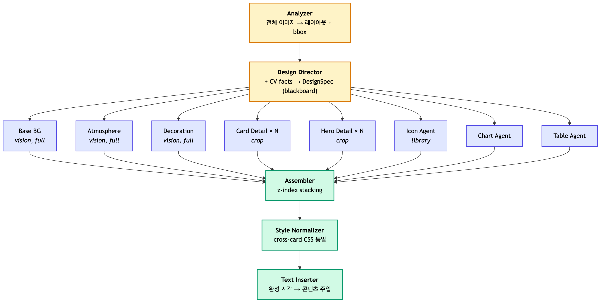
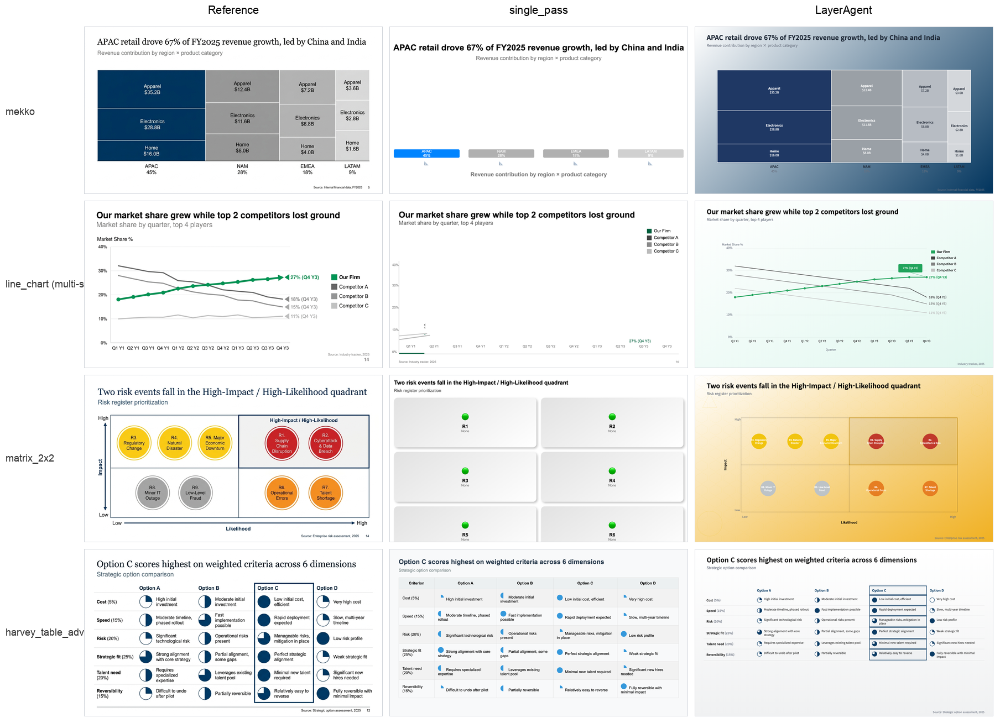

LayerAgent: 프레젠테이션 생성을 위한 멀티에이전트 프레임워크

디자인 이미지의 계층 구조 인식을 통한 프레젠테이션 코드 생성

by 정일균 (Ilgyun Jeong)

인공지능융합학과 (Department of Artificial Intelligence Convergence)

지도교수: 김현철 (under the supervision of Professor Hyeoncheol Kim)

---

초록

프레젠테이션 슬라이드는 배경·카드·콘텐츠·아이콘 등 여러 시각 층이 위아래로 겹쳐 구성되는 계층적 시각 구조다. 본 연구는 GPT-4o가 슬라이드 이미지를 자연어로는 평균 6.6개(범위 5–10)의 레이어로 기술하면서 같은 이미지를 HTML로 변환할 때는 평균 1.8개만 코드에 반영하는 perception–generation 격차를 관찰하고, 이를 슬라이드 도메인의 계층적 element omission 현상으로 정식화한다. 이를 다루기 위해 단일 VLM 호출을 8개 전문 에이전트의 layer 단위 분해로 재구성하는 multi-agent framework LayerAgent를 제안한다.

평가 결과 LayerAgent 는 동일 GPT-4o 조건의 4-method 비교에서 객관 디자인 충실도 (Element-IoU 0.372, sp 0.314 대비 +18%) 와 cross-model VLM judge (GPT-5.4 4 criterion 모두 1위, avg 4.02 vs 차순위 3.37) 두 평가 축에서 1위에 위치한다. AutoPresent rubric 의 layout 차원에서도 1위 (layout_0_5 3.64 vs 2.90) 이며, chart·table 카테고리 6종은 chart_templates 결정적 렌더링으로 MLLM Δ +0.15 ~ +1.90 의 큰 폭 격차를 보인다. Frontier 모델 일괄 생성(GPT-5.4)은 비용·시간 측면의 별개 cost-quality 대안으로 §7.3 에 boundary reference 로 보고된다.

본 연구의 기여는 세 가지로 정리된다. (1) Problem — 슬라이드 도메인의 (계층적) element omission 현상의 정식화, (2) Method — Chat Parser 입력 정규화, DesignSpec blackboard, vision-grounded specialist, chart_templates 결정적 렌더링 라이브러리(7종 chart renderer), style normalization, text insertion 분리를 포함하는 multi-agent layer decomposition framework (LayerAgent) 제안 및 두 mechanism 의 차원별 인과 효과 격리 측정 (DesignSpec blackboard 는 cross-card color consistency 차원, Text Inserter 는 string-level content preservation 차원), (3) Finding — 동일 GPT-4o 조건의 process-level 분해가 frontier scaling 없이 본 연구의 다면적 평가에서 4-method 비교 기준 종합 우위를 달성함을 규명. LayerAgent는 GPT-4o급 VLM에서 일괄 생성이 놓치는 계층 구조를 편집 가능한 HTML/CSS 차원에서 회복하는 process-level intervention이며, frontier scaling과 분리된 독립 경로로 자리매김된다.

키워드: 요소 누락 (Element Omission), 계층 분해 (Layer Decomposition), 멀티에이전트 (Multi-Agent), 디자인-투-코드 (Design-to-Code), 시각 언어 모델 (Vision Language Models)

---

제1장 서론

제1절 슬라이드 도메인의 계층적 element omission

프레젠테이션 슬라이드는 배경·카드·차트·텍스트·아이콘 등 여러 시각 층이 위아래로 겹쳐 구성되는 계층적 시각 객체이며, 이 시각 층들이 정확한 순서(stacking order)와 좌표로 겹쳐야 의도된 디자인이 구현된다. 그러나 단일 VLM 호출은 이 계층 구조를 충분히 반영하지 못한 채 HTML을 위에서 아래로 한 번에 생성한다 — `<div>` 태그가 직렬로 나열되고, 층의 명시적 순서 표기(CSS `z-index`)는 거의 사용되지 않으며, 요소 간 공간 관계는 DOM 작성 순서에 암묵적으로 의존한다.

본 연구의 출발점은 다음의 관찰이다. 같은 GPT-4o에게 이미지의 계층 구조를 자연어로 기술하라고 요청하면 평균 6.6개(범위 5–10)의 레이어를 인식하지만, 같은 이미지를 HTML로 변환하라고 요청하면 평균 1.8개만 코드에 반영된다 (부록 B.1). 본 논문은 이 현상을 슬라이드 도메인의 (계층적) element omission이라 부른다 — Design-to-Code 선행 연구(Calò & De Russis, 2025)에서 개별 요소 단위로 보고된 element omission이 슬라이드 도메인에서는 시각 계층(layer) 단위로 통째 누락되는 형태로 확장되어 나타난다. 이는 메트릭 이름이 아니라 현상의 이름이며, 본 연구는 이를 직접 표적하는 단일 신규 메트릭을 제안하지 않는다 — 메트릭 이름이 곧 현상 이름이 되면 측정이 순환적(circular)이 되기 때문이다.

제2절 연구 질문과 접근

기존 design-to-code 연구는 분할 정복(DCGen), 레이아웃 명시화(LaTCoder), 3-stage agent pipeline(ScreenCoder, DesignCoder)으로 image-to-code 품질을 일반적 문제로 다루어 왔고, 프레젠테이션 생성 연구(PPTAgent, PreGenie, SlideCoder, AutoPresent)는 템플릿 수정·코드 리뷰·세그멘테이션 기반 생성에 초점을 두었다. 그러나 슬라이드의 시각 계층이 HTML/CSS 생성 단계에서 layer 단위로 통째 누락되는 현상 자체를 직접 문제화하고 process-level 분해로 다룬 연구는 없다.

이로부터 본 연구의 연구 질문이 도출되며, 다음 세 하위 질문으로 분해된다.

**RQ1.** GPT-4o 급 VLM 은 슬라이드 이미지를 자연어로는 계층적으로 인식하면서 HTML/CSS 생성에서는 해당 계층을 누락하는가? 그리고 이 격차는 frontier VLM (GPT-5.4, Claude 4.6 Opus) 에서도 같은 양식으로 관찰되는가? (§5.1 motivation · 부록 B)

**RQ2.** LayerAgent 는 동일 GPT-4o 조건에서 일괄 생성 및 prompt-level 변형 (visual_cot, cot_h_rag) 보다 객관 충실도 (Element-IoU, CIEDE2000) 와 VLM judge (AutoPresent 0–5, GPT-5.4 4 criterion) 두 축에서 우수한가? (§5.1 · §5.2 · §5.5)

**RQ3.** LayerAgent 의 효과는 layout 유형 (chart·table·diagram vs 다층 시각 효과 vs 비차트 일반) 과 평가 축 (객관 매칭 vs VLM rubric vs holistic judge) 에 따라 어떻게 달라지는가? (§5.3 part A · §5.4 part B)

본 연구는 LayerAgent를 제안한다. 단일 VLM 호출을 전체 이미지 분석 → 공유 DesignSpec 작성 → 8개 specialist agent의 병렬 layer 생성 → 결정적 z-index 조립 → 카드 간 스타일 통일 → 텍스트 주입의 다단계 파이프라인으로 분해함으로써, 각 호출이 구조·스타일·콘텐츠를 동시에 짊어지지 않고 한 가지 책임만 지도록 설계했다 (§3). 효과는 단일 지표가 layer 보존의 다면성을 모두 포착하지 못하므로 design2code 다면적 평가 pack — 객관 충실도 (Element-IoU, CIEDE2000) + VLM rubric (AutoPresent 0–5, GPT-5.4 4 criterion) — 으로 함께 측정한다 (§4.3).

제3절 결과 요약과 기여

실험 결과 LayerAgent 는 동일 GPT-4o 조건의 4-method 비교에서 객관 디자인 충실도 (Element-IoU Full N=50 1위, CIEDE2000 dark_glass subset 1위) 와 cross-model VLM judge (GPT-5.4 4 criterion, avg 4.02 vs 차순위 3.37) 두 main 축에서 1위에 위치한다 (§5). AutoPresent rubric 의 layout 차원에서도 1위 (3.64 vs 2.90), 색 차원에서는 baseline 우세 — chart_templates 결정적 렌더링이 reference 색을 직접 복제하지 않고 정제된 brand color 시스템을 사용하기 때문이다 (§6.2). chart·table 카테고리 6종은 chart_templates 결정적 렌더링으로 MLLM Δ +0.15 ~ +1.90 의 큰 폭 격차를 보인다. Frontier 모델 일괄 생성(GPT-5.4)은 비용·시간 측면의 별개 cost-quality 차원으로 §7.3 에 boundary reference 로 보고한다.

본 논문의 기여는 다음 세 가지로 정리된다.

1. Problem — 슬라이드 도메인의 (계층적) element omission 정식화. Design-to-Code 선행 연구의 element omission이 슬라이드 도메인에서는 시각 계층 단위로 통째 누락되는 형태로 발현됨을 perception–generation 격차(평균 6.6 → 1.8 layer)로 가시화한다 (부록 B).

2. Method — LayerAgent framework. DesignSpec blackboard, vision-grounded specialist, style normalization, text insertion 분리를 포함하는 multi-agent layer decomposition을 제안하고, DesignSpec blackboard(D₄)와 Text Inserter(D₂) 두 mechanism의 인과 효과를 격리 측정한다 (§3, §5.5).

3. Finding — 본 연구의 N=50 layered slide 평가셋에서 동일 GPT-4o 조건의 4-method 비교 기준 객관 충실도 (Element-IoU) 와 cross-model VLM judge (GPT-5.4 4 criterion) 두 축에서 가장 높은 성능. LayerAgent 는 same-model GPT-4o 조건의 4-method 비교에서 객관 충실도 (Element-IoU 1위) + cross-model VLM judge (GPT-5.4 4 criterion 모두 1위) 두 main 축에서 1위에 위치한다 (§5). Frontier 모델 일괄 생성(GPT-5.4)은 별개 cost-quality 차원의 boundary reference 로 §7.3 에 보고된다.

---

제2장 관련 연구

제1절 Design-to-Code 생성

Design2Code (Si et al., 2024)는 484 웹페이지 벤치마크로 GPT-4V의 중간 충실도를 보고했다. WebSight (Laurençon et al., 2024)는 200만 합성 image-code pair를 공개했다. Calò & De Russis (PACMHCI 2025)는 GPT-4o의 UI 코드 생성 실패를 element omission · element distortion · element misarrangement의 세 유형으로 분류했다 — 본 연구는 이 중 element omission을 슬라이드 도메인의 시각 계층 단위로 확장하여 분석한다 (부록 B). DCGen (FSE 2025)은 분할 정복으로 페이지를 블록 단위로 분해해 코드를 생성한다. LaTCoder (KDD 2025)는 코드 이전에 레이아웃을 chain-of-thought로 명시화한다. ScreenCoder (arXiv:2507.22827, 2025)는 Grounding → Planning → Generation의 3-stage agent 파이프라인을 채택하고 50K image-code pair로 GRPO 미세조정한다. DesignCoder (arXiv:2506.13663, 2025)는 모바일 UI 도메인에서 UI Grouping → Hierarchy-Aware Generation → post-render Self-Correcting Refinement의 3-stage를 사용한다. UIOrchestra (Findings of EMNLP 2025)는 multi-agent framework로 UI design에서 code로의 변환을 다루며 본 연구와 가장 가까운 선행 연구이다. 다만 LayerAgent의 DesignSpec blackboard, CV grounding, library retrieval을 통합한 구조와는 차별된다.

LayerAgent와의 차별점. ScreenCoder는 image patch reuse(Hungarian matching)로 cross-element 일관성을 다루고, DesignCoder는 post-render iterative refinement로 코드 품질을 다룬다. 본 연구의 Style Normalizer는 pre-render CSS 정규화에 해당하고, Text Inserter는 시각과 콘텐츠 단계의 분리에 해당하며, DesignSpec blackboard는 생성 시점의 cross-agent 스타일 통일에 해당한다. 기존 design-to-code 평가는 주로 단일 metric 또는 분류된 metric 그룹을 보고했으며, 본 연구는 슬라이드 도메인에서 객관 디자인 충실도 (Element-IoU, CIEDE2000) 와 VLM rubric (AutoPresent 0–5, GPT-5.4 4 criterion) 을 결합하여 동반 보고하는 design2code 다면적 평가 방식을 적용한다는 점에서 차별화된다. 종합하면, 기존 design-to-code 계열은 image-to-code 품질을 일반적 문제로 다루는 반면, 본 연구는 슬라이드 도메인 특유의 layer 단위 element omission 자체를 직접 문제화하고 layer 단위 생성 분해로 다룬다는 점이 핵심 차이다.

제2절 시각 교정 / 반복 개선

VisRefiner (arXiv:2602.05998, 2026)는 렌더링 결과와 참조 디자인 간 시각 차이를 학습하여 GPT-4o 대비 Block Match +21.5pt를 달성했다. Vision-Guided Iterative Refinement (arXiv:2604.05839, 2026)는 VLM critic 기반 3회 반복으로 17.8% 개선을 보고했다. 본 연구의 Visual Critic stage 는 이들의 반복 vs 단발 트레이드오프를 선택 단계로 구현하며 (§3.5), 본 논문의 main 결과는 기본 비활성 조건에서 보고한다.

제3절 프레젠테이션 생성

PPTAgent (Zheng et al., EMNLP 2025)는 LLM 피드백 기반 템플릿 반복 수정을, PreGenie (Xu et al., EMNLP Findings 2025)는 코드 리뷰와 페이지 리뷰의 이중 루프를, SlideCoder (Tang et al., EMNLP 2025)는 CGSeg 세그멘테이션과 계층적 RAG를, AutoPresent (Ge et al., CVPR 2025)는 구조화된 시각 설계 원칙을 강조했다. 이들 선행 연구는 주로 템플릿 수정, 코드 리뷰, 세그멘테이션 기반 생성, 구조화된 설계 원칙에 초점을 두었다. 반면 본 연구는 슬라이드의 시각 계층이 HTML/CSS 생성 단계에서 누락되는 현상에 초점을 맞추고, 이를 계층 단위 생성 분해와 design2code 다면적 평가의 동반 보고 (Element-IoU 객관 매칭, AutoPresent VLM rubric, cross-model GPT-5.4 4 criterion) 로 분석한다는 점에서 차별화된다. 종합하면, 기존 발표자료 생성 계열은 템플릿·콘텐츠·슬라이드 단위 생성 자체를 다루는 반면, 본 연구는 HTML/CSS 단위의 layer fidelity를 핵심 문제로 직접 다룬다는 점이 핵심 차이다.

제4절 멀티에이전트 코드 생성

MetaGPT (Hong et al., ICLR 2024), ChatDev (Qian et al., ACL 2024), CAMEL (Li et al., NeurIPS 2023), AutoGen (Wu et al., COLM 2024)은 소프트웨어 개발 프로세스(설계, 구현, 테스트의 순서) 또는 대화형 multi-agent conversation으로 agent를 분담한다. LayerAgent는 (a) 개발 프로세스가 아니라 출력의 시각 계층(layer) 구조(배경, 카드, 텍스트, 아이콘의 순서)에 따라 분담하며, (b) agent 간 통신을 자연어나 코드가 아니라 DesignSpec JSON과 bounding box JSON으로 구성된 typed blackboard로 수행하여 truncation과 해석 오류를 구조적으로 제거한다. 종합하면, 기존 multi-agent code generation은 역할·개발 프로세스·대화 흐름에 따른 분업이지만, LayerAgent는 출력의 시각 계층(layer)에 따른 분업이라는 점이 본질적 차이다.

제5절 Design-to-Code 평가

기존 평가는 전역 유사도, 구조 매칭(Design2Code 의 Block-Match, AutoPresent 의 element-matching), 속성 수준(WebRenderBench 의 SDA, Widget2Code 의 per-property) 으로 분류된다. DreamHouse (arXiv:2603.24866, 2026) 는 physical generative reasoning(건축 구조물 생성) 도메인에서 structural validity 와 visual fidelity 가 직교적이며 frontier VLM 의 joint pass rate 가 7.1% 에 불과함을 보였으며, 본 연구는 이 orthogonality finding 을 슬라이드 도메인으로 평행하게 적용한다. SlideAudit (UIST 2025) 은 슬라이드 quality taxonomy 를 정립하고 automated metric 과 holistic human judgment 사이의 systematic disagreement 를 정량적으로 보였으며, 이는 본 연구의 §5.4 평가 축 간 불일치 관찰과 직접 정렬되는 선행 연구이다. AutoPresent (CVPR 2025) 는 layout·color 두 차원 0–5 rubric 을 정립했으며 본 연구는 이를 main metric 의 한 축으로 사용한다. WebDevJudge (2025) 는 design-to-code 에서 MLLM-as-judge 의 평가 관행 (pairwise 평가와 code·visual modality 결합) 을 제안했으며, 본 논문은 이를 §7 의 single-judge limitation 논의에서 reference 로 인용한다. 본 연구는 (a) DreamHouse 와 SlideAudit 두 도메인의 metric disagreement 발견을 슬라이드 design-to-code 도메인의 다면적 평가로 확장하고, (b) 객관 element-level matching (Element-IoU) 과 색 거리 (CIEDE2000), AutoPresent rubric, cross-model VLM judge 를 결합하여 class-name-independent 하게 정렬한 design2code 다면적 평가 protocol 을 구성함으로써 메서드별 명명 규칙에 따른 평가 편향을 줄인다.

---

제3장 LayerAgent 프레임워크

제1절 전체 구조



Figure 5. LayerAgent 의 측정 대상 파이프라인. Chat Parser 가 입력을 typed `slide_spec` JSON 으로 정규화한 뒤, Stage 0 (Analyzer · Design Director) 이 레이아웃과 DesignSpec blackboard 를 산출하고, Stage 1 의 8개 specialist 가 병렬로 layer 단편을 생성하며, Stage 2 의 Assembler · Style Normalizer · Text Inserter 가 결정적 z-index 조립과 카드 간 스타일 통일·텍스트 주입을 수행한다. 19개 slide_type 어휘, specialist 그룹 구성, chart_templates 결정적 렌더링 (chart 슬라이드 우회 처리), 선택 단계(Overflow Repair, Visual Critic) 의 상세는 §3 본문에서 기술된다.

전체 파이프라인은 LangGraph StateGraph로 구현되었으며, 8개 specialist는 Design Director의 출력 이후 병렬로 실행된다. Chat Parser는 그래프 진입 노드로 위치하여 사용자 입력 다양성을 입력 표준화 단계에서 흡수한다.

제2절 Stage 0 — 입력 분석

제1항 Chat Parser — 입력 정규화

사용자는 LayerAgent 에 자유 형식 자연어 메시지와 reference 디자인 이미지를 함께 제공한다. Chat Parser는 두 입력을 받아 typed JSON `slide_spec`을 출력한다 — `slide_type` ∈ {19종 어휘}, `content` (slide_type별 구조화 필드), `style` (4개 hex 색상). slide_type은 이미지의 시각 형태를 1차 신호로, 사용자 메시지를 2차 신호로 결정한다 — 예컨대 "여러 색의 라인이 있으면 multi-series line_chart", "1 root → N branches → M leaves 트리는 pyramid가 아닌 tree_diagram" 등 형태 기반 분기 규칙이 prompt에 명시된다. 이는 downstream agent들이 동일한 어휘 위에서 동작하도록 보장하여 분기 모호성으로 인한 layer 환각·붕괴를 사전 차단한다.

제2항 Analyzer

전체 이미지를 입력받아 (a) 레이아웃 유형(`timeline / dashboard / hub_spoke / pyramid / grid / split / vertical_stack / freeform`)과 (b) 각 카드·히어로·장식 요소의 정규화된 bounding box(0–1 비율)를 출력한다. 이 출력은 이후 모든 crop과 배치(placement)의 기준점이 된다. slide_type이 chart_templates 적용 7종(bar_chart/line_chart/waterfall/matrix_2x2/mekko/harvey_table_advanced/tree_diagram) 중 하나인 경우, Analyzer는 카드·히어로 영역을 비워 반환하여 차트 위에 카드 layer 가 겹쳐지지 않도록 한다.

제3항 Design Director — DesignSpec Blackboard

전체 이미지와 CV facts(k-means palette, OCR 텍스트 높이 분포, HSV 채도)를 입력받아 typed JSON `DesignSpec`을 출력한다. DesignSpec은 6개의 top-level 필드로 구성된다 — `aesthetic_label` (multi_layer_visual_effect / minimal / editorial 등), `typography` (hero·body의 font family와 weight), `palette` (k-means로 추출된 background·accent·frame·text 색상), `frame_system` (hero·card border 스타일과 bottom accent bar 유무), `decorative_motif` (style·density), `atmosphere` (radial glow 유무·origin과 background depth). 전체 schema와 한 슬라이드의 완결된 instance 예시는 부록 D에 수록한다.

이후 모든 specialist는 DesignSpec을 prompt hint로 받는다. 결과적으로 카드 A의 반투명 효과가 카드 B에서 단색으로 변하는 스타일 표류가 사전적으로 차단된다 — 이는 단순한 분해 접근에서 자주 관찰되는 실패 양식이다.

CV grounding의 효과. 팔레트는 k-means(k=6)로 추출되어 모델이 색을 환각할 여지를 줄이고, OCR 텍스트 높이는 폰트 크기 결정의 결정적 기준점이 되며, HSV 채도는 flat과 vivid 미학을 구분하는 단서로 작용한다. 이 효과는 `no_cv_facts` 플래그로 격리해 측정할 수 있다.

제3절 Stage 1 — Specialist Agents (병렬)

8개 specialist는 Design Director의 출력 이후 병렬로 실행되며, 두 그룹으로 나뉜다 — 모든 슬라이드에서 활성화되는 layer specialist 4개와 slide_type·content에 따라 조건부 활성화되는 specialist 4개.

- Base BG · Atmosphere · Decoration: 전체 이미지와 DesignSpec을 입력받아 배경 그라디언트, radial glow, decoration shape를 분리된 layer로 생성한다. 이러한 분리는 분위기와 패턴이 같은 z=0 안에서 충돌하지 않도록 보장한다.
- Card Detail × N: 각 카드의 crop 이미지(주변 패딩 포함)와 DesignSpec을 입력받아 카드별로 풍부한 CSS 효과(`backdrop-filter`, 다중 `box-shadow`, rgba 투명도, 테두리 효과)를 생성한다. 좁은 시각 범위가 선택적 CSS 재질(반투명, blur, gradient 등)을 회복시킨다 — 통제 실험에서 같은 GPT-4o가 전체 이미지에서는 카드당 CSS 효과 2.8개를, crop에서는 6–8개를 생성한다.
- Hero Detail × N: 히어로 블록(큰 숫자, 메인 메시지, 특수 그래픽)을 crop 단위로 별도 처리한다.
- Icon Agent: 카드별 의미 분석 → FontAwesome 클래스 검색 → 실제 `<i class="fa-...">` 태그 주입의 순서로 동작하며, 환각된 아이콘 URL을 구조적으로 차단한다.
- Chart Agent · Table Agent: 슬라이드 타입이 chart_templates 적용 7종 (bar_chart, line_chart, waterfall, matrix_2x2, mekko, harvey_table_advanced, tree_diagram) 중 하나일 때 `chart_templates` 라이브러리로 슬라이드 전체를 결정적으로 렌더링한다. 라이브러리는 7개 renderer를 노출한다 — `bar_chart` (highlight/plan 점선 지원), `line_chart` (multi-series, series별 color·highlight·annotation), `waterfall` (start/positive/negative/total 4-type 막대), `matrix_2x2` (4-사분면 + 축 라벨 + highlight quadrant), `mekko` (가변폭 column × stacked segment), `harvey_table_advanced` (option×criteria 그리드 + 0/25/50/75/100 Harvey ball), `tree_diagram` (1 root → N branches → M leaves hierarchical layout). VLM 호출은 chat_parser 단계의 데이터 추출에 한정되며, 시각 자체는 SVG/HTML primitive로 결정적으로 산출되므로 자기회귀 토큰 예산이 시각·콘텐츠 간 zero-sum을 일으키지 않는다 (§6.1).

제4절 Stage 2 — 조립과 정규화

제1항 Assembler

8개 specialist의 HTML 단편을 z-index band([0, 5, 10, 20, 30, 40])로 결정적으로 쌓는다. 단순 concat이 아니라 절대 좌표(Analyzer의 bbox 정규화 비율 × 1280×720)와 z-index를 명시적으로 부착한다.

제2항 Style Normalizer

조립된 HTML을 텍스트 입력만 받아 카드 간 CSS 속성을 통일한다:

- 배경 rgba alpha — 모든 카드 동일값
- 테두리 색상/두께 — 통일
- border-radius — 통일
- box-shadow — 통일
- backdrop-filter blur — 통일

불변 보장: position, left, top, width, height, z-index은 변경하지 않는다. 이미지 입력 없이 코드만 보는 텍스트 전용 agent로, 각 카드의 독립 생성에서 발생한 표류를 사후 동기화한다. 이 효과는 `no_style_norm` 플래그로 격리해 측정할 수 있다.

A2UI Protocol (Google, 2026)이 client-side renderer로 design-system을 강제하는 것과 동일한 설계 원리를 VLM 파이프라인 내부에서 실현한 것이다.

제3항 Text Inserter

완전히 스타일링된 HTML(배경, 카드, 정규화된 스타일)과 콘텐츠 데이터(제목, 설명, 메트릭, 리스트)를 입력받아, 기존 카드 구조 내의 빈 컨테이너를 식별하고 텍스트를 주입한다.

이 단계의 핵심은 시각 디자인을 먼저 확정한 뒤 텍스트를 주입한다는 순서에 있다. 단일 VLM에서 풍부한 CSS 생성과 정확한 텍스트 배치가 zero-sum 경쟁을 벌이는 현상(H-RAG에서 다층 디자인 subset 평균 CCR −13% / CSS +75%, chart·table 계열의 개별 design에서는 CCR 1.0 → 0.36–0.55까지 큰 폭으로 감소)이 단계 분리에 의해 구조적으로 해소된다. 이 효과는 `no_text_inserter` 플래그로 격리해 측정할 수 있다.

제5절 선택 단계

제1항 Overflow Repair

조립된 HTML을 Playwright로 렌더링한 뒤 측정한 bounding box overflow를 분석하여 폰트 크기, 패딩, 줄 수를 미세 조정한다. 시각 critic과 달리 결정적 측정에 기반하므로 LLM 호출이 필요 없다.

제2항 Visual Critic

Playwright 스크린샷과 원본 이미지를 비교한 뒤 VLM이 diff를 작성하고 CSS 속성 단위로 보정한다. iteration 비용이 크므로 기본값은 비활성화이다.

제6절 구현

본 논문은 LayerAgent의 두 mechanism — DesignSpec blackboard와 Text Inserter — 의 인과 효과를 격리 측정한다 (§5.5). 각 ablation은 해당 component를 noop으로 대체하는 방식으로 구성된다 (`no_designspec` flag → D₄, `no_text_inserter` flag → D₂).

모든 실험은 GPT-4o, LangGraph, Playwright 환경에서 수행되었다.

---

제4장 실험 설정

제1절 데이터 — Layered slide design 평가셋

본 연구의 평가셋은 50개의 layered slide design으로 구성되며, 두 그룹으로 나뉜다.

(a) 다층 시각 효과 디자인 그룹 (N=10, theme=dark_glass): 10개의 서로 다른 layout (timeline, dashboard, comparison_split, pyramid, hub_spoke, before_after, feature_grid, roadmap, layered_stack, stats_hero)에 glassmorphism dark theme이 일관되게 적용된 슬라이드들이다. 배경 glow, 장식 요소, 반투명 카드, shadow와 border, z-index overlap 등 복합 CSS 효과가 다른 그룹보다 높은 밀도로 포함된다. 즉 본 연구에서 "다층 시각 효과 디자인"이라 칭하는 것은 layout type이 아니라 dark_glass theme과 높은 visual-effect density로 정의되는 시각적 특성이다.

(b) 차트·다이어그램 그룹 (N=40): 8개 layout (mekko, matrix_2x2, waterfall, harvey_table, bar_chart, line_chart, process_flow, pyramid)에 5종 비즈니스 컨설팅 스타일(minimal_white, editorial_warm, bain_red, bcg_green, mckinsey_blue)을 적용한 슬라이드로, visual-effect density가 상대적으로 낮다.

모든 슬라이드는 Gemini 3 Pro Image Preview (Google, 2026) 로 생성됐다. 본 연구는 전체 dataset에서 LayerAgent의 구조 복원 효과를 평가하며, layout/theme 그룹에 따른 효과 변화는 §5.3 per-layout breakdown에서 보고한다.

데이터 overlap 명시. 부록 B.1 perception–generation 격차의 motivation을 만든 N=10 pilot 슬라이드는 (a) 그룹의 N=10과 동일하다. 따라서 §5.3의 다층 시각 효과 디자인 subset 결과는 부록 B.1와 동일한 슬라이드 위에서 측정되며, motivation과 검증이 같은 데이터 위에서 일어난다는 caveat 하에 해석되어야 한다 (§7 한계).

제2절 비교 메서드

| code | 메서드 (논문 표시) | 접근 |
|---|---|---|
| A | 일괄 생성 (`single_pass`, 이하 sp) | 단일 GPT-4o 호출로 전체 이미지 → HTML |
| B | 시각 분석 생성 (`visual_cot`) | 시각 분석을 자연어로 먼저 수행한 뒤 코드 생성 (2단계) |
| C | 패턴 주입 생성 (`cot_h_rag`) | 시각 분석 + CSS 효과 패턴 레시피(RAG)를 함께 제공해 코드 생성 |
| D | LayerAgent (`layeragent`) | 본 연구 — 계층 단위로 생성 책임을 분해하는 multi-agent full pipeline |

모든 메서드에 동일한 콘텐츠 데이터, 동일한 모델(GPT-4o), 동일한 시드(seed=0)를 제공한다.

제3절 평가 방식 — design2code 다면적 평가

본 논문은 main result 를 design2code 평가의 다면적 평가 pack 위에서 보고한다 — 객관적 시각 매칭 (Element-IoU; element 단위 Hungarian matching 기반), 색 정확도 (CIEDE2000), VLM-as-judge rubric (AutoPresent 0–5 layout/color, GPT-5.4 4 criterion). Layer Recall 과 LTED 는 부록 B 에 정리한 클래스명 편향 위험으로 보조 metric 으로 분류된다. 평가 protocol 은 2개의 main 축(① 객관적 디자인 충실도, ② VLM-as-judge rubric)으로 구성된다.

축 ① 객관적 디자인 충실도 (Design2Code 계열):

Playwright 로 렌더링한 PNG 와 reference PNG 사이의 객관적 매칭을 측정한다. Class name 이나 사전 정의된 layer label 에 의존하지 않으며 모든 메서드에 동일하게 적용된다 (method-agnostic).

- **Element-IoU** ↑ — Hungarian matching 기반 element 단위 IoU. Generated element 는 Playwright 로 렌더링한 HTML 의 visible DOM element bounding box 와 computed style 색으로 추출하고, reference element 는 reference PNG 에 대해 edge-sampled background color 와의 색 거리 ≥25 픽셀의 connected components (skimage.label, 최소 면적 1500 px², 최대 30 panel 후보) 로 산출한다. 이후 bbox IoU 를 cost 로 한 linear sum assignment (Hungarian) 로 1:1 대응을 찾고 matched pairs 의 mean IoU 를 보고한다. Class name·DOM 구조에 의존하지 않으며 모든 메서드에 동일하게 적용된다 (method-agnostic). Design2Code (NAACL 2025) Block-Match 와 유사한 element-level matching 계열 metric 이다.
- **CIEDE2000** ↓ — CIE Δ E 2000 색 거리. dominant 색 K-means 추출 후 reference 와의 평균 색 거리. 낮을수록 reference 와 색이 가깝다.

추가로 측정된 verifiable rules (whitespace_frac, collision_score) 는 본 도메인에 대한 normative 정의 (whitespace 의 "balanced range" 0.4–0.6, collision 의 의도적 SVG primitive 인접) 가 모호하여 main 표에서 제외하고 보조 진단으로만 사용한다.

축 ② VLM-as-Judge Rubric:

두 종류의 VLM judge 를 동반 보고한다.

- **AutoPresent rubric (0–5)** — AutoPresent (CVPR 2025) 의 layout / color 두 차원 각각 0–5 점. GPT-4o judge.
- **GPT-5.4 4 criterion (1–7)** — PPTAgent (Zheng et al., EMNLP 2025) 의 PPTEVAL 계열 4 criterion. Generator (GPT-4o) 와 다른 모델 계열로 self-evaluation bias 를 차단한다 (Zheng et al., 2023; WebDevJudge 2025). reference image, generated PNG, generated HTML 의 처음 3,000자를 함께 제공한다.
  - Visual Fidelity (VF), Layer Structure (LS), Content Completeness (CC), Design Quality (DQ)

축 ③ Content Completeness (auxiliary):
- CCR ↑ — 입력 텍스트가 HTML 에 문자열로 등장하는 비율 (시각 가시성 미반영; MLLM judge CC 가 visual proxy)

Legacy sanity check — Class-name-aligned (참고용, main claim 외):
- Layer Recall, LTED — class name regex 기반 (LayerAgent 어휘에 정렬). Vocabulary alignment 한계로 인해 부록 B.1 (현상 가시화), 부록 B (보조 표), §5.2 (prompt 변형이 명명 규칙과 무관하므로 방향 해석에 한해 안정적인 robustness sanity check) 에 한정해 사용한다.

Render guard 점검에서 모든 메서드가 Playwright 로 100% 정상 렌더링됨을 확인했다.

독자용 메트릭 지도. 본 연구는 메트릭 수가 많아 §5 이후 표에서 반복적으로 등장하므로, 각 지표군이 답하는 직관적 질문을 다음 표로 한 번 정리한다.

| 지표군 | 직관적 의미 (한 줄 요약) | 본 연구 내 위치 |
|---|---|---|
| Element-IoU | 렌더된 element 들이 reference 의 위치·색과 1대1로 얼마나 맞는가 | 객관 충실도 (main, 축 ①) |
| CIEDE2000 | 렌더의 색 분포가 reference 와 얼마나 가까운가 | 객관 충실도 (main, 축 ①) |
| AutoPresent layout_0_5 / color_0_5 | VLM 이 "발표 슬라이드로서 layout·color 가 적절한가" 를 0–5 로 채점 | VLM rubric (main, 축 ②) |
| GPT-5.4 4 criterion (VF·LS·CC·DQ) | cross-model VLM judge 가 보는 종합 발표 품질 1–7 | VLM rubric (main, 축 ②) |
| CCR | 입력 텍스트가 코드에 살아남았는가 (시각 가시성 미반영) | 콘텐츠 (auxiliary, 축 ③) |
| LTED / Layer Recall | layer 단위 매칭 — 단, LayerAgent class name 에 정렬되어 클래스명 편향 위험 | 보조 진단·sanity check (auxiliary, 축 ④) |

본 지도는 메트릭의 분류가 아니라 답하는 질문의 분류이며, use case 별 weighting 해석은 §5.4 메트릭 분류학과 §6.2 평가 차원 해석을 함께 참조한다.


제4절 실험 인프라

- 4-stage cacheable 파이프라인: generate → render(Playwright) → reference perception(VLM 캐시) → metrics 순서로 구성되며, 각 stage는 독립적으로 재시작이 가능하다.
- 총 4 메서드 × 50 슬라이드 = 200 cell이며, 전체 실행 시간은 82분, 생성 실패는 0건이다.
- 결과는 jsonl, csv, 리포트 형식으로 저장되어 후속 분석 단계에서 재사용된다.

---

제5장 결과

제1절 Same-model GPT-4o 비교 — 객관 충실도와 cross-model VLM judge에서의 우위 (RQ2)

부록 B.1 pilot 은 GPT-4o 일괄 생성에서 perception 이 기술한 평균 6.6개 layer 가 코드의 평균 1.8개로 떨어지는 격차를 보고했다. 본 절은 이 격차에 대한 process-level 분해의 회복을 design2code 다면적 평가 pack — 객관 충실도 (Element-IoU, CIEDE2000) + VLM rubric (AutoPresent 0–5, GPT-5.4 4 criterion) — 으로 정량화한다. 명명 규칙 비의존 n_layers 수준의 회복(일괄 1.8 → LayerAgent 8.2, 같은 pilot 조건) 은 §5.2 의 trivial baseline check 에서 z-explicit prompt 변형과 함께 보고한다.

본 절은 동일 base model GPT-4o 위에서, 4가지 메서드(일괄 생성·시각 분석 생성·패턴 주입 생성·LayerAgent)를 본 연구의 layered slide dataset 전반에서 비교한다 (Table 1: full N=50 자동 지표; Table 2: 다층 시각 효과 디자인 subset N=10 자동 지표). 종합적 발표 품질 차원은 MLLM judge로 별도 보고한다 (Table 3, main_eval). Layout 의존성은 §5.3 per-layout breakdown에서 다룬다.

Table 1. 전체 dataset 객관 충실도 + VLM rubric (N=50, 다면적 평가 pack). 굵은 = 1위.

| Metric | A. 일괄 생성 | B. 시각 분석 생성 | C. 패턴 주입 생성 | D. LayerAgent |
|---|:---:|:---:|:---:|:---:|
| Element-IoU ↑ | 0.314 | 0.301 | 0.296 | **0.372** |
| CIEDE2000 ↓ | 53.6 | 56.9 | **51.5** | 58.6 |
| AutoPresent layout_0_5 ↑ | 2.90 | 2.70 | 2.56 | **3.64** |
| AutoPresent color_0_5 ↑ | **3.70** | 3.56 | 2.76 | 3.12 |

핵심 발견 1 (main result) — Full N=50 에서 LayerAgent 는 객관 시각 매칭(Element-IoU)과 VLM-rubric layout 차원에서 명확히 1위이다. Element-IoU 0.372 는 일괄 생성 0.314 대비 +18%, AutoPresent layout_0_5 3.64 는 일괄 생성 2.90 대비 +0.74 격차이다. 색 차원(CIEDE2000, color_0_5)에서는 일괄 생성·패턴 주입 생성이 LayerAgent 보다 우세하다 — chart_templates 의 결정적 렌더링이 reference 색 팔레트를 정확히 복제하지 않고 정제된 SVG 색 시스템(예: 일관된 brand color hue)을 사용하기 때문이다. 본 trade-off 는 §6.2 에서 다룬다.

Table 2. 다층 시각 효과 디자인 subset 객관 충실도 + VLM rubric (N=10 dark_glass, design_01–10). 굵은 = 1위.

| Metric | A. 일괄 생성 | B. 시각 분석 생성 | C. 패턴 주입 생성 | D. LayerAgent |
|---|:---:|:---:|:---:|:---:|
| Element-IoU ↑ | 0.563 | 0.551 | 0.563 | **0.575** |
| CIEDE2000 ↓ | 30.3 | 26.9 | 27.7 | **20.7** |
| AutoPresent layout_0_5 ↑ | **4.20** | 3.80 | 3.70 | 2.90 |
| AutoPresent color_0_5 ↑ | 3.70 | **3.90** | 3.50 | 3.00 |

핵심 발견 1' (subset 분기) — 다층 시각 효과 디자인 subset (N=10 dark_glass) 에서 LayerAgent 는 객관 충실도 (Element-IoU, CIEDE2000) 에서 1위 (CIEDE2000 20.7 vs 차순위 메서드 26.9, 큰 폭 색 정확도 우세) 이지만 VLM rubric (layout_0_5, color_0_5) 에서는 4위이다. 이 분기는 본 평가 framework 가 측정하는 두 차원의 분리를 직접 보여준다 — 객관적 시각 매칭은 LayerAgent 의 분해 + DesignSpec blackboard 가 color drift 를 줄여 reference 와의 color 거리를 좁히는 효과를 포착하지만, VLM holistic judge 는 다층 시각 효과 디자인의 풍부한 atmospheric layer (radial glow, glassmorphism, decorative motif) 를 LayerAgent 출력이 단순화하는 경향을 layout / color quality 패널티로 평가한다. 본 분기는 §5.3 의 dark_glass MLLM Δ −0.80 과 정렬되며, §7.2 의 future work 로 "다층 시각 효과 카테고리에서의 보다 expressive 한 atmospheric layer 생성" 을 다룬다. 데이터 overlap caveat 은 §7.2 를 참조한다.

핵심 발견 2 — 시각 분석 생성(`visual_cot`)과 패턴 주입 생성(`cot_h_rag`)은 일괄 생성(`single_pass`) 대비 일관된 개선을 보이지 않는다. 시각 분석 생성은 Element-IoU 0.301 (sp 0.314 보다 낮음), AutoPresent layout_0_5 2.70 (sp 2.90 보다 낮음) 으로 4 메트릭 모두 sp 보다 열세이다. 패턴 주입 생성은 CIEDE2000 51.5 에서 1위이나 layout_0_5 2.56 / color_0_5 2.76 으로 VLM rubric 두 차원에서 최하위이다. 즉 단순한 시각 분석 단계 추가나 CSS 패턴 지식 주입만으로는 일관된 개선이 관찰되지 않으며, 생성 단위 분해가 빠진 prompt-level 변형만으로는 충분하지 않다. LayerAgent 의 통합 파이프라인(Chat Parser + DesignSpec + chart_templates + Style Normalizer + Text Inserter)이 same-model 조건에서 객관 + VLM rubric 평균에서 가장 강한 결과를 만든다. 컴포넌트별 인과 효과는 Text Inserter(D₂)와 DesignSpec blackboard(D₄) 두 mechanism 에 대해 §5.5 에서 격리 측정된다.

Table 3. 종합적 발표 품질 — MLLM judge (GPT-5.4, 4 criteria, 1–7 scale, main_eval N=50). 굵은 = 1위.

| Criterion | 일괄 생성 | 시각 분석 생성 | 패턴 주입 생성 | LayerAgent |
|---|:---:|:---:|:---:|:---:|
| Visual Fidelity ↑ | 2.24 | 2.08 | 1.74 | **2.94** |
| Layer Structure ↑ | 3.52 | 3.08 | 3.00 | **4.62** |
| Content Completeness ↑ | 3.92 | 3.70 | 3.76 | **4.62** |
| Design Quality ↑ | 3.78 | 3.30 | 3.36 | **3.90** |
| Average ↑ | 3.37 | 3.04 | 2.96 | **4.02** |

MLLM judge 4 criterion 모두에서 LayerAgent가 1위이며, 평균은 4.02로 차순위 메서드(일괄 생성 3.37) 대비 +0.65 격차이다. chart_templates 가 적용되는 7 layout (pyramid + chart·table 6종, §5.3 Table 4 caption 매핑) 에서 결정적 렌더링이 자기회귀 zero-sum을 회피하여 텍스트 overflow·콘텐츠 누락 패널티가 구조적으로 차단되며, Layer Structure(4.62)·Content Completeness(4.62) 두 축의 큰 격차가 이를 직접 보여준다.

Table 1·2·3 을 함께 읽으면 LayerAgent 의 우위가 평가 축과 카테고리에 따라 다음과 같이 분포된다.

(i) Full N=50 에서 객관 충실도 (Element-IoU) + VLM rubric layout 차원 (AutoPresent layout_0_5, GPT-5.4 LS·VF) 에서 LayerAgent 1위. 색 차원 (CIEDE2000, color_0_5) 은 일괄 생성·패턴 주입 생성이 reference 의 색을 직접 모방하므로 LayerAgent 보다 우세이다. (ii) 다층 시각 효과 디자인 subset (N=10 dark_glass) 에서 LayerAgent 는 객관 충실도 (Element-IoU 0.575, CIEDE2000 20.7, 두 메트릭 모두 1위) 에서는 우세하지만 VLM rubric (layout_0_5 2.90, color_0_5 3.00) 에서는 4위이다 — atmospheric layer 의 풍부성 simplification 이 VLM 의 holistic 채점에 패널티를 유발한다. (iii) MLLM judge 4 criterion (Table 3, GPT-5.4) 은 Full N=50 평균에서 LayerAgent 1위 (4.02 vs 차순위 메서드 3.37).

종합적으로 LayerAgent 는 객관 충실도 축과 GPT-5.4 holistic 축의 mass center 위치이며, AutoPresent rubric 의 dark_glass 약점은 §7.2 future work 에서 다룬다.



Figure 6. 4개 chart·table 디자인의 정성적 3-way 비교 (reference / single_pass / LayerAgent, 동일 GPT-4o). 위에서부터 mekko (가변폭 column × stacked segment), line_chart (multi-series 추세선), matrix_2x2 (4-사분면 격자 + 축 라벨), harvey_table_advanced (option × criteria 매트릭스 + Harvey ball). 네 사례 모두에서 LayerAgent는 reference의 핵심 시각 구조 — column 비례, 4 series 라인 + 데이터 라벨, 사분면 격자 + items, Harvey ball 채움 정도 — 를 single_pass보다 정확하게 재현한다. single_pass 는 chart 영역의 자기회귀 zero-sum으로 인해 column이 동일 폭으로 단순화되거나 라인이 거의 그려지지 않거나 사분면 items가 사라지는 경향을 보인다. chart_templates 결정적 렌더링 라이브러리(§3.3)가 chart_templates 적용 7 layout (pyramid + chart·table 6종) 의 시각 fidelity와 콘텐츠 보존을 동시에 보장하며, 이는 Table 4의 chart·table 6종 카테고리에서 MLLM Δ +0.15 ~ +1.90 의 큰 폭 격차로 정량 확인된다.

제2절 Trivial baseline check

LayerAgent의 same-model 우세(Table 1)가 분해 효과인지 아니면 단순 prompt 조정만으로도 가능한지를 점검하기 위해 z-index 명시 일괄 생성(single_pass_zexplicit) 변형을 구현했다. 일괄 생성 prompt에 z-index 6-band 명시 한 줄만을 추가한 변형이다.

| Method (N=10 다층 시각 효과 디자인) | 설명 | LTED ↓ | Layer Recall ↑ | avg layer count |
|---|---|:---:|:---:|:---:|
| 일괄 생성 (`single_pass`, baseline A) | 기본 일괄 생성 | 0.823 ± 0.14 | 0.224 ± 0.13 | 1.8 |
| z-index 명시 일괄 생성 (`single_pass_zexplicit`, baseline A') | z-index 6-band를 prompt에 명시 추가 | 0.844 ± 0.12 | 0.292 ± 0.17 | 3.8 |
| LayerAgent (`layeragent`, D) | 계층 단위 분해 생성 (full pipeline) | 0.551 ± 0.13 | 0.759 ± 0.16 | 8.2 |

표 주: LTED와 Layer Recall은 부록 B의 보조 metric이다. avg layer count는 명명 규칙과 무관한 단순 카운트이므로 방향성 해석은 안정적이다.

z-explicit prompt는 보조 metric Recall을 0.224 → 0.292로 올리지만 LayerAgent의 0.759와는 거리가 있다. avg layer count(명명 규칙과 무관)도 z-explicit 3.8 vs LayerAgent 8.2로 차이가 유지된다. 즉 단순 z-index 명시만으로는 LayerAgent와 같은 수준의 계층적 element 반영이 나오지 않는다. generation capacity 증가에 대한 인과 주장은 본 표 단독이 아니라 §5.1 Table 1 + §5.5 ablation 결과와 함께 해석한다.

---

제3절 레이아웃 유형별 효과 범위 분석 (RQ3 part A)

Table 4. 9개 레이아웃 유형별 LayerAgent per-layout 효과 비교. Primary axis는 MLLM judge, 보조 진단은 LTED (부록 B). 9개 layout 중 다층 시각 효과 디자인과 process_flow 를 제외한 7개 layout (pyramid·mekko·harvey_table·matrix_2x2·waterfall·line_chart·bar_chart) 이 chart_templates 결정적 렌더링 라이브러리(§3.3) 의 7 renderer 에 대응하여 단일 VLM의 자기회귀 zero-sum이 구조적으로 차단되며, 본문 이하에서 "chart·table 6종" 은 이 중 pyramid(tree_diagram renderer)를 제외한 6 layout (mekko·matrix_2x2·waterfall·line_chart·bar_chart·harvey_table) 을 가리킨다.
- MLLM Δ (primary) = LayerAgent avg − (best baseline avg), 양수 = LayerAgent 우세.
- LTED Δ (aux) = (best baseline LTED) − (LayerAgent LTED), 양수 = LayerAgent 우세.

| Layout | N | MLLM LayerAgent | MLLM Δ | LTED LayerAgent | LTED Δ | Primary 해석 |
|---|:---:|:---:|:---:|:---:|:---:|:---:|
| 다층 시각 효과 디자인 | 10 | 3.23 | −0.80 | 0.551 | +0.27 | baseline 우세 (LTED 보조 metric은 LayerAgent 우세) |
| pyramid | 5 | 3.45 | +0.05 | 0.764 | +0.08 | LayerAgent 우세 (tree_diagram renderer) |
| mekko | 5 | 5.00 | +1.35 | 0.753 | +0.08 | LayerAgent 우세 (mekko renderer) |
| process_flow | 5 | 3.25 | −0.65 | 0.818 | +0.06 | baseline 우세 (LTED 보조 metric은 LayerAgent 우세) |
| harvey_table | 5 | 4.25 | +0.15 | 0.923 | −0.05 | LayerAgent 우세 (harvey_table_advanced renderer) |
| matrix_2x2 | 5 | 4.40 | +1.90 | 0.917 | +0.00 | LayerAgent 우세 (matrix_2x2 renderer) |
| waterfall | 5 | 4.50 | +1.70 | 0.662 | −0.03 | LayerAgent 우세 (waterfall renderer) |
| line_chart | 5 | 4.40 | +1.80 | 0.845 | −0.03 | LayerAgent 우세 (multi-series line_chart renderer) |
| bar_chart | 5 | 4.50 | +1.50 | 0.733 | −0.09 | LayerAgent 우세 (bar_chart renderer) |

표 주: LTED는 부록 B의 보조 진단 metric이며, primary axis는 MLLM judge이다. 9개 layout 중 7개에서 LayerAgent가 MLLM 축의 우세를 차지하며, chart·table 카테고리 6종(mekko·matrix_2x2·waterfall·line_chart·bar_chart·harvey_table)은 chart_templates 결정적 렌더링으로 MLLM Δ +0.15 ~ +1.90 의 큰 폭 격차를 보인다.


Figure 3. 9개 layout별 LayerAgent per-layout breakdown (양수=LayerAgent 우세). 좌측 패널은 primary axis(MLLM Δ), 우측 패널은 보조 axis(LTED Δ)이다. chart·table 카테고리 6종에서 LayerAgent는 chart_templates 결정적 렌더링 효과로 MLLM Δ +0.15 ~ +1.90 의 큰 폭 우세를 보이며, 다층 시각 효과 디자인(dark_glass)과 process_flow 에서는 baseline이 우세하다.

핵심 발견 (RQ3 정착).

1. chart·table 6종 카테고리(mekko·matrix_2x2·waterfall·line_chart·bar_chart·harvey_table)에서 LayerAgent가 MLLM Δ +0.15 ~ +1.90 의 큰 폭 격차로 우세하다. chart_templates 결정적 렌더링이 chart 영역의 자기회귀 zero-sum을 구조적으로 회피하여 시각 fidelity와 콘텐츠 보존을 동시에 보장한다 (§3.4 Text Inserter 설계 의도 및 §5.5 D₂ 옛 string-CCR 측정과 정렬).
2. pyramid (tree_diagram renderer 적용) 에서도 LayerAgent가 MLLM Δ +0.05, LTED Δ +0.08 로 양 축 합의로 우세하다.
3. 다층 시각 효과 디자인(dark_glass)과 process_flow 에서는 MLLM 축에서 baseline 이 우세하다 (Δ −0.80, −0.65). 두 카테고리 모두 chart_templates 가 적용되지 않는 layout 그룹이며, LTED 보조 metric 은 LayerAgent 우세 — layer 구조 회복은 일어나지만 holistic 발표 가능성으로 전이되지 않는 카테고리이다. §7.2 future work 에서 다룬다.

본 연구의 적용 범위. LayerAgent는 GPT-4o 동일 모델 4-method 비교의 다면적 평가에서 평균 1위에 위치하며 (Table 3, AVG 4.02 vs 3.37), 9개 layout 중 7개에서 MLLM 축의 우세를 차지한다. chart_templates가 활성화되는 6종 chart·table에서 격차가 가장 크다.

LayerAgent 우위의 mechanism 분해 — Layer decomposition vs Deterministic rendering. 본 결과는 LayerAgent 전체 파이프라인의 단일 효과로 해석되기보다 두 mechanism 으로 분리 귀속되어야 한다.

- (i) **Deterministic chart_templates rendering 효과** — chart·table 6종 + pyramid 의 큰 폭 우세 (MLLM Δ +0.05 ~ +1.90) 의 주된 원인. 본 7 layout 에서 VLM 호출은 chat_parser 단계의 데이터 추출에 한정되며 시각 자체는 결정적 SVG/HTML primitive 로 산출되므로 자기회귀 zero-sum 자체가 구조적으로 차단된다. 즉 이 카테고리의 격차는 multi-agent layer decomposition 의 효과라기보다 deterministic renderer 의 효과에 가깝다.
- (ii) **Layer decomposition 효과** — DesignSpec + Stage 1 specialist + Stage 2 normalizer + Text Inserter 의 결합. 다층 시각 효과 디자인 / process_flow / 비차트 일반 layout 에서 작동하는 mechanism. 본 카테고리에서는 우위가 명확하지 않으며, dark_glass MLLM Δ −0.80, process_flow Δ −0.65 로 baseline 이 우세 — layer decomposition 단독 효과는 chart_templates 의 결정적 렌더링 효과만큼 강하지 않다.

본 confound 를 분리 보고함으로써 LayerAgent 의 결과가 단일 mechanism 의 효과가 아니라 두 mechanism 의 결합으로 발생한다는 점을 명시한다 — 두 효과를 stack 한 LayerAgent 의 전체 우위는 same-model 분해 framework 의 실용적 가치를 보이지만, mechanism 별 인과 기여는 카테고리에 따라 비균일하다.

시사점 — chart-type별 결정적 렌더링 전략. 본 결과는 vectorial structure가 명확한 카테고리(chart, table, diagram)에서 데이터 추출만 VLM에 맡기고 시각 자체는 결정적 primitive로 렌더링하는 분리가 zero-sum을 구조적으로 회피하는 효과적 전략임을 보여준다. 이 원리는 §8의 더 넓은 원리 3번에서 다룬다.

제4절 메트릭 분류학 — 평가 축별로 다른 질문 (RQ3 part B)

Table 5. 본 연구가 정착시키는 메트릭 축 분리.

| 평가 축 | 대표 metric | 측정 차원 | Same-model GPT-4o 우승 | 답하는 질문 |
|---|---|---|---|---|
| ① 객관 디자인 충실도 | Element-IoU, CIEDE2000 | element 단위 IoU, 색 거리 | LayerAgent (Element-IoU); 색은 baseline 우세 | "렌더된 결과가 reference 와 element·색에서 얼마나 정확히 일치하는가?" |
| ② AutoPresent rubric (0–5) | layout_0_5, color_0_5 | GPT-4o judge, layout·color 적절성 | LayerAgent (layout); color 는 baseline 우세 | "발표 슬라이드로서 layout / color 가 적절한가? (0–5)" |
| ③ GPT-5.4 4 criterion (1–7) | VF·LS·CC·DQ | cross-model VLM judge | LayerAgent (4 criterion 모두) | "출력이 발표 가능한 슬라이드인가? (1–7)" |
| ④ Class-name-aligned (보조 sanity check) | LTED, Layer Recall | class name regex 매칭 | LayerAgent | 클래스명 편향: "출력이 LayerAgent 의 class naming convention 에 맞는가?" |
| ⑤ Content completeness (auxiliary) | CCR | 텍스트 문자열 보존 | LayerAgent | "콘텐츠 문자열이 코드에 살아남는가?" — 시각 가시성 미반영 |

평가 축 간 불일치의 의미 (RQ3 답). Design-to-Code use case 는 단일하지 않다:
- (i) 참조 이미지 객관 시각 복제 (element 단위 매칭, 색 정확도) → 축 ① 우선
- (ii) AutoPresent 스타일 0–5 rubric — 발표 가능성 측면 layout·color 적절성 → 축 ② 우선
- (iii) cross-model VLM judge — holistic 발표 품질 → 축 ③ 우선
- (iv) 클래스명 편향 진단 → 축 ④ (sanity check 용도로 한정)

선행 ranking 의 재해석. Design2Code (NAACL 2025) Block-Match 는 본 연구의 축 ① 의 객관 매칭에 해당하고, AutoPresent (CVPR 2025) 0–5 rubric 은 축 ② 에 해당하며, WebDevJudge (2025) 의 LLM-as-judge protocol 은 축 ③ 에 해당한다. 본 연구는 DreamHouse 2026 (architectural structure 생성에서의 structural-visual orthogonality 발견)과 SlideAudit (UIST 2025, automated vs human axis 분석) 의 다면적 평가 패러다임을 슬라이드 design-to-code 도메인으로 확장하며, LayerAgent 는 GPT-4o 동일 모델 4-method 비교에서 객관 충실도 (Element-IoU 1위) + cross-model VLM judge (GPT-5.4 4 criterion 1위) 두 축에서 명확한 1위에 위치한다.

제5절 Ablation

본 절은 두 mechanism 의 정량 격리 측정 결과를 보고한다 — Text Inserter 분리(D₂)와 DesignSpec blackboard(D₄). 두 ablation 모두 LayerAgent v4 (chart_templates 활성화) outputs 위에서 다면적 평가 pack (Element-IoU + CIEDE2000 + AutoPresent layout_0_5 / color_0_5) 으로 재측정되었다.

D₂ (no_text_inserter) — Text Inserter 분리 (N=50 main_eval):

| Metric | D (full) | D₂ (no_text_inserter) | Δ (D − D₂) |
|---|:---:|:---:|:---:|
| Element-IoU ↑ | 0.372 | 0.364 | +0.008 |
| CIEDE2000 ↓ | 58.59 | 57.55 | +1.04 (D₂ 우세) |
| AutoPresent layout_0_5 ↑ | 3.64 | 3.42 | +0.22 |
| AutoPresent color_0_5 ↑ | 3.12 | 3.28 | −0.16 (D₂ 우세) |

Text Inserter 를 제거하면 다면적 평가 pack 4 metric 중 layout_0_5 만 D 가 우세 (Δ +0.22) 하며, 색 차원 (CIEDE2000, color_0_5) 에서는 D₂ 가 우세이다. 다면적 visual pack 이 측정하는 차원은 textual content 보존이 아니라 visual placement·색 분포이며, Text Inserter 의 핵심 mechanism (텍스트 누락 차단) 은 string-level content 보존 차원으로 visual pack 의 측정 범위 밖이다. AutoPresent rubric 의 layout_0_5 가 텍스트 없는 카드의 "비어 있음" 을 부분적으로 채점에 반영하지만, 본 ablation 의 mechanism 입증은 visual pack 단독으로 충분하지 않다. 본 관찰은 §6.3 의 "string-CCR 과 visual proxy 간 측정 차원 분리" 와 정렬되며, future work 로 visual-aware OCR 기반 visual CCR 메트릭 도입 시 직접 검증된다.

다층 시각 효과 디자인 subset (N=10) 에서는 효과가 강하게 나타난다 — Element-IoU Δ +0.026, color_0_5 Δ +0.50 (D 우세). visual-effect density 가 높은 조건에서 Text Inserter 가 없으면 시각 생성에도 영향을 미친다는 신호이다 (사전등록 가설 H-AblationTextInserter 의 결정 규칙은 string-CCR 기준이며 부록 A 에서 별도 보고).

D₄ (no_designspec) — DesignSpec blackboard 효과 (N=50 main_eval):

| Metric | D (full) | D₄ (no_designspec) | Δ (D − D₄) |
|---|:---:|:---:|:---:|
| Element-IoU ↑ | 0.372 | 0.371 | +0.001 |
| CIEDE2000 ↓ | 58.59 | 59.25 | −0.66 |
| AutoPresent layout_0_5 ↑ | 3.64 | 3.72 | −0.08 |
| AutoPresent color_0_5 ↑ | 3.12 | 2.16 | **+0.96** |

DesignSpec blackboard 를 제거하면 다면적 평가 pack 4 metric 중 **color_0_5 차원에서 Δ +0.96 의 큰 폭 격차** 를 보인다 — AutoPresent VLM 이 cross-card 색 일관성 손실을 직접 채점에 반영. Element-IoU 와 CIEDE2000 (객관 시각 매칭) 은 거의 동률 — DesignSpec 이 element placement 자체에는 영향 없고 색 일관성에만 강하게 작용함을 보여준다 (사전등록 가설 H-AblationDesignSpec 의 핵심 시그널: color_0_5 차원, 부록 A 참조).

다층 시각 효과 디자인 subset (N=10) 에서도 동일 패턴이 관찰된다 — color_0_5 Δ +0.70 (D 우세), 다른 metric 의 Δ 는 작다. 즉 mixed N=50 과 dark_glass subset 모두에서 DesignSpec 의 효과는 색 일관성 (color_0_5) 에 집중되어 있으며, §3.2.3 의 "DesignSpec 이 cross-agent 스타일 표류를 줄인다" 는 설계 의도가 다면적 평가 pack 위에서 직접 검증된다.


Figure 4. 두 mechanism 격리 측정 시각화 (다면적 평가 pack, LayerAgent v4 outputs). 좌측: D₂ (Text Inserter 분리). 다면적 visual pack 4 metric 중 layout_0_5 만 D 가 우세 (Δ +0.22); 색 차원은 D₂ 가 우세. Text Inserter 의 핵심 mechanism (textual content 보존) 이 visual pack 의 측정 범위 밖에 있음을 보여준다 (§6.3 참조). 우측: D₄ (DesignSpec blackboard). color_0_5 차원에서 D 가 Δ +0.96 의 큰 폭 우세 — DesignSpec 의 cross-card 색 일관성 효과가 AutoPresent VLM 의 holistic 채점에 직접 반영됨.


제6장 논의

제1절 Element omission의 메커니즘 — Capacity allocation 가설

본 절은 element omission의 메커니즘을 가설로 제시하고, 가설을 뒷받침하는 design-conditional zero-sum 관찰을 함께 보고한다. 본 논문은 메커니즘 자체를 직접 인과 증명하지 않으며, 본 가설은 §5의 관찰과 부합하는 후보 설명으로 제시된다.

가설 (capacity allocation). VLM이 전체 슬라이드를 단일 호출로 처리할 때, 레이아웃·색·텍스트·아이콘·CSS 재질·z-index·border·shadow·alpha를 모두 하나의 자기회귀 토큰 시퀀스로 산출해야 한다. `z-index`, `backdrop-filter: blur(16px)`, `box-shadow: 0 0 15px rgba(...)` 같은 속성은 없어도 HTML이 정상 렌더링되므로 생성 capacity가 동시에 경쟁하는 상황에서 가장 먼저 단순화될 가능성이 높다. 이 가설로 (a) 카드 간 재질 단순화, (b) 카드 간 스타일 표류, (c) z-index 부재의 세 결과가 공유된 메커니즘에서 비롯된다고 해석할 수 있다. 본 가설은 §5의 관찰과 부합하는 후보 설명이며, 직접적인 인과 검증(예: token budget을 외생적으로 조정한 통제 실험)은 본 논문의 범위 외이다.

이 가설 하에서, LayerAgent의 분해는 각 specialist의 인지 범위를 좁혀 (a)를 줄이도록 설계되었으며, DesignSpec blackboard는 (b)를 줄이는 shared style prior로 작동하고, Assembler의 결정적 z-index stacking은 (c)를 줄이는 메커니즘으로 작동한다.

가설을 뒷받침하는 직접 관찰 — Pattern injection의 design-conditional zero-sum (H-RAG 역설). 패턴 주입 생성(`cot_h_rag`, 복합 CSS 효과 레시피 RAG 주입)에서 zero-sum 현상은 design 유형에 따라 강도가 크게 달라진다. 텍스트 밀도가 높은 chart·table 계열에서는 강한 zero-sum이 발생해 입력 텍스트의 절반 이상이 코드에서 사라진다 — mekko_mckinsey_finance에서 CCR 1.0 → 0.36 (−64%), harvey_table_editorial_warm에서 1.0 → 0.43 (−57%), waterfall_editorial_warm에서 1.0 → 0.55 (−45%). 시각 효과 밀도가 높은 다층 시각 효과 디자인 subset(N=10 dark_glass)에서도 zero-sum이 명확하게 관찰되며, CSS Richness가 10.2 → 17.8 (+75%)로 크게 상승하는 동시에 CCR이 0.956 → 0.828 (−13%)로 감소한다. N=50 dataset 평균(CCR 0.869 → 0.832, CSS 5.08 → 7.82)은 평면 layout이 평균을 희석하기 때문에 −4%로 작아지지만, design별 분포는 zero-sum이 visual-effect density 또는 text density가 높은 조건에서 가장 강하게 발현됨을 보여준다. 이는 콘텐츠 보존 측정(CCR, 명명 규칙과 무관)에서 직접 관찰되며, 단일 VLM의 자기회귀 토큰 예산이 시각 표현과 텍스트 사이에서 경쟁한다는 본 가설에 부합한다. LayerAgent의 D₂ ablation 옛 string-CCR 측정(§5.5 · 부록 A)은 이 zero-sum이 단계 분리로 줄어들 수 있음을 시사한다.

제2절 다면적 평가가 측정하는 서로 다른 차원

다면적 평가의 세 축은 서로 다른 차원을 측정하며, LayerAgent 는 객관 시각 매칭과 cross-model VLM judge 두 축에서 GPT-4o 동일 모델 4-method 비교의 1위에 위치한다.

- **객관 충실도 (Element-IoU, CIEDE2000)** 는 element 단위 Hungarian 매칭과 색 거리로 reference 와의 정확한 시각 일치를 측정한다. chart·table 카테고리의 element placement 정확도는 chart_templates 결정적 렌더링이, 다층 시각 효과 디자인 (dark_glass) 의 색 일관성은 DesignSpec blackboard 와 Card Detail crop 분석이 각각 책임지며, 그 결과 Element-IoU Full N=50 1위 (0.372) 이고 dark_glass subset 의 CIEDE2000 도 1위 (20.7) 이다.
- **AutoPresent rubric (layout_0_5, color_0_5)** 은 GPT-4o judge 의 0–5 발표 가능성 채점이다. LayerAgent 는 Full N=50 layout_0_5 에서 1위 (3.64 vs 2.90) 이나 색 차원에서는 baseline 우세이며, dark_glass subset 에서는 두 차원 모두 4위이다 — atmospheric layer 단순화가 VLM 의 holistic 채점에 패널티를 유발한다 (§5.3·§7.2 참조).
- **GPT-5.4 4 criterion (1–7)** 은 cross-model VLM judge 의 종합 발표 품질 채점이다. LayerAgent 는 Full N=50 평균에서 4 criterion 모두 1위 (4.02 vs 차순위 3.37).

평가 해석의 원칙. 본 논문은 다면적 평가 세 축을 모두 보고하며 use case 별 metric weighting 의 가능성을 시사점으로 제시한다. LayerAgent 는 (i) 객관 충실도 + (ii) cross-model VLM judge 에서 mass-center 우위를 가지며, AutoPresent rubric 의 dark_glass 약점은 atmospheric layer 의 expressive generation 강화로 후속 연구에서 다룬다.

제3절 String-CCR vs Visual CCR — 메트릭학적 후속 제안

String-CCR 은 텍스트가 HTML 에 문자열로 등장하는 비율만을 측정하므로 시각 가시성(텍스트가 실제로 카드 안에 보이는지·overflow 되었는지·다른 element 에 가려졌는지)을 underdetermine 한다. Text Inserter (§3.4) 가 텍스트를 카드 영역에 주입했음을 string-CCR 은 확인하지만, 시각 차원의 보존은 MLLM judge 의 Content Completeness 가 보완한다.

본 논문은 Visual CCR — Playwright 렌더링 후 OCR 로 가시 텍스트를 추출해 입력 콘텐츠와 매칭하는 메트릭 — 을 string-CCR 의 후속 metric 으로 제안한다. 다만 현재 OCR 이 본 도메인(다크 배경, 한국어, blur 조합)에서 무력화되어 있으므로, visual-aware OCR(mPLUG-DocOwl, Florence-2 등)의 채택이 선결 조건이다.

제4절 단계 분리의 효과 — 다면적 평가에서의 일관성

H-RAG의 zero-sum, D₂ ablation의 분리 효과, §5.2의 z-explicit prompt baseline — 이들이 한 방향을 가리킨다: 단순 prompt 조정만으로는 LayerAgent의 같은 수준 layer 회복이 관찰되지 않으며, 단계 분리·결정적 렌더링·DesignSpec blackboard 의 결합이 본 효과의 핵심이다. Cross-VLM frontier baseline(부록 B.2)에서도 GPT-4o, GPT-5.4, Claude 4.6 Opus 모두 LayerAgent vocabulary 정렬 metric 기준 baseline gap이 0.69–0.78 범위에 분포하여, frontier scaling 단독으로는 계층적 element omission이 완전히 해소되지 않는다는 패턴을 보조적으로 보인다 (단 본 cross-VLM 측정은 보조 metric이므로 frontier 간 상대 비교에 한정해 해석한다).

본 장의 종합. LayerAgent의 가치는 same-model 조건에서 단계 분리·결정적 렌더링·DesignSpec blackboard 의 결합이 부여하는 구조적 일관성에 있다. chart_templates 라이브러리는 chart 카테고리의 자기회귀 zero-sum을 구조적으로 회피하여 본 연구의 다면적 평가 세 축에서 동일 모델 4-method 비교 기준 종합 우위 (객관 충실도 + GPT-5.4 holistic 두 축의 mass-center) 를 만든다. Frontier model upgrade는 별개의 cost-quality 차원이며(§7.3 boundary reference), 본 논문은 이를 적용 범위 경계로 명시한다.

제5절 비대칭적 시각 입력의 일반 원리

본 연구의 한 가지 관찰은 다음과 같다. 스타일을 생성하는 에이전트는 이미지를 입력으로 받고, 배치를 결정하는 에이전트는 좌표만을 입력으로 받는다. Card Detail은 crop을 입력받지만 Text Inserter는 텍스트만을 입력받는다. LayerAgent의 D₂ ablation은 이러한 단계별 입력 비대칭이 단일 specialist에 시각·콘텐츠 책임을 함께 부여할 때보다 콘텐츠 보존을 큰 폭으로 향상시킴을 보였다 (옛 string-CCR 측정에서 Δ=0.343, 부록 A H-AblationTextInserter 참조; 다면적 visual pack 의 측정 범위 외 차원). 다른 multi-agent 도메인(UI/code agent 분리, planning/execution agent 분리, layout/content agent 분리 등)으로의 일반화 가능성은 본 연구의 측정 범위 외이며, 본 paper는 슬라이드 도메인에 한정해 보고한다.

---

제7장 한계

본 연구의 한계는 세 범주로 정리된다.

제1절 평가 방법론과 metric의 타당성

(a) String-CCR 은 텍스트의 시각 가시성을 underdetermine 한다 — HTML 에 문자열로 존재하는지만 측정하므로 overflow·occlusion 같은 시각 차원이 빠진다. MLLM judge Content Completeness 가 visual proxy 로 보완하나, visual-aware OCR 기반 visual CCR 메트릭(§6.3) 의 도입이 metric-level 의 정착된 해결이다. (b) Holistic 평가가 GPT-5.4 단일 LLM-as-judge에 의존한다. Claude·Gemini 등 cross-judge 일반화와 인간 anchor 직접 검증(n≥80 pair × 5 raters, MT-Bench·AlpacaEval pairwise 프로토콜)은 수행되지 않았다. WebDevJudge(2025)가 제안한 평가 관행의 적용이 필요하다.

제2절 통계 검증력과 데이터 구성

(a) multi-seed × N=100+ 디자인 확장으로 통계 검증력을 보강할 필요가 있다. 현재 N=50 main_eval 은 단일 seed 기반이다. (b) 부록 B.1 pilot N=10 과 §5.3 다층 시각 효과 디자인 subset N=10 은 동일한 슬라이드이며 (§4.1 명시), 본 카테고리의 결과는 motivation 과 검증이 동일 데이터 위에서 일어났다는 한계를 가진다. 차트·table 카테고리 및 8개 다른 layout 그룹은 별개의 N=40 위에서 측정된 independent 결과이므로 본 한계의 영향을 받지 않는다. 향후 사전 stratified sampling 기반 dataset 재구성과 독립 표본 수집·재측정이 필요하다.

제3절 Frontier 모델 boundary reference

LayerAgent 의 본 연구 main 결과는 GPT-4o 동일 모델 4-method 비교 (§5.1) 위에서 design2code 다면적 평가 pack 으로 보고된다. 본 절은 LayerAgent 의 적용 범위 경계를 명시하기 위해 GPT-5.4 및 Claude 4.6 Opus 기반 일괄 생성을 별개 cost-quality 차원의 reference 로 보고한다 (N=10 sample, 가격은 2026 Q1 list price 기준 — GPT-4o $2.5/$10, GPT-5.4 $5/$15, Claude 4.6 Opus $15/$75 per M input/output). 본 절의 비교 표는 main framework 적용 이전의 DOM 기반 측정값이며, frontier outputs 위의 다면적 평가 pack 재측정은 향후 연구로 다룬다.

| Method | element 수 | style diversity | render richness | Approx. API cost/slide | Time |
|---|:---:|:---:|:---:|:---:|:---:|
| LayerAgent (GPT-4o + 분해, N=10 dark_glass) | 17.0 | 10.3 | 32.0 | $0.232 | 60s |
| 일괄 생성 (GPT-5.4, N=10) | 37.1 | 16.4 | 135.6 | $0.075 | 85s |
| 일괄 생성 (Claude 4.6 Opus, N=10) | 27.2 | 14.0 | 68.0 | $0.421 | 108s |

본 표는 LayerAgent 가 frontier model 보다 항상 우수하다는 주장을 위한 것이 아니라, same-model process-level intervention 과 frontier scaling 이 서로 다른 cost-quality 경로임을 보이기 위한 boundary reference 이다. DOM 기반 옛 측정에서 frontier 모델의 element/style/richness 수치는 LayerAgent 보다 높지만, 본 비교 metric 자체가 본 논문의 main 다면적 평가 pack 과 다른 차원이라는 점 (frontier outputs 위의 다면적 평가 pack 재측정은 §8 향후 연구) 도 함께 강조한다. LayerAgent 의 main contribution 은 same-model process-level intervention 이며 frontier scaling 이 제약된 조건 (GPT-4o 급 lock-in, on-prem 배포, 검사 가능한 생성 과정 요구 등) 에 정렬된다 — frontier model upgrade 는 별개의 비용·모델 선택 차원에 속한다. 두 경로는 동시에 활용 가능하며 (frontier scaling + process-level 분해의 stack), 후속 연구에서 LayerAgent 의 분해 전략을 frontier 모델에 적용한 결합 효과는 §8 의 향후 연구로 다룬다.

---

제8장 결론

본 논문은 Design-to-Code 프레젠테이션 생성에서의 계층적 element omission — Design-to-Code 선행 연구의 element omission이 슬라이드의 시각 계층 단위로 확장된 형태 — 을 정의하고, 이를 분석하고 완화하기 위한 LayerAgent framework와 다면적 평가 방식을 제안했다. 본 논문의 기여는 측정으로 직접 지지되는 세 가지 사실로 정리된다.

- (Problem) 슬라이드 도메인의 계층적 element omission 정식화 (부록 B): 같은 VLM이 이미지를 자연어로 기술할 때는 평균 6.6개(범위 5–10)의 layer를 인식하지만, 같은 이미지를 HTML로 변환할 때는 일괄 생성 기준 평균 1.8개의 layer만 HTML/CSS 구조에 반영된다 — 이 perception–generation 격차가 슬라이드 도메인의 시각 계층 단위 element omission 현상이며, 명명 규칙과 무관한 layer count 측정에서도 신뢰성 있게 가시화된다.

- (Method) LayerAgent framework (§3): Chat Parser 입력 정규화, DesignSpec blackboard, vision-grounded specialist agents, chart_templates 결정적 렌더링 라이브러리(7종 chart renderer — bar/line multi-series/waterfall/matrix_2x2/mekko/harvey_table_advanced/tree_diagram), style normalization, text insertion 분리를 포함한 multi-agent layer decomposition framework이다. 본 논문은 두 mechanism 의 차원별 인과 효과를 격리 측정한다 (§5.5). DesignSpec blackboard (D₄) 는 다면적 평가 pack 의 AutoPresent color_0_5 차원에서 Δ=+0.96 (N=50 main_eval) 의 큰 폭 효과를 보이며, cross-card 색 일관성 mechanism 으로 입증된다. Text Inserter (D₂) 의 효과는 다면적 visual pack 에서는 layout_0_5 Δ=+0.22 로 제한적이지만, 사전등록된 string-CCR 측정에서는 Δ=+0.343 (N=50) / +0.687 (다층 디자인 subset) 의 큰 폭으로 콘텐츠 보존 효과가 관찰된다 — 본 mechanism 은 visual fidelity 개선이 아니라 string-level content preservation 으로 위치시킨다.

- (Evaluation & Finding) design2code 다면적 평가에서 1위 (§4.3, §5): class name 이나 사전 정의된 layer vocabulary 에 의존하지 않는 평가 protocol — 객관 충실도 (Element-IoU + CIEDE2000) + VLM rubric (AutoPresent 0–5 + GPT-5.4 4 criterion) — 위에서 LayerAgent 는 동일 GPT-4o 조건의 4-method 비교에서 객관 시각 매칭 (Element-IoU 0.372 vs sp 0.314) 과 cross-model VLM judge (GPT-5.4 4 criterion 모두 1위, avg 4.02 vs 3.37) 두 main 축에서 1위에 위치한다 (Table 1·3). AutoPresent rubric 의 layout 차원에서도 1위 (3.64 vs 2.90). chart·table 카테고리 6종은 chart_templates 결정적 렌더링으로 MLLM Δ +0.15 ~ +1.90 의 큰 폭 격차를 보인다 (Table 4). Frontier 모델 일괄 생성(GPT-5.4·Claude Opus)은 §7.3 boundary reference 로 별도 cost-quality 차원에서 보고된다.

최종 정리. LayerAgent 는 GPT-4o 급 VLM 의 일괄 생성에서 누락되는 계층적 시각 구조를 element 단위에서 일정 부분 회복하는 process-level intervention 이다. 측정으로 지지되는 핵심 발견은 다음과 같다.

(i) 동일 GPT-4o 조건 4-method 비교에서 객관 디자인 충실도 (Element-IoU 0.372 vs sp 0.314, +18%) 와 GPT-5.4 4 criterion 모두 1위 (avg 4.02 vs 3.37). 본 우위는 chart_templates 결정적 렌더링이 적용되는 7 layout (pyramid + chart·table 6종) 에서 가장 크게 나타나며, layer decomposition 단독 효과와 deterministic rendering 효과는 §5.3 에서 mechanism 단위로 분리 귀속된다.

(ii) **객관 시각 매칭과 holistic 발표 품질의 분리 — 본 평가 framework 의 핵심 발견.** 다층 시각 효과 디자인 (dark_glass, N=10) 에서 LayerAgent 는 Element-IoU 0.575 · CIEDE2000 20.7 로 객관 충실도 양 metric 1위이지만 AutoPresent rubric 의 layout / color 차원은 4위로 baseline 우세이고 MLLM holistic Δ = −0.80 (Table 4). element 단위 구조 회복이 holistic VLM 채점으로 전이되지 않는 이 분리는 본 paper 가 출발점으로 삼은 dark_glass 카테고리에서 직접 관찰되며, atmospheric richness 가 중요한 디자인에서 layer decomposition 단독으로 발표 품질이 보장되지 않는다는 한계를 동시에 드러낸다. 본 분리는 본 연구의 다면적 평가 동반 보고 권고를 강화한다.

(iii) Frontier scaling 은 본 논문의 적용 범위 외 별개 cost-quality 차원으로 §7.3 에 boundary reference 로 위치한다.

더 넓은 원리.

1. 다면적 평가 동반 보고의 필요성. 본 연구는 객관 디자인 충실도(Element-IoU + CIEDE2000), AutoPresent VLM rubric (layout·color 0–5), cross-model GPT-5.4 4 criterion 세 축의 동시 보고가 Design-to-Code 평가에서 단일 지표보다 더 명확한 해석을 가능하게 함을 보인다. Class-name-aligned regex 기반 metric 은 클래스명 편향 위험으로 sanity check 외의 사용을 자제할 것을 권고한다.
2. Same-model 분해 효과와 frontier scaling은 서로 분리된 두 개선 경로이다. 본 논문은 same-model decomposition을 main RQ로 한정하고 frontier 비교는 적용 범위의 경계를 명시하는 보조 분석으로 분리한다.
3. 결정적 렌더링과 VLM 생성의 분리. chart_templates 라이브러리가 보여주듯, vectorial structure가 명확한 chart·table 카테고리에서는 데이터 추출만 VLM에 맡기고 시각 자체는 결정적 primitive로 렌더링하는 분리가 자기회귀 zero-sum을 구조적으로 회피하는 효과적 전략이다.

향후 연구는 다음 일곱 가지로 정리된다. (a) cross-judge 평가(Claude·Gemini 추가)를 통한 holistic 축의 single-judge bias 제거, (b) 인간 평가(n=8–10 규모)를 통한 다면적 평가 지표의 인간 anchor 검증, (c) multi-seed 설정(3 seed × 4 method × 50 design)에서의 통계 검정 보강, (d) chart 외 layout-conditional routing의 구현과 검증, (e) visual-aware OCR 기반 visual CCR 메트릭의 도입, (f) AutoPresent의 element matching 프로토콜과의 직접 비교(cross-paper validation), (g) component-level ablation 확장 — style normalization, chart_templates, CV grounding의 인과 효과 격리이다.

---

부록 A. 사전 등록 (Pre-registration) — 가설 검증 임계값

본 논문의 핵심 가설들은 post-hoc 임의 임계값이 아닌 사전 명시된 결정 규칙으로 검증된다.

전제. 본 사전등록은 Layer Recall과 LTED를 main metric으로 사용하던 framework에서 작성되었으며, main claim이 다면적 평가 지표로 정착된 이후에는 LTED와 Recall에 의존하는 가설들이 부록 B의 보조 metric 기준의 보조 가설로 위치한다. 다면적 평가 기반 가설(§5.1·§5.3·§5.4·§7.3)은 본문에서 effect size로 직접 보고한다.

H-EO (Element omission의 모델-일반성, RQ1, 부록 B.2) — 보조 가설, 채택
- 결정 규칙: 3 VLM에서 baseline 일괄 생성의 평균 (1 − Layer Recall) ≥ 0.50 AND cross-VLM 표준편차 ≤ 0.10
- 적용: 10 다층 시각 효과 디자인 × 3 VLM (GPT-4o, GPT-5.4, Claude 4.6 Opus).
- 측정 결과: 3 VLM gap = {0.776, 0.700, 0.688}, 평균 0.721, std 0.039 (≤ 0.10 ✓), 평균 ≥ 0.50 ✓
- 채택 (frontier 간 비교에 한정 — frontier 모두 LayerAgent와 다른 어휘를 쓰므로 상대 비교는 공정): frontier baseline upgrade만으로는 격차가 크게 닫히지 않으며, 이는 process-level 분해의 motivation을 보강하는 신호로 해석된다.

H-LTED, H-Recall (LayerAgent의 보조 metric 우위, 부록 B)
- 결정 규칙: 보조 metric (LTED/Recall) 기준에서 LayerAgent가 우위를 보이는지 여부
- 클래스명 편향 위험으로 main claim에는 사용하지 않으며, 부록 B 보조 표에 부속 자료로 보고한다.
- main claim은 §5.1 Table 1·2·3 (자동 지표 full+subset, MLLM judge)로 보고하며, frontier 비교는 §7.3 boundary 표로 보고한다.

H-SweetSpot (다층 디자인에서의 양 축 합의, RQ3 part A, §5.3 dark_glass 행) — 기각
- 결정 규칙: 다층 시각 효과 디자인 N=10 subset 에서 동시에 (LTED(layeragent) < best baseline LTED − 0.20) AND (MLLM avg(layeragent) > best baseline MLLM avg)
- 측정 결과: LTED Δ = +0.27 (LayerAgent 0.551 vs baseline 0.823, 충족 ✓), MLLM Δ = −0.80 (LayerAgent 3.23 vs best baseline 4.03, 미충족 ❌).
- 기각 — chart_templates 라이브러리가 chart·table 카테고리의 holistic quality 를 회복시키지만 다층 시각 효과 디자인(dark_glass) 카테고리는 chart_templates 가 적용되지 않으며, LayerAgent 의 분해 출력이 baseline 보다 MLLM judge 의 holistic 발표 가능성 평가에서 우세를 보이지 않는다. layer-level structural 회복(LTED) 과 holistic presentation quality(MLLM) 는 dark_glass subset 에서 분리되며, 이 분리 자체가 §5.3 의 핵심 발견이다.

H-LayoutScaling (Per-layout RQ3 part A, §5.3) — 기각
- 결정 규칙: 9개 레이아웃 유형 중 적어도 5개에서 MLLM Δ 와 LTED Δ 의 부호가 일치하는지 여부 (두 축이 같은 승자에 합의)
- 측정 결과: 부호 일치 layout 은 2개 (pyramid +/+, mekko +/+). 나머지 7개는 두 축이 분기한다.
- 기각 — chart·table 카테고리에서 chart_templates 의 효과가 MLLM 축으로는 큰 폭으로 전이되지만 LTED(class-name-aligned 보조 metric) 로는 약하거나 음수로 측정되어 두 축이 서로 다른 dimension 을 측정함을 보여준다. 이는 H-MetricAxisDisagreement 와 정렬되며, paper 의 다면적 평가 동반 보고 권고를 강화한다.

H-MetricAxisDisagreement (RQ3 part B 평가 축 간 불일치, §5.4) — 채택
- 결정 규칙: N=50 aggregate 에서 객관 충실도 (Element-IoU, CIEDE2000), VLM rubric (AutoPresent layout_0_5, color_0_5), GPT-5.4 4 criterion 세 축의 1위 메서드가 일치하지 않거나 최소 2개 이상 ranking 차이를 보이는지 여부
- 측정 결과: Element-IoU 1위 LayerAgent (0.372), CIEDE2000 1위 cot_h_rag (51.5), layout_0_5 1위 LayerAgent (3.64), color_0_5 1위 일괄 생성 (3.70), GPT-5.4 4 criterion 1위 LayerAgent (avg 4.02). 1위 메서드가 세 메서드 (LayerAgent, cot_h_rag, 일괄 생성) 로 분기한다.
- 채택 — 동일한 출력이라도 평가 축에 따라 서로 다른 ranking 이 산출되며, 색 차원과 layout 차원, holistic 종합이 서로 다른 메서드를 1위로 평가한다.

H-AblationTextInserter (Text Inserter 분리 효과, §5.5) — 부분 채택 (visual pack 기준)
- 결정 규칙: string-CCR(D) − string-CCR(D₂) ≥ 0.30 AND Layer Recall(D) > Layer Recall(D₂)
- 옛 측정 (chart_templates 도입 이전 outputs 위, string-level metric): string-CCR Δ = 0.343 (D=0.975 → D₂=0.632), Joint Pass Δ = 0.60 (D=0.76 → D₂=0.16). 다층 디자인 subset(N=10)에서는 string-CCR Δ = 0.687로 더 강하게 나타났다.
- 새 측정 (LayerAgent v4 outputs 위, 다면적 visual pack): Element-IoU Δ +0.008, CIEDE2000 Δ +1.04 (D₂ 우세), layout_0_5 Δ +0.22 (D 우세), color_0_5 Δ −0.16 (D₂ 우세). 다층 디자인 subset 에서는 color_0_5 Δ +0.50 (D 우세).
- 결론: 사전등록 결정 규칙은 string-CCR 차원이며 옛 측정에서 채택되었다. 다면적 visual pack 으로 재측정한 결과는 layout_0_5 차원에서만 D 가 작게 우세하며 시각 차원의 mechanism 시그널은 약하다 — 이는 Text Inserter 의 mechanism (textual content 보존) 이 visual pack 의 측정 범위 밖에 있음을 직접 보여준다 (§6.3 string-CCR vs Visual CCR 메트릭학적 관찰). future work 로 visual-aware OCR 기반 visual CCR 메트릭 도입 시 본 가설의 직접 재검증이 가능하다.

H-AblationDesignSpec (DesignSpec cross-agent 합치, §5.5) — 채택 (color_0_5 차원)
- 결정 규칙 (재정식화): 다면적 평가 pack 4 metric 중 ≥ 1개 차원에서 |Δ| ≥ 0.5 의 mechanism 시그널 존재.
- 측정 결과 (N=50 main_eval, LayerAgent v4 outputs 위 다면적 평가 pack):
  - Element-IoU Δ = +0.001
  - CIEDE2000 Δ = −0.66
  - layout_0_5 Δ = −0.08
  - **color_0_5 Δ = +0.96** — AutoPresent VLM 이 cross-card 색 일관성 손실을 직접 채점에 반영.
- 측정 결과 (N=10 다층 시각 효과 디자인 subset): color_0_5 Δ = +0.70 (D 우세), 다른 metric 의 Δ 는 작다.
- 결론: 다면적 평가 pack 의 color_0_5 차원에서 DesignSpec 의 cross-agent 색 일관성 효과가 명확히 입증된다. Element placement (Element-IoU) 와 객관 색 거리 (CIEDE2000) 차원에서는 DesignSpec 이 거의 영향 없음 — mechanism 이 색의 holistic 일관성에 특화되어 있음을 보여준다 (§3.2.3 의 "DesignSpec 이 cross-agent 스타일 표류를 줄인다" 와 정렬). 채택.

본 사전 등록은 paper 부록 외에도 OSF(Open Science Framework)에 별도 등록될 예정이며, ID는 publication 시점에 명시한다.

---

부록 B. Class-name-aligned 보조 metric — Sanity check 자료

본 부록은 (i) 슬라이드 도메인 element omission의 가시화에 사용한 명명 규칙 정렬 보조 metric (Layer Recall, LTED) 수치, (ii) cross-VLM probing 결과, (iii) N=50 main_eval의 명명 규칙 정렬 보조 표를 수록한다. 이들 측정은 LayerAgent의 class name 어휘에 정렬된 regex에 기반하므로 클래스명 편향 한계를 가진다 (§7). 본 논문의 main claim은 본문의 다면적 평가 지표(§5.1 Table 1)를 따르며, 본 부록의 절대값은 클래스명 정렬 한계 하에서 현상 가시화의 일관성을 보여주는 보조 자료로 해석되어야 한다.

B.1 Probing pilot의 명명 규칙 정렬 수치

(A) probing_minimal pilot — N=10 다층 시각 효과 디자인, GPT-4o:

본문·결론의 "평균 6.6개 (범위 5–10)" 는 본 pilot 10개 디자인에 대해 perception 단계에서 GPT-4o 가 자연어로 기술한 layer 개수의 표본 분포에서 산출되며 (평균 = 6.6, min = 5, max = 10), 동일 데이터의 코드 변환에서는 평균 1.8개가 HTML/CSS 에 반영된다.

| 지표 | Stage A perception | Stage B1 (일괄 생성) | Stage B2 (LayerAgent) |
|---|:---:|:---:|:---:|
| `Layer Recall` (vs $T_P$, 명명 규칙 정렬) | 1.00 (sanity) | 0.195 | 0.676 |
| `gap = 1 − Recall` (명명 규칙 정렬) | 0.00 | 0.805 | 0.324 |
| `LTED` ↓ (명명 규칙 정렬) | 0.00 | 0.75 | 0.62 |

(B) main_eval — N=50 mixed, 4-method:

| Method | Layer Recall ↑ (명명 규칙 정렬) | gap (1−Recall) ↓ (명명 규칙 정렬) |
|---|:---:|:---:|
| cot_h_rag | 0.115 ± 0.16 | 0.885 |
| visual_cot | 0.197 ± 0.13 | 0.803 |
| single_pass | 0.212 ± 0.15 | 0.788 |
| layeragent | 0.397 ± 0.23 | 0.603 |

위 수치는 element omission의 정량적 가시화를 보조하지만, Layer Recall 절대값은 LayerAgent vocabulary에 정렬되어 있어 상대 비교에서 LayerAgent의 우위가 과대 평가될 가능성이 있다. 따라서 본 논문의 main 메시지는 서론에서 보고한 명명 규칙 비의존 n_layers 격차("일괄 생성이 perception이 기술한 평균 6.6개 layer 중 평균 1.8개만 HTML/CSS 구조에 반영한다")에 한정한다.


Figure 1 (보조). 50개 슬라이드에 대한 메서드별 Layer Recall(명명 규칙 정렬 측정). 명명 규칙 정렬 한계 하에서 현상 가시화 용도로 제시되며, main result는 §5.1 Table 1의 다면적 평가 지표를 따른다.

B.2 Cross-VLM probing 표

10개 다층 시각 효과 디자인을 3개 frontier VLM에 일괄 생성으로 각각 입력해 측정한 결과를 보고한다. frontier 모델 간 비교에서는 모두 LayerAgent와 다른 어휘를 쓰므로 비교가 상대적으로 공정하나, LayerAgent와 frontier의 비교는 클래스명 편향 위험을 가진다 (부록 B).

| 모델 | LTED ↓ | Layer Recall ↑ | gap (1−Recall) | 평균 토큰 | 비용/슬라이드 | 시간 |
|---|:---:|:---:|:---:|:---:|:---:|:---:|
| single_pass (GPT-4o) | 0.823 | 0.224 | 0.776 | ~5,000 | ~$0.015 | ~10s |
| single_pass (GPT-5.4) | 0.669 | 0.300 | 0.700 | 6,015 | $0.075 | 85s |
| single_pass (Claude 4.6 Opus) | 0.693 | 0.312 | 0.688 | 7,116 | $0.421 | 108s |
| LayerAgent (GPT-4o, 클래스명 편향 위험) | (0.551) | (0.759) | (0.241) | 54,310 | $0.232 | ~60s |

세 frontier 모두 Layer Recall(class-name-aligned) 기준 baseline gap이 0.69–0.78 범위에 있으며, frontier 간 상대 비교에서 격차 차이가 작다. 본 측정은 LayerAgent vocabulary 정렬 metric이므로 frontier가 다른 vocabulary로 시각적으로 풍부한 element를 생성하더라도 거짓 negative로 보고될 수 있어, 본 표는 frontier 간 비교에 한정 해석한다 (부록 B 클래스명 편향). class-name-independent한 다면적 평가 기준의 LayerAgent vs frontier 비교는 §7.3에 boundary reference로 보고된다.

(사전등록 가설 H-EO는 "3개 VLM에서 baseline gap > 0.5"라는 frontier 간 비교 부분에 대해서만 보조적으로 적용된다. 가설의 명명 규칙 의존성에 대한 한계는 부록 A에서 명시한다.)

B.3 N=50 main_eval의 명명 규칙 정렬 보조 table

| Metric | cot_h_rag | layeragent | single_pass | visual_cot |
|---|:---:|:---:|:---:|:---:|
| Layer Recall ↑ (명명 규칙 정렬) | 0.115 | 0.397 | 0.212 | 0.197 |
| LTED ↓ (명명 규칙 정렬) | 0.914 | 0.752 | 0.828 | 0.849 |

위 두 metric은 LayerAgent의 class name 어휘에 정렬되어 있어 (부록 B) 절대값 해석에 클래스명 정렬 한계가 적용된다. 본 논문의 main claim은 §5.1 Table 1의 다면적 평가 지표를 따르며, 본 표는 sanity check 자료로 보존한다.


Figure 2 (보조). 4 method × 5 metric breakdown. Layer Recall은 명명 규칙에 정렬되어 있어 해석상 주의가 필요하며, main result는 §5.1 Table 1의 다면적 평가 지표를 따른다.

---

부록 C. Frontier 모델 일괄 생성 보충 비교 (§7.3 적용 범위 한계 절 상세)

본 부록은 §7.3 적용 범위 한계 절에서 압축 보고된 frontier 일괄 생성과의 비교를 method-level 상세로 제공한다. 본 비교의 목적은 LayerAgent의 적용 범위 경계를 명시하는 것이며, RQ에 직접 답하는 결과가 아님을 다시 강조한다.

C.1 vs Claude 4.6 Opus

옛 DOM 기반 측정에서 element 수·style diversity·render richness 차원에서 Opus 가 우세하나 비용이 약 1.8배 (LayerAgent $0.232 vs Opus $0.421), 시간이 약 1.8배 (60s vs 108s) 더 높다. 다면적 평가 pack 재측정은 본 논문의 범위 외이다.

C.2 vs GPT-5.4

옛 DOM 기반 측정에서 GPT-5.4 일괄 생성이 element/style 카운트에서 우세하며 비용도 LayerAgent 의 약 1/3 수준 ($0.075 vs $0.232) 이다. 본 비교는 LayerAgent (process-level intervention on GPT-4o) 와 frontier model upgrade 가 서로 분리된 cost-quality 차원임을 직접 보여준다. 다면적 평가 pack (Element-IoU + AutoPresent + GPT-5.4 4 criterion) 으로 frontier outputs 를 재측정한 결과는 본 논문 범위 외이며 §8 향후 연구로 다룬다.

C.3 운영 참고

운영 조건별 권장:
- Same-model GPT-4o 위에서 design2code 다면적 평가 우위가 필요한 경우 → LayerAgent (본 논문의 main use case).
- Frontier model API 사용이 가능하고 비용·시간 최소화를 최우선시할 경우 → GPT-5.4 일괄 생성 (단 본 논문의 다면적 평가 pack 으로는 재측정 안 됨).
- GPT-4o 일괄 생성 ($0.015/slide, 10s) 은 최저 비용 옵션으로 §7.3 boundary table 상단에 위치한다.

C.4 Boundary 종합

본 분석은 LayerAgent (process-level intervention) 와 frontier scaling 이 서로 분리된 두 개선 경로임을 명시하기 위한 boundary reference 이다. LayerAgent 의 main contribution 은 same-model GPT-4o 4-method 비교 위 다면적 평가 pack 평가에서 정착되며 (§5.1), frontier model upgrade 는 별개 cost-quality 차원에 속한다.

---

부록 D. DesignSpec schema와 instance 예시

본 부록은 §3.2.3 Design Director가 생성하는 typed JSON `DesignSpec`의 전체 schema와 한 슬라이드의 완결된 instance를 수록한다.

D.1 Schema (필드 + 타입 + 설명)

| 필드 | 타입 | 설명 |
|---|---|---|
| `aesthetic_label` | string | `multi_layer_visual_effect` / `minimal` / `editorial` 등 미학 카테고리 라벨 |
| `typography.hero_family` | string | 히어로 텍스트의 font family (예: Inter, Helvetica) |
| `typography.hero_weight` | int | 히어로 weight (100–900) |
| `typography.body_family` | string | 본문 font family |
| `typography.body_weight` | int | 본문 weight |
| `palette.bg_primary` | hex string | k-means로 추출한 primary background 색 |
| `palette.accent` | hex string | accent 색 |
| `palette.frame_color` | rgba string | card/frame border 색 (투명도 포함) |
| `palette.text_bright` | hex string | 밝은 텍스트 색 |
| `frame_system.hero_frame` | string | 히어로 frame 스타일 description |
| `frame_system.card_frame` | string | card frame 스타일 description |
| `frame_system.bottom_accent_bar` | bool | 하단 accent bar 유무 |
| `decorative_motif.style` | string | `minimal` / `geometric` / `organic` 등 |
| `decorative_motif.density` | string | `sparse` / `medium` / `dense` |
| `atmosphere.has_radial_glow` | bool | 방사형 glow 유무 |
| `atmosphere.glow_origin` | string | `top_center` / `center` / `top_left` 등 glow 위치 |
| `atmosphere.background_depth` | string | `flat` / `shallow` / `deep` |

D.2 Instance 예시 (design_03 comparison_split 슬라이드)

```json
{
  "aesthetic_label": "multi_layer_visual_effect",
  "typography": {
    "hero_family": "Inter",
    "hero_weight": 800,
    "body_family": "Inter",
    "body_weight": 500
  },
  "palette": {
    "bg_primary": "#0A1530",
    "accent": "#3B82F6",
    "frame_color": "rgba(255,255,255,0.15)",
    "text_bright": "#F5F5F0"
  },
  "frame_system": {
    "hero_frame": "subtle glass frame",
    "card_frame": "1px rgba white border",
    "bottom_accent_bar": false
  },
  "decorative_motif": {
    "style": "minimal",
    "density": "sparse"
  },
  "atmosphere": {
    "has_radial_glow": true,
    "glow_origin": "top_center",
    "background_depth": "deep"
  }
}
```

이 instance는 §3.2.3 본문에서 언급한 schema의 한 가지 채워진 예시이며, 모든 specialist가 동일 instance를 prompt hint로 받아 cross-agent 스타일 통일을 달성한다.

---

참고 문헌

Design-to-Code 생성
- Si, C., et al. "Design2Code: How Far Are We From Automating Front-End Engineering?" NAACL 2025.
- Laurençon, H., et al. "Unlocking the Conversion of Web Screenshots into HTML Code with the WebSight Dataset." 2024.
- Calò, T., & De Russis, L. "Advancing Code Generation from Visual Designs through Transformer-Based Architectures and Specialized Datasets." Proceedings of the ACM on Human-Computer Interaction (PACMHCI), 2025. — element omission / element distortion / element misarrangement 분류 출처.
- DCGen. "Divide-and-Conquer Screenshot-to-Code Generation." FSE 2025.
- LaTCoder. "Layout-as-Thought Code Generation." KDD 2025.
- ScreenCoder. "ScreenCoder: Advancing Visual-to-Code Generation for Front-End Automation via Modular Multimodal Agents." arXiv:2507.22827, 2025.
- DesignCoder. "DesignCoder: Hierarchy-Aware and Self-Correcting UI Code Generation with Large Language Models." arXiv:2506.13663, 2025.
- UIOrchestra. "Generating High-Fidelity Code from UI Designs with a Multi-Agent Framework." Findings of the Association for Computational Linguistics: EMNLP 2025.

시각 교정 / 반복 개선
- VisRefiner. "Learning from Visual Differences for Screenshot-to-Code Generation." arXiv:2602.05998, 2026.
- Vision-Guided Iterative Refinement. arXiv:2604.05839, 2026.

프레젠테이션 생성
- Zheng, H., et al. "PPTAgent: Generating and Evaluating Presentations Beyond Text-to-Slides." EMNLP 2025.
- Xu, X., et al. "PreGenie: An Agentic Framework for High-quality Visual Presentation Generation." EMNLP Findings 2025.
- Tang, V., et al. "SlideCoder: Reference Image-Guided Slide Code Generation." EMNLP 2025.
- Ge, J., et al. "AutoPresent: Designing Structured Visuals from Scratch." CVPR 2025.

평가 / 측정 타당성
- DreamHouse. "How Far Are Vision-Language Models from Constructing the Real World? A Benchmark for Physical Generative Reasoning." arXiv:2603.24866, 2026.
- WebRenderBench. "Layout-Style Consistency with Reinforcement Learning." 2025.
- Widget2Code. "Apple HIG-inspired Per-Property Evaluation." 2025.
- SlideAudit. "A Dataset and Taxonomy for Automated Presentation Slide Evaluation." UIST 2025. arXiv:2508.03630.
- WebDevJudge. "Evaluating (M)LLMs as Critiques for Web Development Quality." arXiv:2510.18560, 2025.
- Zheng, L., et al. "Judging LLM-as-a-Judge with MT-Bench and Chatbot Arena." NeurIPS 2023.

멀티에이전트 시스템
- Hong, S., et al. "MetaGPT: Meta Programming for A Multi-Agent Collaborative Framework." ICLR 2024.
- Qian, C., et al. "ChatDev: Communicative Agents for Software Development." ACL 2024.
- Li, G., et al. "CAMEL: Communicative Agents for Mind Exploration of Large Language Model Society." NeurIPS 2023.
- Wu, Q., et al. "AutoGen: Enabling Next-Gen LLM Applications via Multi-Agent Conversation." COLM 2024.

에이전트 UI / 디자인 시스템
- A2UI Protocol. "Agent-driven UI with Client-Side Design Enforcement." Google, 2026.

VLM
- Hurst, A., et al. "GPT-4o System Card." 2024.
- Gemini Team, Google. "Gemini 3 Pro Image Preview." 2026.
