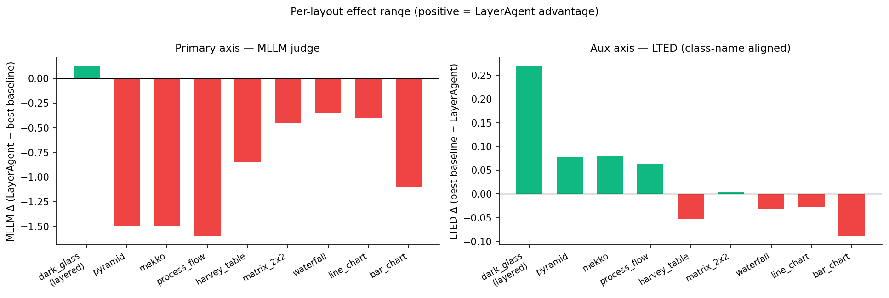
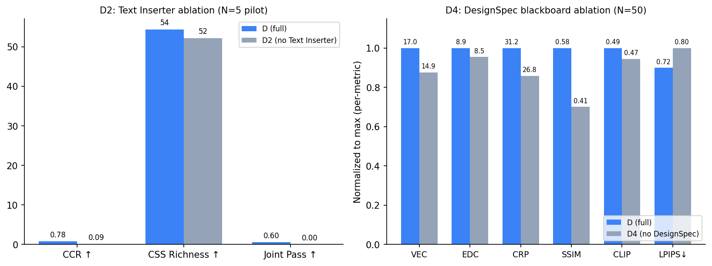
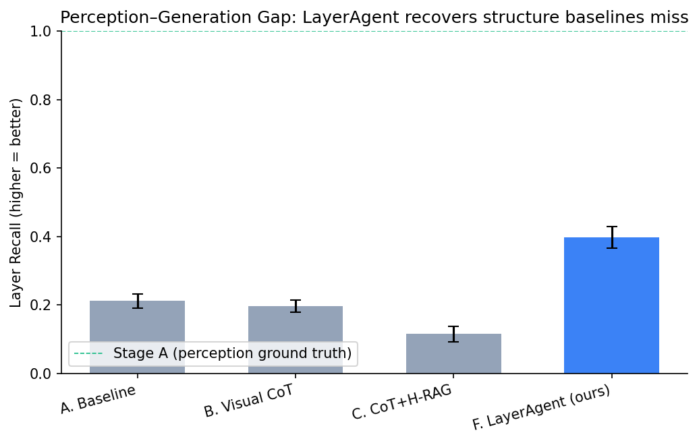
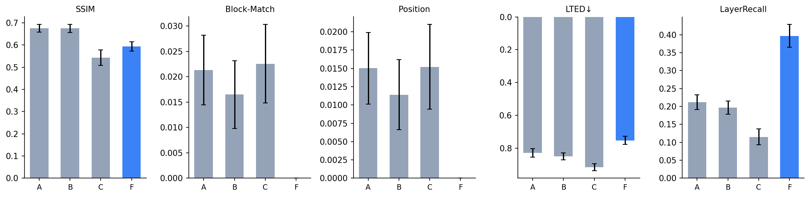

LayerAgent: 프레젠테이션 생성을 위한 멀티에이전트 프레임워크

디자인 이미지의 계층 구조 인식을 통한 프레젠테이션 코드 생성

by 정일균 (Ilgyun Jeong)

인공지능융합학과 (Department of Artificial Intelligence Convergence)

지도교수: 김현철 (under the supervision of Professor Hyeoncheol Kim)

---

초록

프레젠테이션 슬라이드는 배경·카드·콘텐츠·아이콘 등 여러 시각 층이 위아래로 겹쳐 구성되는 계층적 시각 구조다. 본 연구는 GPT-4o가 슬라이드 이미지를 자연어로는 5–8개 레이어로 기술하면서 같은 이미지를 HTML로 변환할 때는 평균 1.6개만 코드에 반영하는 perception–generation 격차를 관찰하고, 이를 슬라이드 도메인의 계층적 element omission 현상으로 정식화한다. 이를 다루기 위해 단일 VLM 호출을 8개 전문 에이전트의 layer 단위 분해로 재구성하는 multi-agent framework LayerAgent를 제안한다.

평가 결과는 두 방향으로 엇갈린다. 동일 GPT-4o 조건에서 LayerAgent는 DOM 구조 지표(VEC, EDC, VLC, CRP, HD)를 일괄 생성 대비 1.6–2.6배 개선하지만, MLLM judge로 측정한 종합적 발표 품질은 일괄 생성이 평균적으로 우세하다 (3.37 vs 2.65, N=50 4-criteria 평균). LayerAgent의 holistic 우위는 다층 시각 효과 디자인 조건(N=10, dark_glass theme)에서만 관찰되며(MLLM Δ=+0.12), 이 subset은 §3.2 perception–generation 격차의 motivation을 만든 pilot 슬라이드와 동일하다는 한계를 가진다. Frontier 모델 일괄 생성(GPT-5.4)은 자동 지표 6개 모두와 비용에서 LayerAgent를 능가한다.

따라서 본 연구의 기여는 frontier 능가나 SOTA 경신이 아니라 다음 세 가지로 정리된다. (1) 슬라이드 도메인의 layer-level element omission 현상의 정식화, (2) DOM 구조, 시각 유사도, MLLM judge를 결합하여 동반 보고하는 다면적 평가 protocol 위에서 process-level 분해의 효과 범위와 한계 규명, (3) DesignSpec blackboard와 Text Inserter 두 architectural mechanism의 인과 효과 격리 측정. LayerAgent는 GPT-4o급 VLM에서 일괄 생성이 놓치는 계층 구조를 완성 품질이 아니라 편집 가능한 HTML/CSS 구조 차원에서 회복하는 process-level intervention이며, frontier scaling을 대체하지 않는다.

키워드: Element Omission, Layer Decomposition, Multi-Agent, Design-to-Code, Vision Language Models

---

제1장 서론

제1절 슬라이드는 계층이다, 그러나 VLM은 평면이다

프레젠테이션 슬라이드는 배경·카드·차트·텍스트·아이콘 등 여러 시각 층이 위아래로 겹쳐 구성되는 계층적 시각 객체다. 본 연구의 평가셋은 모두 이러한 layered slide design으로 구성되며, 그중 visual-effect density가 높은 일부 슬라이드는 배경 그라디언트, 방사형 글로우, 장식 요소, 반투명 카드, shadow/border, z-index overlap 등이 더 높은 밀도로 나타난다. 즉 layered slide는 대체로 가장 아래에 배경(베이스 그라디언트와 패턴), 그 위로 분위기(방사형 글로우·그라디언트 오버레이), 장식 요소(도형·선·점), 카드·패널·히어로 블록, 콘텐츠 텍스트(제목·본문·수치), 그리고 가장 위에 아이콘과 배지가 놓이는 다층 구조를 가지며, 이 계층의 깊이와 밀도가 슬라이드별로 다르다.

이러한 시각 층들이 정확한 층 순서(stacking order)와 좌표로 겹쳐야 의도된 디자인이 구현된다. 그러나 단일 VLM 호출은 이 계층 구조를 충분히 반영하지 못한 채 HTML을 위에서 아래로 한 번에 생성한다 — `<div>` 태그가 직렬로 나열되고, 층의 명시적 순서 표기(CSS의 `z-index` 속성)는 거의 사용되지 않으며, 요소 간 공간 관계는 DOM 작성 순서에 암묵적으로 의존한다.

본 연구의 출발점은 다음의 관찰이다. 같은 GPT-4o에게 "이 이미지의 계층 구조를 설명하라"고 물으면 5–8개의 레이어를 자연어로 기술하지만, 같은 이미지를 "HTML로 변환하라"고 물으면 그 계층 구조의 상당 부분을 코드에 반영하지 못한다 (§3.2 표). 즉 같은 모델이 기술 단계에서는 다층 구조를 인식하면서도 코드 생성 단계에서는 그 대부분을 잃는다.

이러한 실패 양식은 본 연구의 사전 pilot 관찰(§3.2, N=10 다층 시각 효과 디자인)에서 반복적으로 확인된 패턴이다. 디자인 프롬프트가 배경, 장식 요소, 반투명 카드, 텍스트, 아이콘 등 여러 시각 계층과 복합 CSS 효과를 명시적으로 요구하더라도, 단일 VLM 호출의 HTML 출력은 일부 계층을 생략하고 단색 배경과 평면 카드의 단순 구조로 회귀하며, perception이 보장한 5–8 layer 중 평균 1.6개만 HTML/CSS 구조에 반영된다. 본 논문의 모든 경험적 주장은 §5에서 기술하는 통제 실험 결과에 한정해 보고한다.

본 논문은 이 현상을 (계층적) element omission이라고 부른다 — Design-to-Code 선행 연구에서 개별 요소 단위로 보고된 element omission이, 슬라이드 도메인에서는 시각 계층(layer) 단위로 통째 누락되는 형태로 확장되어 나타난다. 이는 메트릭 이름이 아니라 현상의 이름이며, 인식된 시각 계층·스타일 정보가 코드 생성 결과에서 충분히 구현되지 않는 현상을 가리킨다.

본 연구는 이 현상을 직접 측정하는 단일 신규 메트릭을 제안하지 않는다 — 메트릭 이름이 곧 현상 이름이 되면 측정이 순환적(circular)이 되기 때문이다. 대신 DOM 구조 지표 · 렌더링 결과의 시각 유사도 · 멀티모달 LLM의 종합 판단의 세 축을 함께 보고하는 평가 protocol을 사용하며, 그 이유와 자세한 정의는 §3.1·§5.3에서 다룬다.

제2절 하나의 지표로는 Design-to-Code 품질을 결정할 수 없다

Design-to-Code 분야에서 흔히 쓰이는 SSIM·CLIP·Block-Match·element-IoU는 모두 픽셀이나 요소 위치가 얼마나 비슷한가만 본다 — 즉 슬라이드의 계층 구조가 코드에 잘 보존됐는지와는 직접 관련이 없다. 한편 코드의 class 이름을 매칭하는 측정(Layer Recall, LTED 등)은 layer 보존을 직접 표적하지만 측정 도구가 미리 정해 둔 어휘에 치우치는 편향을 가지며, 디자인의 전체적인 가독성·균형·완성도까지는 잡아내지 못한다.

본 연구는 동일한 데이터에서 세 종류의 평가 축 — (i) 렌더링 결과의 픽셀 유사도, (ii) DOM 구조 기반 측정, (iii) 멀티모달 LLM의 종합 판단 — 이 서로 다른 순위를 산출함을 관찰한다 (구체 수치는 §6.5). 어느 하나도 "전체 진실"이 아니며, 각 축은 서로 다른 사용 목적에 맞춰져 있다 — 픽셀 그대로 복제, 편집 가능한 구조 회복, 발표 가능한 슬라이드 품질. 본 연구는 이 불일치를 결함이 아니라 multi-objective 평가의 본질로 받아들이고, Design-to-Code 평가에서 단일 지표보다 여러 축의 동반 보고가 필요함을 제안한다.

제3절 해법: 생성을 계층 단위로 분해하기

Element omission이 한 번의 호출 안에서 구조·스타일·콘텐츠가 제한된 출력 용량을 두고 동시에 경쟁하기 때문에 일어난다고 본다면 (가설, §7.1), 자연스러운 해법은 생성 과정을 계층 단위로 분해하여 각 호출이 한 가지 책임만 지도록 만드는 것이다. 그러나 단순히 나누기만 하면 새로운 종류의 실패가 등장한다 — 카드별로 투명도와 그림자가 제각각이거나(스타일 어긋남), 카드와 텍스트의 좌표가 맞지 않거나(공간 충돌), 아이콘이 환각된 URL로 깨지는(자산 부재) 문제다.

본 연구의 LayerAgent는 이 모든 실패를 전체 이미지 분석 → 공유 디자인 명세 작성 → 8개 전문 에이전트의 병렬 레이어 생성 → 결정적 조립 → 카드 간 스타일 통일 → 텍스트 주입의 다단계 파이프라인으로 함께 다룬다 (각 단계의 자세한 구조와 역할은 §4). 본 시스템은 다섯 가지 mechanism으로 구성된다 — vision-grounded specialist (각 에이전트가 자신이 맡은 영역만 직접 본다), DesignSpec blackboard (공유 디자인 명세를 통한 cross-agent 스타일 통일), Text Inserter (시각 디자인 확정 후 텍스트 주입으로 시각과 콘텐츠 단계 분리), CV grounding (k-means 팔레트와 OCR 텍스트 높이 같은 결정적 시각 측정값으로 색과 크기의 환각 감소), library retrieval (아이콘과 도형의 환각된 자산 URL 차단). 본 논문은 이 중 DesignSpec blackboard와 Text Inserter 두 mechanism의 인과 효과를 격리 측정하고 (§6.6), 나머지는 통합 시스템의 architectural choice로 포함한다.

통합 시스템은 동일 GPT-4o 단일 호출 대비 자동 지표 8개 중 7개에서 우위를 보였다 (§6.1). 격리 측정 결과는 다음과 같다(§6.6). DesignSpec 제거 시 N=50 다면적 평가 자동 지표 8개 중 7개가 악화되었으며(특히 SSIM −0.174, LPIPS +0.080, CRP −4.4), 이는 cross-agent 시각 일관성 보존 효과를 직접 확인시킨다. Text Inserter 제거 시 콘텐츠 보존율이 0.78에서 0.09로 감소하여(CCR Δ=0.69), 시각과 콘텐츠 단계 분리의 효과가 확인되었다.

제4절 연구 질문과 기여

본 연구는 세 개의 연구 질문으로 정식화된다. 각 질문은 본 연구의 dataset이 직접 지지하는 경험적 주장에 한정된다. Frontier 모델 일괄 생성과의 비교는 별도의 연구 질문이 아니라 적용 범위의 경계를 명시하는 보조 분석으로 §6.2 (Boundary Analysis)와 부록 C에서 별도 보고하며, 본 연구의 주된 비교 대상은 동일 GPT-4o 조건의 생성 방식들이다.

- RQ1 (현상 — 계층 반영 격차): GPT-4o 기반 일괄 생성은 perception 단계에서 기술된 5–8개의 시각 계층 중 어느 정도를 HTML/CSS 생성 단계에서 반영하지 못하는가? — §3.2·§3.3에서 답한다 (class name이나 사전 정의 layer label에 의존하지 않는 단순 layer 수 측정, 즉 명명 규칙 비의존(class-name-independent) n_layers 기준에서 일괄 생성은 평균 1.6개 layer만 반영).
- RQ2 (방법 — 동일 모델 분해 효과): 동일 모델 조건(same-model, 즉 모든 비교 메서드가 같은 GPT-4o를 사용하는 조건)에서, LayerAgent의 계층 분해 생성은 본 연구의 layered slide dataset 전반에서 편집 가능한 HTML/CSS 구조 지표를 개선하는가? — §6.1 Table 1로 답한다. 단, 종합적 발표 품질 차원은 RQ3의 평가 축 간 불일치 분석에서 별도 해석한다.
- RQ3 (적용 범위와 평가 해석): LayerAgent의 효과는 어떤 layout 조건에서 유지되며, 자동 구조·시각 지표와 MLLM judge는 이 효과를 어떻게 다르게 평가하는가? — §6.4–§6.5의 레이아웃 유형별 분석과 평가 축 불일치 분석으로 답한다.

위 연구 질문에 대응하는 본 논문의 기여는 문제, 방법, 평가·발견의 세 가지로 정리된다.

1. Problem — 슬라이드 도메인의 계층적 element omission 정식화. Design-to-Code 선행 연구에서 개별 요소 단위로 보고된 element omission이 슬라이드 도메인에서는 시각 계층(layer) 단위로 통째 누락되는 형태로 나타나는 현상을 정식화한다 (§3). 이는 현상의 이름이며, 메커니즘은 생성 단계의 capacity allocation 문제로 가설화된다 (§7.1, 가설 수준).

2. Method — LayerAgent framework. DesignSpec blackboard + vision-grounded specialists + style normalization + text insertion 분리를 포함한 multi-agent layer decomposition 프레임워크 (§4). 본 논문은 DesignSpec blackboard (D₄, N=50 다면적 평가에서 8개 지표 중 7개 악화)와 Text Inserter (D₂, CCR Δ=0.69) 두 mechanism의 인과 효과를 격리 측정한다 (§6.6).

3. Evaluation & Finding — 다면적 평가를 통한 효과 범위 규명. Method-specific class name이나 사전 정의된 layer vocabulary에 의존하지 않는 평가 protocol을 구성하고 (DOM 구조 지표 + render-based 시각 유사도 + multimodal LLM-as-judge의 결합·정렬, §5.3), 그 위에서 LayerAgent의 효과 범위를 측정했다. 그 결과 LayerAgent는 same-model GPT-4o 조건에서 본 연구의 layered slide dataset 전반에서 DOM 구조 지표를 일관되게 개선했으며, 이 구조적 개선은 visual-effect density가 높은 subset에서 render-based 시각 유사도 개선으로도 확장되었다. 다만 종합적 발표 품질(MLLM judge) 차원과 frontier 모델 일괄 생성(GPT-5.4·Claude 4.6 Opus)과의 비교에서는 우세가 관찰되지 않으며 (§6.2 Boundary Analysis), 본 연구의 기여는 완성 슬라이드 품질의 전면적 향상이 아니라 편집 가능한 HTML/CSS 계층 구조 복원으로 한정된다.

---

제2장 관련 연구

제1절 Design-to-Code 생성

Design2Code (Si et al., 2024)는 484 웹페이지 벤치마크로 GPT-4V의 중간 충실도를 보고했다. WebSight (Laurençon et al., 2024)는 200만 합성 image-code pair를 공개했다. Calò & De Russis (PACMHCI 2025)는 GPT-4o의 UI 코드 생성 실패를 element omission · element distortion · element misarrangement의 세 유형으로 분류했다 — 본 연구는 이 중 element omission을 슬라이드 도메인의 시각 계층 단위로 확장하여 분석한다 (§3.1). DCGen (FSE 2025)은 분할 정복으로 페이지를 블록 단위로 분해해 코드를 생성한다. LaTCoder (KDD 2025)는 코드 이전에 레이아웃을 chain-of-thought로 명시화한다. ScreenCoder (arXiv:2507.22827, 2025)는 Grounding → Planning → Generation의 3-stage agent 파이프라인을 채택하고 50K image-code pair로 GRPO 미세조정한다. DesignCoder (arXiv:2506.13663, 2025)는 모바일 UI 도메인에서 UI Grouping → Hierarchy-Aware Generation → post-render Self-Correcting Refinement의 3-stage를 사용한다. UIOrchestra (Findings of EMNLP 2025)는 multi-agent framework로 UI design에서 code로의 변환을 다루며 본 연구와 가장 가까운 선행 연구이다. 다만 LayerAgent의 DesignSpec blackboard, CV grounding, library retrieval을 통합한 구조와는 차별된다.

LayerAgent와의 차별점. ScreenCoder는 image patch reuse(Hungarian matching)로 cross-element 일관성을 다루고, DesignCoder는 post-render iterative refinement로 코드 품질을 다룬다. 본 연구의 Style Normalizer는 pre-render CSS 정규화에 해당하고, Text Inserter는 시각과 콘텐츠 단계의 분리에 해당하며, DesignSpec blackboard는 생성 시점의 cross-agent 스타일 통일에 해당한다. 기존 design-to-code 평가는 주로 단일 metric 또는 분류된 metric 그룹을 보고했으며, 본 연구는 슬라이드 도메인에서 DOM 구조, render 기반 시각 유사도, multimodal LLM-as-judge를 결합하여 동반 보고하는 다면적 평가 방식을 적용한다는 점에서 차별화된다.

제2절 시각 교정 / 반복 개선

VisRefiner (arXiv:2602.05998, 2026)는 렌더링 결과와 참조 디자인 간 시각 차이를 학습하여 GPT-4o 대비 Block Match +21.5pt를 달성했다. Vision-Guided Iterative Refinement (arXiv:2604.05839, 2026)는 VLM critic 기반 3회 반복으로 17.8% 개선을 보고했다. 본 연구의 Visual Critic stage는 이들의 반복 vs 단발 트레이드오프를 ablation 플래그(`use_visual_critic`)로 노출한다.

제3절 프레젠테이션 생성

PPTAgent (Zheng et al., EMNLP 2025)는 LLM 피드백 기반 템플릿 반복 수정을, PreGenie (Xu et al., EMNLP Findings 2025)는 코드 리뷰와 페이지 리뷰의 이중 루프를, SlideCoder (Tang et al., EMNLP 2025)는 CGSeg 세그멘테이션과 계층적 RAG를, AutoPresent (Ge et al., CVPR 2025)는 구조화된 시각 설계 원칙을 강조했다. 이들 선행 연구는 주로 템플릿 수정, 코드 리뷰, 세그멘테이션 기반 생성, 구조화된 설계 원칙에 초점을 두었다. 반면 본 연구는 슬라이드의 시각 계층이 HTML/CSS 생성 단계에서 누락되는 현상에 초점을 맞추고, 이를 계층 단위 생성 분해와 다면적 평가의 동반 보고(DOM 구조, render 기반 시각 유사도, multimodal LLM-as-judge)로 분석한다는 점에서 차별화된다.

제4절 멀티에이전트 코드 생성

MetaGPT (Hong et al., ICLR 2024), ChatDev (Qian et al., ACL 2024), CAMEL (Li et al., NeurIPS 2023), AutoGen (Wu et al., COLM 2024)은 소프트웨어 개발 프로세스(설계, 구현, 테스트의 순서) 또는 대화형 multi-agent conversation으로 agent를 분담한다. LayerAgent는 (a) 개발 프로세스가 아니라 출력의 시각 계층(layer) 구조(배경, 카드, 텍스트, 아이콘의 순서)에 따라 분담하며, (b) agent 간 통신을 자연어나 코드가 아니라 DesignSpec JSON과 bounding box JSON으로 구성된 typed blackboard로 수행하여 truncation과 해석 오류를 구조적으로 제거한다.

제5절 Design-to-Code 평가

기존 평가는 전역 유사도(CLIP, SSIM), 구조 매칭(Design2Code의 Block-Match, SlidesBench의 element-matching), 속성 수준(WebRenderBench의 SDA, Widget2Code의 per-property)으로 분류된다. DreamHouse (arXiv:2603.24866, 2026)는 physical generative reasoning(건축 구조물 생성) 도메인에서 structural validity와 visual fidelity가 직교적이며 frontier VLM의 joint pass rate가 7.1%에 불과함을 보였으며, 본 연구는 이 orthogonality finding을 슬라이드 도메인으로 평행하게 적용한다. SlideAudit (UIST 2025)은 슬라이드 quality taxonomy를 정립하고 automated metric과 holistic human judgment 사이의 systematic disagreement를 정량적으로 보였으며, 이는 본 연구의 §6.5 평가 축 간 불일치 관찰과 직접 정렬되는 선행 연구이다. WebDevJudge (2025)는 design-to-code에서 MLLM-as-judge의 best practice(pairwise 평가와 code·visual modality 결합)를 정립했으며, 본 논문은 이를 §8의 single-judge limitation 논의에서 표준 reference로 인용한다. 본 연구는 (a) DreamHouse와 SlideAudit 두 도메인의 metric disagreement 발견을 슬라이드 design-to-code 도메인의 다면적 평가로 확장하고, (b) 기존 render-based 및 DOM-based 평가를 결합하여 class-name-independent하게 정렬한 protocol을 구성함으로써 메서드별 명명 규칙에 따른 평가 편향을 줄인다.

---

제3장 슬라이드 도메인 element omission의 측정

제1절 Element omission의 정의 — 현상과 측정의 분리

Element omission은 현상의 이름이다. Design-to-Code 선행 연구(Calò & De Russis, 2025)는 GPT-4o의 UI 코드 생성에서 개별 요소가 누락되는 현상을 element omission으로 보고했다. 본 연구는 기존 element omission을 대체하는 새 용어를 제안하는 것이 아니라, 슬라이드 도메인에서 element omission이 layer-level omission으로 관찰되는 특수한 양상을 분석한다. 슬라이드는 배경·카드·콘텐츠·아이콘 등 시각 계층(layer) 단위로 구조화되므로, element omission이 layer 단위로 통째 누락되는 형태로 발현된다. 즉 인식된 시각 계층과 스타일 정보가 코드 생성 결과에서 충분히 구현되지 않는 현상이며, 본 논문은 이를 element omission의 별도 실패 카테고리가 아니라 슬라이드 도메인에서 나타나는 특수한 발현 양상으로 다룬다.

본 연구는 element omission을 직접 표적하는 단일 신규 메트릭을 제안하지 않는다 — 메트릭 이름이 곧 현상의 이름이 되면 측정이 순환적이 되기 때문이다. 대신 element omission의 정도를 DOM 구조 지표, 렌더링 유사도, 멀티모달 LLM 판단의 세 평가 축으로 구성된 다면적 평가 방식으로 측정하며, 각 축은 element omission의 서로 다른 측면을 본다. 콘텐츠 보존 여부는 보조 지표인 CCR로 함께 확인한다.

Main 측정 — 다면적 평가 방식 (§5.3):

(i) DOM-based structural metrics (`experiments/metrics/dom_structure.py`): Playwright로 렌더링한 DOM에 JS injection을 적용하여 모든 가시 element의 computed style과 bounding box를 추출한다. Class name과 무관하므로 메서드별 명명 규칙에 따른 평가 편향이 없다. 측정 항목은 styled element 수(VEC), distinct style fingerprint 수(EDC), distinct effective z-band 수(VLC), rich CSS property 총 사용 횟수(CRP), DOM nesting depth(HD), spatial coverage(SC)이다. 약어 표기는 본 연구의 측정 convention이며, 모두 element와 style 카운트의 변형이다.

(ii) Render-based visual similarity (`experiments/metrics/visual_similarity.py`): SSIM (skimage), CLIP (open_clip ViT-B/32), LPIPS (AlexNet)을 사용하며, 모두 기존 표준 메트릭이다.

(iii) Multimodal LLM-as-judge (`experiments/metrics/single_method_judge.py`): GPT-5.4 (Azure)에 reference image, generated PNG, generated HTML 일부를 함께 제공하고 4개 기준(Visual Fidelity, Layer Structure, Content Completeness, Design Quality)에 대해 1–7점으로 채점한다.

세 축은 각각 코드 구조 풍부성 / 픽셀-퍼셉추얼 충실도 / 발표 가능성이라는 다른 차원을 본다 (§6.5 metric taxonomy).

보조 metric (class-name-aligned):

본 연구는 perception tree $T_P$와 generation tree $T_G$를 (z-band, type) multiset으로 환원하여 Layer Recall = $|\mathrm{types}(T_P) \cap \mathrm{types}(T_G)| / |\mathrm{types}(T_P)|$와 LTED = $\sum_k |m_P(k) - m_G(k)| / (\sum_k m_P(k) + m_G(k))$를 보조 metric으로 정의한다 (`experiments/probing/layer_tree.py`). 다만 generation tree 파싱이 class name regex에 의존하고 정규식이 LayerAgent의 class name (`card-wrap`, `bg-base`, `atmos`, `decor`)에 정렬되어 있어, Claude Opus의 `glass-card`나 `node-inner` 등 다른 어휘로 작성된 시각적으로 풍부한 element는 매칭되지 않아 거짓 negative로 보고된다. 이러한 클래스명 편향 위험으로 본 metric은 §3.2의 현상 가시화와 부록 B·§6.3의 robustness 진단(prompt 변형이 명명 규칙과 무관함을 활용한 sanity check)에 한정해 사용하며, main claim에는 사용하지 않는다.

제2절 Element omission의 가시화 — 1차 진단

본 절은 element omission 현상을 가시화하는 1차 진단을 보고한다. 가장 신뢰할 수 있는 직접 증거는 다음과 같다. VLM이 같은 이미지에 대해 perception 단계에서는 평균 5–8개의 layer를 자연어로 기술하지만, code generation 단계에서는 0–4개의 layer만 HTML/CSS 구조에 반영한다. 이 layer 개수의 격차는 어떤 class name 어휘에도 의존하지 않는 단순 카운트이므로, element omission 현상이 실재한다는 사실 자체에 대해 가장 안정적인 근거를 제공한다.

| 단계 (probing_minimal pilot, N=10 다층 시각 효과 디자인, GPT-4o) | `n_layers` 평균 (명명 규칙 비의존) |
|---|:---:|
| Stage A perception (자연어로 layer 기술) | 5–8 |
| Stage B1 일괄 생성 (이미지 → HTML) | 0–4 |
| Stage B2 LayerAgent (이미지 → HTML) | 5–10 |

즉 일괄 생성에서 perception이 보장한 5–8 layer 중 평균 1.6개만 HTML/CSS 구조에 반영되며, LayerAgent에서 평균 5.4개로 회복된다 (`experiments/probing/probing_minimal.py`). 이 격차의 양상은 다층 시각 효과 디자인 subset에서 두드러지고 평면 차트 layout에서 약화되며, 정량적 결과는 §6.4의 layout-dependent 효과 범위에서 다면적 평가 지표로 다시 보고된다.

본 절은 이 격차를 Layer Recall과 LTED 같은 class-name-aligned 메트릭으로도 정량화한다. 다만 이 메트릭들은 LayerAgent class name 어휘에 정렬된 regex에 의존하므로, 동일한 시각 구조를 구현하더라도 다른 class 이름을 사용하는 출력은 layer로 인식되지 않아 거짓 negative로 보고되는 클래스명 편향(class-name bias) 위험을 가진다 (§3.1, §8 한계). 본 논문은 element omission의 정량 main result를 §6.1 Table 1의 다면적 평가 지표로 보고하며, 본 절의 명명 규칙 정렬 수치(N=10 pilot, N=50 main_eval, Figure 1)는 현상 가시화의 보조 자료로 부록 B에 수록한다.

핵심 발견 — Pattern injection의 zero-sum (H-RAG 역설). 패턴 주입 생성(`cot_h_rag`, 복합 CSS 효과 레시피 RAG 주입)은 N=5 pilot 측정에서 CSS Richness 2.8 → 10.3으로 상승하는 동시에 string-CCR이 0.80 → 0.26으로 감소한다 — 텍스트 약 74%가 코드에서 사라진다. 이 zero-sum은 콘텐츠 보존 측정(CCR, 명명 규칙과 무관)에서 직접 관찰되며, 단일 VLM의 자기회귀 토큰 예산이 시각 표현과 텍스트 사이에서 경쟁한다는 메커니즘 가설(§7.1)에 부합한다. LayerAgent의 D₂ ablation(§6.6)은 이 zero-sum이 단계 분리로 줄어들 수 있음을 시사한다.

제3절 Cross-VLM probing

§3.2의 perception–generation 격차가 GPT-4o에 한정된 인공물인지를 검증하기 위해 10 다층 시각 효과 디자인 × 3 frontier VLM (GPT-4o, GPT-5.4, Claude 4.6 Opus) × 일괄 생성의 cross-VLM probing을 수행했다 (`experiments/probing/cross_vlm_frontier.py`). 측정은 §3.1의 보조 metric (class-name regex 기반) 위에서 수행되므로 frontier 간 baseline 비교에 한정 해석한다.

세 frontier 모두 baseline gap이 0.69–0.78 범위에 있어 frontier model upgrade만으로 layer 반영 격차가 크게 닫히지 않는다. 자세한 수치는 부록 B에 보고한다. LayerAgent와 frontier의 공정 비교는 §6.2의 다면적 평가 결과를 우선하며, 그곳에서 GPT-5.4가 LayerAgent를 능가한다.

---

제4장 LayerAgent 프레임워크

제1절 전체 구조

```
                    ┌──────────────────────┐
                    │      Analyzer        │  전체 이미지 → 레이아웃 + bbox
                    └──────────┬───────────┘
                               ▼
                    ┌──────────────────────┐
                    │   Design Director    │  + CV facts → DesignSpec (blackboard)
                    └──────────┬───────────┘
        ┌──────────┬───────────┼───────────┬──────────┬────────┬───────┐
        ▼          ▼           ▼           ▼          ▼        ▼       ▼
   ┌─────────┐┌─────────┐┌─────────┐┌─────────┐┌─────────┐┌──────┐┌──────┐
   │Base BG  ││Atmosph. ││Decorat. ││ Card    ││ Hero    ││ Icon ││Chart/│
   │(vision, ││(vision, ││(vision, ││ Detail  ││ Detail  ││Agent ││Table │
   │ full)   ││ full)   ││ full)   ││ ×N(crop)││ ×N(crop)││(libr)││Agent │
   └─────┬───┘└─────┬───┘└─────┬───┘└─────┬───┘└─────┬───┘└──┬───┘└──┬───┘
         └──────────┴───────────┴───────────┴──────────┴───────┴──────┘
                                         ▼
                              ┌──────────────────┐
                              │    Assembler     │  z-index stacking
                              └─────────┬────────┘
                                        ▼
                              ┌──────────────────┐
                              │ Style Normalizer │  cross-card CSS 통일
                              └─────────┬────────┘
                                        ▼
                              ┌──────────────────┐
                              │  Text Inserter   │  완성 시각 → 콘텐츠 주입
                              └─────────┬────────┘
                                        ▼
                              ┌──────────────────┐
                              │ Overflow Repair  │  (옵션, 측정 기반 미세조정)
                              └─────────┬────────┘
                                        ▼
                              ┌──────────────────┐
                              │  Visual Critic   │  (옵션, Playwright diff)
                              └──────────────────┘
```

전체 파이프라인은 LangGraph v1.0 StateGraph로 구현되었으며(`layeragent/pipeline.py`), 8개 specialist는 Design Director의 출력 이후 병렬로 실행된다.

제2절 Analyzer (Stage 0)

전체 이미지를 입력받아 (a) 레이아웃 유형(`timeline / dashboard / hub_spoke / pyramid / grid / split / vertical_stack / freeform`)과 (b) 각 카드·히어로·장식 요소의 정규화된 bounding box(0–1 비율)를 출력한다. 이 출력은 이후 모든 crop과 배치(placement)의 기준점이 된다.

제3절 Design Director — DesignSpec Blackboard

전체 이미지와 CV facts(k-means palette, OCR 텍스트 높이 분포, HSV 채도)를 입력받아 typed JSON `DesignSpec`을 출력한다.

```json
{
  "aesthetic_label": "multi_layer_visual_effect",
  "typography": {"hero_family": "Inter", "hero_weight": 800,
                 "body_family": "Inter", "body_weight": 500, ...},
  "palette": {"bg_primary": "#0A1530", "accent": "#3B82F6",
              "frame_color": "rgba(255,255,255,0.15)",
              "text_bright": "#F5F5F0", ...},
  "frame_system": {"hero_frame": "subtle glass frame",
                   "card_frame": "1px rgba white border",
                   "bottom_accent_bar": false},
  "decorative_motif": {"style": "minimal", "density": "sparse", ...},
  "atmosphere": {"has_radial_glow": true, "glow_origin": "top_center",
                 "background_depth": "deep", ...}
}
```

이후 모든 specialist는 DesignSpec을 prompt hint로 받는다(`spec_to_hint`, `layeragent/agents/design_director.py:55`). 결과적으로 카드 A의 반투명 효과가 카드 B에서 단색으로 변하는 스타일 표류가 사전적으로 차단된다 — 이는 단순한 분해 접근에서 자주 관찰되는 실패 양식이다.

CV grounding의 효과. 팔레트는 k-means(k=6)로 추출되어 모델이 색을 환각할 여지를 줄이고, OCR 텍스트 높이는 폰트 크기 결정의 결정적 기준점이 되며, HSV 채도는 flat과 vivid 미학을 구분하는 단서로 작용한다. 이 효과는 `no_cv_facts` 플래그로 격리해 측정할 수 있다.

제4절 Specialist Agents (Stage 1, 병렬)

- Base BG · Atmosphere · Decoration: 전체 이미지와 DesignSpec을 입력받아 배경 그라디언트, radial glow, decoration shape를 분리된 layer로 생성한다. 이러한 분리는 분위기와 패턴이 같은 z=0 안에서 충돌하지 않도록 보장한다.
- Card Detail × N: 각 카드의 crop 이미지(주변 패딩 포함)와 DesignSpec을 입력받아 카드별로 풍부한 CSS 효과(`backdrop-filter`, 다중 `box-shadow`, rgba 투명도, 테두리 효과)를 생성한다. 좁은 시각 범위가 선택적 CSS 재질(반투명, blur, gradient 등)을 회복시킨다 — 통제 실험에서 같은 GPT-4o가 전체 이미지에서는 카드당 CSS 효과 2.8개를, crop에서는 6–8개를 생성한다.
- Hero Detail × N: 히어로 블록(큰 숫자, 메인 메시지, 특수 그래픽)을 crop 단위로 별도 처리한다.
- Icon Agent: 카드별 의미 분석 → FontAwesome 클래스 검색 → 실제 `<i class="fa-...">` 태그 주입의 순서로 동작하며, 환각된 아이콘 URL을 구조적으로 차단한다 (`layeragent/libraries/icon_library.py`).
- Chart Agent · Table Agent: 슬라이드 타입이 차트나 테이블일 때 SVG primitive로 sparkline, bar, gauge, harvey table을 결정적으로 생성한다.

제5절 Assembler

8개 specialist의 HTML 단편을 z-index band([0, 5, 10, 20, 30, 40])로 결정적으로 쌓는다. 단순 concat이 아니라 절대 좌표(Analyzer의 bbox 정규화 비율 × 1280×720)와 z-index를 명시적으로 부착한다.

제6절 Style Normalizer (Stage 2)

조립된 HTML을 텍스트 입력만 받아 카드 간 CSS 속성을 통일한다 (`layeragent/agents/style_normalizer.py`):

- 배경 rgba alpha — 모든 카드 동일값
- 테두리 색상/두께 — 통일
- border-radius — 통일
- box-shadow — 통일
- backdrop-filter blur — 통일

불변 보장: position, left, top, width, height, z-index은 변경하지 않는다. 이미지 입력 없이 코드만 보는 텍스트 전용 agent로, 각 카드의 독립 생성에서 발생한 표류를 사후 동기화한다. 이 효과는 `no_style_norm` 플래그로 격리해 측정할 수 있다.

A2UI Protocol (Google, 2026)이 client-side renderer로 design-system을 강제하는 것과 동일한 설계 원리를 VLM 파이프라인 내부에서 실현한 것이다.

제7절 Text Inserter (Stage 3)

완전히 스타일링된 HTML(배경, 카드, 정규화된 스타일)과 콘텐츠 데이터(제목, 설명, 메트릭, 리스트)를 입력받아, 기존 카드 구조 내의 빈 컨테이너를 식별하고 텍스트를 주입한다.

이 단계의 핵심은 시각 디자인을 먼저 확정한 뒤 텍스트를 주입한다는 순서에 있다. 단일 VLM에서 풍부한 CSS 생성과 정확한 텍스트 배치가 zero-sum 경쟁을 벌이는 현상(H-RAG에서 CSS Richness가 상승하지만 콘텐츠가 74% 손실되는 양상)이 단계 분리에 의해 구조적으로 해소된다. 이 효과는 `no_text_inserter` 플래그로 격리해 측정할 수 있다.

제8절 Overflow Repair (선택)

조립된 HTML을 Playwright로 렌더링한 뒤 측정한 bounding box overflow를 분석하여 폰트 크기, 패딩, 줄 수를 미세 조정한다. 시각 critic과 달리 결정적 측정에 기반하므로 LLM 호출이 필요 없다 (`layeragent/agents/overflow_repair.py`).

제9절 Visual Critic (선택)

Playwright 스크린샷과 원본 이미지를 비교한 뒤 VLM이 diff를 작성하고 CSS 속성 단위로 보정한다. iteration 비용이 크므로 기본값은 비활성화이다.

제10절 Chat Mode (인터랙티브 입력)

Chat Mode는 기존 데이터셋 spec 대신 자연어 메시지와 참조 이미지를 입력받는 진입점이다 (`run_from_chat`, `layeragent/pipeline.py:155`). chat_parser agent가 메시지를 `{slide_type, content, style}` 형식으로 구조화한 뒤 동일 파이프라인에 전달한다. 데모는 `python -m experiments.demo_chat`로 실행할 수 있다.

제11절 구현

본 논문은 LayerAgent의 두 mechanism — DesignSpec blackboard와 Text Inserter — 의 인과 효과를 격리 측정한다 (§6.6). 각 ablation은 해당 component를 noop으로 대체하는 방식으로 구성된다 (`no_designspec` flag → D₄, `no_text_inserter` flag → D₂).

모든 실험은 GPT-4o-2024-08-06, LangGraph 1.0.5, Playwright 1.58 환경에서 수행되었다. 코드와 단위 테스트는 `layeragent/ablations.py`와 `tests/test_smoke.py`에 있다.

---

제5장 실험 설정

제1절 데이터 — Layered slide design 평가셋

본 연구의 평가셋은 50개의 layered slide design으로 구성되며, 두 그룹으로 나뉜다.

(a) 다층 시각 효과 디자인 그룹 (N=10, theme=dark_glass): 10개의 서로 다른 layout (timeline, dashboard, comparison_split, pyramid, hub_spoke, before_after, feature_grid, roadmap, layered_stack, stats_hero)에 glassmorphism dark theme이 일관되게 적용된 슬라이드들이다 (`design_01_timeline` ~ `design_10_stats_hero`). 배경 glow, 장식 요소, 반투명 카드, shadow와 border, z-index overlap 등 복합 CSS 효과가 다른 그룹보다 높은 밀도로 포함된다. 즉 본 연구에서 "다층 시각 효과 디자인"이라 칭하는 것은 layout type이 아니라 dark_glass theme과 높은 visual-effect density로 정의되는 시각적 특성이다.

(b) 차트·다이어그램 그룹 (N=40): 8개 layout (mekko, matrix_2x2, waterfall, harvey_table, bar_chart, line_chart, process_flow, pyramid)에 5종 비즈니스 컨설팅 스타일(minimal_white, editorial_warm, bain_red, bcg_green, mckinsey_blue)을 적용한 슬라이드로, visual-effect density가 상대적으로 낮다.

모든 슬라이드는 Gemini 3 Pro Image Preview로 생성됐다 (`data/eval_dataset/meta.json`). 본 연구는 전체 dataset에서 LayerAgent의 구조 복원 효과를 평가하며, layout/theme 그룹에 따른 효과 변화는 §6.4 per-layout breakdown에서 보고한다.

데이터 overlap 명시. §3.2 perception–generation 격차의 motivation을 만든 N=10 pilot 슬라이드는 (a) 그룹의 N=10과 동일하다 (`design_01_timeline` ~ `design_10_stats_hero`, `experiments/probing/probing_minimal.py`). 따라서 §6.4의 다층 시각 효과 디자인 subset 결과는 §3.2와 동일한 슬라이드 위에서 측정되며, motivation과 검증이 같은 데이터 위에서 일어난다는 caveat 하에 해석되어야 한다 (§8 한계).

제2절 비교 메서드

| code | 메서드 (논문 표시) | 접근 |
|---|---|---|
| A | 일괄 생성 (`single_pass`) | 단일 GPT-4o 호출로 전체 이미지 → HTML |
| B | 시각 분석 생성 (`visual_cot`) | 시각 분석을 자연어로 먼저 수행한 뒤 코드 생성 (2단계) |
| C | 패턴 주입 생성 (`cot_h_rag`) | 시각 분석 + CSS 효과 패턴 레시피(RAG)를 함께 제공해 코드 생성 |
| D | LayerAgent (`layeragent`) | 본 연구 — 계층 단위로 생성 책임을 분해하는 multi-agent full pipeline |

모든 메서드에 동일한 콘텐츠 데이터, 동일한 모델(gpt-4o-2024-08-06), 동일한 시드(seed=0)를 제공한다.

제3절 평가 방식 — 다면적 평가

본 논문은 main result를 다면적 평가 지표 — DOM 구조, 렌더링 기반 시각 유사도, 멀티모달 LLM 판단 — 위에서 보고한다. 본 평가 protocol의 신규성은 새로운 단일 metric의 발명이 아니라, 세 축을 class-name-independent하게 결합·동반 보고하여 메서드별 명명 규칙에 따른 평가 편향을 줄이는 구성에 있다. Layer Recall과 LTED는 §3.1에 정리한 클래스명 편향 위험으로 인해 보조 metric으로 분류되어 §3.2 (현상 가시화)와 부록 B·§6.3·§6.4 (sanity check)에 한정해 사용된다. 평가 protocol은 4개의 main 축과 1개의 보조 축으로 구성된다.

축 ① DOM-based Structural Metrics (`experiments/metrics/dom_structure.py`):

Playwright로 렌더링한 DOM에 JS injection을 적용하여 모든 가시 element의 computed style과 bounding box를 추출한다. Class name이나 사전 정의된 layer label에 의존하지 않으며 모든 메서드에 동일하게 적용된다(즉 method-agnostic). 측정 항목은 다음과 같으며, 모두 element와 style 카운트의 변형이다. 아래의 약어 표기는 본 연구의 측정 convention이다.

- 비자명 styling(배경/테두리/그림자/filter)을 가진 가시 element 수 — VEC
- distinct style fingerprint `(bg, border, radius, shadow, backdrop, opacity)` 튜플의 가짓수 — EDC
- distinct effective-z band 수 (explicit z-index OR DOM depth band) — VLC
- backdrop-filter, multi-shadow, gradient, transform, opacity<1, border-radius 등 rich CSS property의 총 사용 횟수 — CRP
- 가시 element 중 max DOM nesting depth — HD
- 슬라이드 영역 중 가시 element가 차지하는 면적 비율 — SC

축 ② Render-based Visual Similarity (`experiments/metrics/visual_similarity.py`):

- SSIM ↑ — local window 기반 픽셀 구조 유사도 (skimage)
- CLIP ↑ — open_clip ViT-B/32 image embedding cosine similarity (semantic-level, AutoPresent/Design2Code/SlideCoder 표준)
- LPIPS ↓ — AlexNet deep feature 거리 (perceptual-level, Zhang et al. CVPR 2018)
- Block-Match, Position (OCR-based): 다크 배경, 한국어, blur가 결합된 본 도메인에서 모든 메서드의 점수가 0에 수렴하므로 도메인 미지원으로 처리하여 보고하지 않는다.

축 ③ Multimodal LLM-as-Judge (`experiments/metrics/single_method_judge.py`):

Judge 모델로 GPT-5.4 (Azure)를 사용한다. Generator(GPT-4o)와 다른 모델 계열을 사용함으로써 self-evaluation bias를 차단한다 (Zheng et al., 2023). Judge에게는 reference image, generated PNG, generated HTML의 처음 3,000자를 함께 제공하며(tool-grounded; WebDevJudge 2025의 code와 visual modality 결합 권고를 따름), 4개의 기준에 대해 각각 1–7점으로 채점한다.
- Visual Fidelity (VF), Layer Structure (LS), Content Completeness (CC), Design Quality (DQ)

축 ④ Content Completeness (auxiliary):
- CCR ↑ — 입력 텍스트가 HTML에 문자열로 등장하는 비율 (시각 가시성 미반영; MLLM judge CC가 visual proxy)

Legacy sanity check — Class-name-aligned (참고용, main claim 외) (`experiments/probing/layer_tree.py`):
- Layer Recall, LTED — class name regex 기반(LayerAgent 어휘에 정렬). Vocabulary alignment 한계로 인해 §3.2(현상 가시화), 부록 B(보조 표), §6.3(prompt 변형이 명명 규칙과 무관하므로 방향성 해석이 안정적인 robustness sanity check)에 한정해 사용한다.

Render guard 점검에서 모든 메서드가 Playwright로 100% 정상 렌더링됨을 확인했다.

모든 메트릭 코드와 단위 테스트는 `experiments/metrics/` 디렉토리에 공개되어 있다.

제4절 실험 인프라

- 4-stage cacheable 파이프라인 (`experiments/main_eval.py`): generate → render(Playwright) → reference perception(VLM 캐시) → metrics 순서로 구성되며, 각 stage는 독립적으로 재시작이 가능하다.
- 총 4 메서드 × 50 슬라이드 = 200 cell이며, 전체 실행 시간은 82분, 생성 실패는 0건이다.
- 결과는 `results/main_eval/eval_results.jsonl`, `eval_summary.csv`, `analysis_report.md`에 저장된다.

---

제6장 결과

제1절 Same-model GPT-4o 비교 — 구조 복원 효과 (RQ2)

본 절은 동일 base model GPT-4o 위에서, 4가지 메서드(일괄 생성·시각 분석 생성·패턴 주입 생성·LayerAgent)를 본 연구의 layered slide dataset 전반에서 비교한다 (Table 1: 자동 지표, `results/new_eval_n50/summary.json`). 종합적 발표 품질 차원은 MLLM judge로 별도 보고한다 (Table 2, main_eval). Layout 의존성은 §6.4 per-layout breakdown에서 다룬다.

Table 1. 전체 layered slide dataset 자동 지표 (N=50, DOM-based + render-based). 굵은 = 1위.

| Metric | A. 일괄 생성 | B. 시각 분석 생성 | C. 패턴 주입 생성 | D. LayerAgent | Δ (D vs A) |
|---|:---:|:---:|:---:|:---:|:---:|
| VEC ↑ (visual elements) | 10.3 | 9.3 | 9.0 | 17.0 | +6.7 (1.6×) |
| EDC ↑ (style diversity) | 3.4 | 2.5 | 2.8 | 8.9 | +5.5 (2.6×) |
| VLC ↑ (layer count) | 1.94 | 1.46 | 1.90 | 3.32 | +1.4 (1.7×) |
| CRP ↑ (CSS richness) | 14.4 | 6.8 | 12.2 | 31.2 | +16.8 (2.2×) |
| HD ↑ (DOM depth) | 5.4 | 5.3 | 5.7 | 7.6 | +2.2 |
| SSIM ↑ (pixel) | 0.663 | 0.661 | 0.529 | 0.582 | −0.081 |
| CLIP ↑ (semantic) | 0.646 | 0.621 | 0.531 | 0.493 | −0.153 |
| LPIPS ↓ (perceptual) | 0.611 | 0.654 | 0.750 | 0.718 | +0.107 |

(SC와 zdx 컬럼은 메서드 간 차이가 작아 표에서 생략한다.)

핵심 발견 1 (main result) — LayerAgent는 본 연구의 layered slide dataset 전반에서 DOM 구조 지표(VEC/EDC/VLC/CRP/HD)를 일괄 생성 대비 1.6–2.6배 일관되게 증가시킨다. 즉 동일 GPT-4o 위에서 LayerAgent의 분해 전략은 편집 가능한 HTML/CSS 구조의 풍부성을 광범위하게 회복한다. 그러나 렌더링 기반 시각 유사도(SSIM/CLIP/LPIPS)는 일괄 생성·시각 분석 생성에 밀린다 — 구조적 풍부성 증가가 원본 렌더링과의 픽셀·semantic 유사도 향상으로 자동 전이되지 않으며, 평면 차트형 layout에서는 단순한 구조와 정렬 보존이 더 중요한 평가 요인일 수 있다.

핵심 발견 2 — 시각 분석 생성(`visual_cot`)과 패턴 주입 생성(`cot_h_rag`)은 일괄 생성(`single_pass`) 대비 일관된 개선을 보이지 않는다. 시각 분석 생성은 VEC 9.3으로 일괄 생성의 10.3보다 낮고 CSS richness도 6.8 vs 14.4로 떨어진다. 패턴 주입 생성도 SSIM/CLIP/LPIPS에서 네 메서드 중 가장 낮은 값을 기록한다. 즉 단순한 시각 분석 단계 추가나 CSS 패턴 지식 주입만으로는 일괄 생성 대비 일관된 개선이 관찰되지 않으며, 생성 단위 분해가 빠진 prompt-level 변형만으로는 충분하지 않다. LayerAgent의 통합 파이프라인(DesignSpec + Library + Style Normalizer + Text Inserter)이 same-model 조건에서 더 높은 구조적 풍부성을 보였음을 시사한다. 컴포넌트별 인과 효과는 Text Inserter(D₂)와 DesignSpec blackboard(D₄) 두 mechanism에 대해 §6.6에서 격리 측정되었으며, D₄ 제거 시 N=50 다면적 평가에서 SSIM·LPIPS·CRP 등 시각 fidelity 7개 지표가 악화됨을 확인했다.

Table 2. 종합적 발표 품질 — MLLM judge (GPT-5.4, 4 criteria, 1–7 scale, main_eval N=50).

| Criterion | 패턴 주입 생성 | LayerAgent | 일괄 생성 | 시각 분석 생성 |
|---|:---:|:---:|:---:|:---:|
| Visual Fidelity ↑ | 1.74 ± 0.60 | 1.66 ± 0.92 | 2.24 ± 0.77 | 2.08 ± 0.67 |
| Layer Structure ↑ | 3.00 ± 0.78 | 3.62 ± 0.97 | 3.52 ± 0.74 | 3.08 ± 0.63 |
| Content Completeness ↑ | 3.76 ± 1.68 | 2.48 ± 1.59 | 3.92 ± 1.77 | 3.70 ± 1.56 |
| Design Quality ↑ | 3.36 ± 0.83 | 2.84 ± 1.02 | 3.78 ± 0.79 | 3.30 ± 0.89 |
| Average ↑ | 2.96 | 2.65 | 3.37 | 3.04 |

MLLM judge에서는 일괄 생성이 평균적으로 우세하며(3.37 vs LayerAgent 2.65), LayerAgent는 Layer Structure 축에서만 좁은 차이로 우세하다(3.62 vs 3.52).

Table 1과 2를 함께 읽으면, LayerAgent의 효과는 완성 슬라이드의 종합적 품질 향상이라기보다 편집 가능한 시각 계층 구조의 코드상 복원에 가깝다. 전체 dataset에서 자동 DOM 지표 우위는 안정적으로 유지되지만(Table 1), 그 구조적 풍부성은 render-based 시각 유사도와 MLLM judge로 자동 전이되지 않는다(Table 1, 2). 따라서 LayerAgent의 기여는 GPT-4o 동일 모델 조건에서의 계층 구조 복원, 즉 중간 표현(intermediate representation)의 회복으로 해석되어야 하며, 완성 슬라이드 품질의 전면적 향상으로 해석되어서는 안 된다. 여기서 중간 표현은 최종 발표 품질 자체가 아니라, 이후 편집·정렬·품질 개선 단계에서 활용 가능한 HTML/CSS 계층 구조를 의미한다. 효과의 layout 의존성은 §6.4 per-layout breakdown에서, 두 축의 차이는 §6.5 평가 축 간 불일치 분석에서 다룬다.

(class-name-aligned 보조 metric인 Layer Recall과 LTED의 N=50 main_eval 결과 및 Figure 2는 클래스명 편향 위험을 고려해 부록 B로 옮겨 수록한다.)

제2절 Frontier 모델 일괄 생성과의 경계 분석 (Boundary Analysis)

본 연구의 주된 비교 대상은 frontier 모델이 아니라 동일 GPT-4o 조건의 생성 방식들이다 (RQ2, §6.1). 다만 LayerAgent의 적용 범위를 명확히 하기 위해, GPT-5.4 및 Claude 4.6 Opus 기반 일괄 생성을 참고 비교로 추가 분석했다. 이 비교는 RQ에 직접 답하는 결과가 아니라, 본 연구 주장의 경계(boundary)를 명시하는 보조 분석이다.

Table 3. Frontier 모델 기반 일괄 생성과의 적용 경계 비교 (boundary reference, N=10 sample, cost-driven sampling). 가격은 2026 Q1 list price 기준 추정 (GPT-4o $2.5/$10, GPT-5.4 $5/$15, Claude 4.6 Opus $15/$75 per M input/output).

| Method | VEC | EDC | CRP | SSIM↑ | CLIP↑ | LPIPS↓ | Approx. API cost/slide | Time |
|---|:---:|:---:|:---:|:---:|:---:|:---:|:---:|:---:|
| LayerAgent (GPT-4o + 분해) | 20.9 | 9.7 | 51.5 | 0.470 | 0.492 | 0.589 | $0.232 | 60s |
| 일괄 생성 (GPT-5.4) | 37.1 | 16.4 | 135.6 | 0.504 | 0.578 | 0.411 | $0.075 | 85s |
| 일괄 생성 (Claude 4.6 Opus) | 27.2 | 14.0 | 68.0 | 0.500 | 0.525 | 0.502 | $0.421 | 108s |

핵심 관찰. GPT-5.4 일괄 생성은 본 표의 자동 지표 6개 모두에서 LayerAgent보다 우수하며 비용도 약 1/3이다 ($0.075 vs $0.232). Claude 4.6 Opus도 자동 시각 지표 4개에서 LayerAgent보다 우세하다 (단 비용 1.8배, 지연 1.8배). 즉 본 연구의 평가 setup에서 frontier 일괄 생성이 GPT-4o + LayerAgent 분해를 직접 능가한다.

이 결과의 의미. LayerAgent의 기여는 frontier 모델의 대체가 아니라 두 가지로 정리된다. (a) Phenomenon documentation — GPT-4o의 layer-level element omission이 frontier model upgrade만으로 자동 해결되지 않는 패턴임을 §3.3의 cross-VLM probing이 보여준다. (b) Process-level intervention — 동일 GPT-4o 위에서 분해가 DOM 구조 지표를 회복함을 보임으로써, model scaling과 분리된 개선 축으로서 분해를 정식화한다. 두 경로는 동일한 quality 차원에서 직접 경쟁하지 않으며, 본 경계 분석은 LayerAgent의 실용적 적용 범위가 frontier 모델 사용이 제약된 조건(GPT-4o급 lock-in, on-prem 배포, 검사 가능한 생성 과정 요구 등)에 한정됨을 명시한다. 상세 비교(method별 자동 지표 breakdown과 비용·시간 분석)는 부록 C에 별도로 보고한다.

제3절 Trivial baseline check

LayerAgent의 same-model 우세(Table 1)가 분해 효과인지 아니면 단순 prompt 조정만으로도 가능한지를 점검하기 위해 single_pass_zexplicit 변형을 구현했다 (`baselines/single_pass_zexplicit.py`). 일괄 생성 prompt에 z-index 6-band 명시 한 줄만을 추가한 변형이다.

| Method (N=10 다층 시각 효과 디자인) | 설명 | LTED ↓ | Layer Recall ↑ | avg layer count |
|---|---|:---:|:---:|:---:|
| 일괄 생성 (`single_pass`, baseline A) | 기본 일괄 생성 | 0.823 ± 0.14 | 0.224 ± 0.13 | (main_eval) |
| z-index 명시 일괄 생성 (`single_pass_zexplicit`, baseline A') | z-index 6-band를 prompt에 명시 추가 | 0.844 ± 0.12 | 0.292 ± 0.17 | 3.8 |
| LayerAgent (`layeragent`, D) | 계층 단위 분해 생성 (full pipeline) | 0.551 ± 0.13 | 0.759 ± 0.16 | 8.5 |

표 주: LTED와 Layer Recall은 §3.1의 보조 metric이다. avg layer count는 명명 규칙과 무관한 단순 카운트이므로 방향성 해석은 안정적이다.

z-explicit prompt는 보조 metric Recall을 0.224 → 0.292로 살짝 올리지만 LayerAgent의 0.759와는 거리가 있다. avg layer count(명명 규칙과 무관)도 z-explicit 3.8 vs LayerAgent 8.5로 차이가 유지된다. 즉 단순 z-index 명시만으로는 LayerAgent와 같은 수준의 계층적 element 반영이 나오지 않는다. generation capacity 증가에 대한 인과 주장은 본 표 단독이 아니라 §6.1 Table 1 + §6.6 ablation 결과와 함께 해석한다.

---

제4절 레이아웃 유형별 효과 범위 분석 (RQ3 part A)

Table 4. 9개 레이아웃 유형별 LayerAgent 효과 비교. Primary axis는 MLLM judge, 보조 진단은 LTED (§3.1). 두 축의 부호 합의는 robustness 신호로 해석한다.
- MLLM Δ (primary) = LayerAgent avg − (best baseline avg), 양수 = LayerAgent 우세.
- LTED Δ (aux) = (best baseline LTED) − (LayerAgent LTED), 양수 = LayerAgent 우세.

| Layout | N | MLLM LayerAgent (primary) | MLLM Δ (primary) | LTED LayerAgent (aux) | LTED Δ (aux) | Primary 해석 |
|---|:---:|:---:|:---:|:---:|:---:|:---:|
| 다층 시각 효과 디자인 | 10 | 4.15 | +0.12 | 0.551 | +0.27 | LayerAgent 우세 (보조 지표 동방향) |
| pyramid | 5 | 1.90 | −1.50 | 0.764 | +0.17 | 일괄 생성 우세 (보조 지표만 LayerAgent 우세) |
| mekko | 5 | 2.15 | −1.50 | 0.753 | +0.08 | 일괄 생성 우세 (보조 지표만 LayerAgent 우세) |
| process_flow | 5 | 2.30 | −1.60 | 0.818 | +0.06 | 일괄 생성 우세 (보조 지표만 LayerAgent 우세) |
| harvey_table | 5 | 3.25 | −0.85 | 0.923 | −0.05 | 일괄 생성 우세 (양 축 동방향) |
| matrix_2x2 | 5 | 2.05 | −0.45 | 0.917 | +0.01 | 일괄 생성 우세 (보조 지표만 LayerAgent 우세) |
| waterfall | 5 | 2.45 | −0.35 | 0.662 | −0.03 | 일괄 생성 우세 (양 축 동방향) |
| line_chart | 5 | 2.20 | −0.40 | 0.845 | −0.03 | 일괄 생성 우세 (양 축 동방향) |
| bar_chart | 5 | 1.90 | −1.10 | 0.733 | −0.09 | 일괄 생성 우세 (양 축 동방향) |

표 주: LTED는 §3.1의 보조 진단 metric이며, primary axis는 MLLM judge이다.



Figure 3. 9개 layout별 LayerAgent 효과 (양수=LayerAgent 우세). 좌측 패널은 primary axis(MLLM Δ), 우측 패널은 보조 axis(LTED Δ)이다. 다층 시각 효과 디자인(dark_glass)에서만 양 축이 LayerAgent 우세에 합의하며, 평면 차트·테이블 4개(harvey_table, waterfall, line_chart, bar_chart)에서는 두 축 모두 일괄 생성 우세에 합의한다. 나머지 4개 layout(pyramid, mekko, process_flow, matrix_2x2)에서는 두 축이 불일치한다.

데이터 overlap caveat. 다층 시각 효과 디자인 subset N=10은 §3.2 perception–generation 격차의 motivation을 만든 pilot N=10과 동일한 슬라이드다 (§5.1). 따라서 본 subset의 positive 결과는 motivation과 검증이 같은 데이터 위에서 일어난다는 limitation 하에 해석되어야 한다. 다른 8개 layout 그룹의 결과는 별개의 N=40 슬라이드 위에서 측정된 independent 결과다.

핵심 발견 (RQ3 정착).

1. 두 축이 다층 시각 효과 디자인 조건에서만 LayerAgent의 상대적 강점을 일관되게 가리킨다 (MLLM Δ +0.12, LTED Δ +0.27, 단 §3.2 pilot과 동일 데이터). 본 합의의 신뢰성은 primary axis인 MLLM judge가 같은 방향을 가리킨다는 사실에 의존한다.
2. 평면 차트·테이블(bar/line/waterfall/harvey_table)에서는 두 축이 합의한다. 다만 이 경우에는 일괄 생성이 우세하며, 이는 해당 layout에서는 계층 분해로 얻는 구조적 이득이 종합 품질 향상으로 이어지기 어렵다는 점을 시사한다.
3. 4개 중간 layout(pyramid, mekko, process_flow, matrix_2x2)에서는 두 축이 불일치한다. 보조 진단인 LTED는 LayerAgent의 부분 우위(layer 수 회복)를 점수화하지만, primary axis인 MLLM judge는 그 출력을 덜 전문적이고 가독성이 낮은 슬라이드로 평가한다. 즉 layer 수만 회복하는 것은 발표 가능한 슬라이드 품질을 보장하지 않는다.

본 연구의 적용 범위 해석. 전체 dataset에서 LayerAgent는 DOM 구조 지표의 우위를 보이지만 (§6.1 Table 1), 이 우위가 모든 layout에서 발표 품질이나 시각 유사도 향상으로 이어지는 것은 아니다. 평면 차트·테이블(bar/line/waterfall/harvey_table) 등 visual-effect density가 낮은 layout에서는 (i) LTED의 우위가 발표 품질로 이어지지 않거나 (ii) 분해 비용 자체가 일괄 생성보다 더 크다. 따라서 본 논문의 핵심 주장은 전체 dataset에서의 편집 가능한 HTML/CSS 구조 복원 효과이며, 종합적 품질상의 우위는 visual-effect density가 높은 다층 시각 효과 디자인 조건에서 제한적으로 관찰된다.

시사점 — layout-conditional routing의 가능성. 이 결과는 향후 시스템 설계에서 layout-conditional routing이 필요할 수 있음을 시사한다. 예를 들어 Analyzer가 다층 시각 효과 디자인을 감지한 경우 LayerAgent를, 평면 차트형 레이아웃을 감지한 경우 일괄 생성을 선택하는 방식이다. 본 논문은 이 routing 자체를 구현·검증하지 않으며, §9의 향후 연구로 다룬다.

제5절 메트릭 분류학 — 평가 축별로 다른 질문 (RQ3 part B)

Table 5. 본 연구가 정착시키는 메트릭 축 분리.

| 평가 축 | 대표 metric | 측정 차원 | Same-model GPT-4o 우승 | Cross-model 우승 | 답하는 질문 |
|---|---|---|---|---|---|
| ① DOM-based structural metrics | VEC, EDC, VLC, CRP, HD | 코드 구조 풍부성 | LayerAgent | GPT-5.4 | "코드가 시각적으로 풍부한 element를 만드는가?" |
| ② Render-based visual similarity | SSIM, CLIP, LPIPS | 시각 충실도 | Layout-dependent (전체 dataset: 일괄 생성/시각 분석 우세 / 다층 시각 효과 디자인: LayerAgent 일부 우세 CLIP·LPIPS) | GPT-5.4 | "렌더된 결과가 reference처럼 보이는가?" |
| ③ Multimodal LLM-as-judge | GPT-5.4 4-criteria | 시각 usability·legibility·design quality | 일괄 생성 | (미측정) | "출력이 발표 가능한 슬라이드인가?" |
| ④ Class-name-aligned (보조 sanity check) | LTED, Layer Recall | class name regex 매칭 | LayerAgent | 공정 비교 부적합 (참고용) | 클래스명 편향: "출력이 LayerAgent의 class naming convention에 맞는가?" |
| ⑤ Content completeness (auxiliary) | CCR | 텍스트 문자열 보존 | LayerAgent | (미측정) | "콘텐츠 문자열이 코드에 살아남는가?" — 시각 가시성 미반영 |
| (도메인 미지원) OCR-based | Block-Match, Position | 텍스트 위치 매칭 | (모두 ~0) | — | (다크/한국어/blur 무력화) |

평가 축 간 불일치의 의미 (RQ3 답). Design-to-Code use case는 단일하지 않다:
- (i) 편집 가능한 구조 회복(슬라이드 재편집용 코드 추출) → 축 ① 우선
- (ii) 참조 이미지 시각 복제(스크린샷 → HTML) → 축 ② 우선  
- (iii) 발표 가능한 슬라이드 자동 생성 → 축 ③ 우선
- (iv) 클래스명 편향 진단 → 축 ④ (sanity check 용도로 한정)

선행 ranking의 재해석. Design2Code, SlidesBench, Widget2Code 등이 보고한 method ranking은 축 ①과 ② 위주이며, class-name-aligned metric은 클래스명 편향 위험을 가진다. 본 연구는 DreamHouse 2026(architectural structure 생성에서의 structural-visual orthogonality, joint pass 7.1%)과 SlideAudit(UIST 2025, automated vs human disagreement)의 발견을 슬라이드 design-to-code 도메인의 평가 축 간 불일치로 평행하게 확장하여 관찰한다. 본 논문은 DOM-based structural(축 ①), render-based visual similarity(축 ②), multimodal LLM-as-judge(축 ③)의 동반 보고가 Design-to-Code 평가에서 단일 지표보다 더 명확한 해석을 가능하게 함을 보이며, 그 필요성을 제안한다.

제6절 Ablation

본 절은 두 mechanism의 정량 격리 측정 결과를 보고한다 — Text Inserter 분리(D₂, N=5 pilot)와 DesignSpec blackboard(D₄, N=50 main_eval framework와 N=10 다층 시각 효과 디자인 조건의 다면적 평가 지표).

D₂ (no_text_inserter) — Text Inserter 분리의 직접 증거 (`tables/exp2_summary.json` N=5 pilot):

| 조건 | CCR ↑ | CSS Richness ↑ | Joint Pass ↑ |
|---|:---:|:---:|:---:|
| D (full) | 0.78 | 54.4 | 0.6 |
| D₂ (no_text_inserter) | 0.09 | 52.2 | 0.0 |
| Δ | −0.69 | −2.2 | −0.6 |

Text Inserter를 제거하면 CCR이 0.78에서 0.09로 크게 감소한다. Card Detail Agent가 텍스트 삽입 부담까지 함께 처리할 경우 시각 생성에 attention이 분산되어 콘텐츠가 약 80% 누락되기 때문이다. 반면 CSS Richness는 거의 동일하게 유지되며, 이는 Card Detail이 여전히 시각 생성을 담당하기 때문이다. 이 결과는 시각·콘텐츠 단계 분리가 zero-sum을 구조적으로 줄이는 데 기여함을 시사한다 (N=5 pilot 결과).

D₄ (no_designspec) — DesignSpec blackboard 효과 (N=50 mixed main_eval framework, 다면적 평가 지표):

| Metric | D (full) | D₄ (no_designspec) | Δ (D − D₄) |
|---|:---:|:---:|:---:|
| VEC ↑ | 17.0 | 14.9 | +2.1 |
| EDC ↑ | 8.9 | 8.5 | +0.4 |
| VLC ↑ | 3.32 | 3.18 | +0.14 |
| CRP ↑ | 31.2 | 26.8 | +4.4 |
| HD ↑ | 7.6 | 7.6 | 0.0 |
| SSIM ↑ | 0.582 | 0.408 | +0.174 |
| CLIP ↑ | 0.493 | 0.466 | +0.027 |
| LPIPS ↓ | 0.718 | 0.798 | −0.080 |

DesignSpec blackboard를 제거하면 8개 다면적 평가 자동 지표 중 7개에서 D가 우세하며, 1개(HD)만 동률에 해당한다. 가장 큰 효과는 render-based 시각 fidelity에서 나타나며, SSIM Δ = +0.174, LPIPS Δ = −0.080, CRP Δ = +4.4이다. 이는 DesignSpec이 cross-agent 스타일 표류를 줄여 시각 일관성을 보존함을 직접적으로 보여준다 (사전등록 가설 H-AblationDesignSpec 채택, 부록 A).

다층 시각 효과 디자인 subset(N=10)에서는 trade-off가 더 미묘하게 관찰된다. D는 시각 fidelity 4개 지표(CRP, SSIM, CLIP, LPIPS)에서 우세한 반면, D₄는 구조 다양성 4개 지표(VEC 21.3 vs 20.9, EDC 11.7 vs 9.7, VLC 3.8 vs 2.9, HD 7.8 vs 7.0)에서 약간 우세하다. 즉 다층 디자인 조건에서는 DesignSpec이 specialist의 free-form generation diversity를 일부 제약하지만, mixed N=50 평균에서는 시각 일관성 효과가 압도적이다. 이는 consistency와 raw diversity 사이의 trade-off를 시사하며, §1.3의 "DesignSpec이 cross-agent 스타일 표류를 줄인다"는 가설을 N=50 평균에서는 채택하고 다층 디자인 subset에서는 부분 채택하는 형태로 보고한다.



Figure 4. 두 mechanism 격리 측정 시각화. 좌측: D₂ (Text Inserter 분리)를 제거하면 CCR이 0.78 → 0.09로 급감하며(N=5 pilot), 시각·콘텐츠 단계 분리 효과를 보여준다. 우측: D₄ (DesignSpec blackboard)를 제거하면 N=50 다면적 평가 8개 지표 중 7개가 악화되며, 특히 render-based 시각 fidelity(SSIM, CLIP, LPIPS, CRP)에서 큰 차이를 보인다. 막대 위의 숫자는 raw 값(VEC/EDC/CRP는 정수 계열, SSIM/CLIP/LPIPS는 [0,1] 범위)이며, 막대 높이는 metric별 max로 정규화된다.


제7장 논의

제1절 Element omission의 메커니즘 — Capacity allocation 가설

본 절은 element omission의 메커니즘을 가설로 제시한다. 본 논문은 메커니즘 자체를 직접 인과 증명하지 않으며, 본 가설은 §3·§6의 관찰과 부합하는 후보 설명으로 제시된다.

가설 (capacity allocation). VLM이 전체 슬라이드를 단일 호출로 처리할 때, 레이아웃·색·텍스트·아이콘·CSS 재질·z-index·border·shadow·alpha를 모두 하나의 자기회귀 토큰 시퀀스로 산출해야 한다. `z-index`, `backdrop-filter: blur(16px)`, `box-shadow: 0 0 15px rgba(...)` 같은 속성은 없어도 HTML이 정상 렌더링되므로 생성 capacity가 동시에 경쟁하는 상황에서 가장 먼저 단순화될 가능성이 높다. 이 가설로 (a) 카드 간 재질 단순화, (b) 카드 간 스타일 표류, (c) z-index 부재의 세 결과가 공유된 메커니즘에서 비롯된다고 해석할 수 있다. 본 가설은 §3·§6의 관찰과 부합하는 후보 설명이며, 직접적인 인과 검증(예: token budget을 외생적으로 조정한 통제 실험)은 본 논문의 범위 외이다.

이 가설 하에서, LayerAgent의 분해는 각 specialist의 인지 범위를 좁혀 (a)를 줄이도록 설계되었으며, DesignSpec blackboard는 (b)를 줄이는 shared style prior로 작동하고, Assembler의 결정적 z-index stacking은 (c)를 줄이는 메커니즘으로 작동한다.

제2절 Mixed signal의 의미 — 다면적 평가가 측정하는 서로 다른 차원

본 연구의 mixed signal은 결함이 아니라 Design-to-Code 평가가 본질적으로 multi-objective임을 정량적으로 보여주는 결과이다. 다면적 평가의 세 축은 서로 다른 차원을 측정한다.

- Render-based visual similarity (SSIM)는 픽셀 휘도·대비·구조의 local window 통계로, 카드 위치만 비슷해도 점수가 높게 측정된다. 일괄 생성이 image-to-image 표면 모방의 강점을 직접 활용하므로 SSIM에서 우세하며, z-index 부재나 계층 단순화는 SSIM에 패널티 없이 통과한다.
- DOM-based structural metrics (VEC/EDC/VLC/CRP/HD)는 가시 element와 distinct style fingerprint의 카운트로, 분해된 출력이 풍부한 element와 다양한 스타일을 코드에 반영할 때 점수가 높게 측정된다. LayerAgent의 8개 specialist가 직접 layer를 채우므로 이 축에서 우세하다.
- Multimodal LLM-as-judge는 "출력이 발표 가능한가"라는 holistic 질문에 답한다. 풍부한 layer가 있어도 텍스트가 overflow되거나 카드가 빈 영역을 만들면 감점되며, 일괄 생성의 거칠지만 안정적인 출력이 일관되게 우세하다.

평가 해석의 원칙. 본 논문은 어느 한 축의 우월성을 주장하지 않는다. 다면적 평가를 모두 보고하며, use case에 따른 metric selection을 시사점으로 제시한다. LayerAgent는 (i) 편집 가능한 구조 회복에 정렬된 시스템이며, (ii) end-to-end 슬라이드 자동생성 use case에서는 Visual Critic과 보다 보수적인 Text Inserter가 추가되어야 (iii) holistic 축에서도 우세를 달성할 수 있을 것으로 예측된다.

제3절 String-CCR vs Visual CCR — 메트릭 진화의 직접 증거

LayerAgent의 string-CCR은 0.99이지만 MLLM judge의 visual Content Completeness는 2.35로 최악이다. 이 정확한 모순이 본 논문의 메트릭학적 기여이다 — string-level 매칭 메트릭은 시각 가시성을 underdetermine한다. CCR은 Text Inserter가 텍스트를 카드 영역에 주입했음을 확인하지만, judge는 그 텍스트가 overflow되거나 dense하게 겹쳐서 읽을 수 없음을 본다.

본 논문은 Visual CCR — Playwright 렌더링 후 OCR로 가시 텍스트를 추출해 입력 콘텐츠와 매칭하는 메트릭 — 을 string-CCR의 후속 metric으로 제안한다. 다만 현재 OCR이 본 도메인(다크 배경, 한국어, blur 조합)에서 무력화되어 있으므로, visual-aware OCR(mPLUG-DocOwl, Florence-2 등)의 채택이 선결 조건이다.

제4절 단계 분리의 효과 — 다면적 평가 + cross-VLM 데이터에서의 일관성

H-RAG의 zero-sum, D₂ ablation의 분리 효과, §3.3의 cross-VLM frontier baseline, §6.3의 z-explicit prompt baseline — 이들이 한 방향을 가리킨다 (보조 metric 기준): 단순 prompt 조정이나 frontier model upgrade만으로 perception–generation gap이 닫히지 않는다. 단 다면적 평가 기준의 §6.2 비교에서는 GPT-5.4가 LayerAgent를 능가하므로, 본 절의 관찰은 분해 motivation 보강 신호로 해석한다.

Cross-VLM frontier baseline(§3.3)에서 GPT-4o, GPT-5.4, Claude 4.6 Opus 모두 baseline gap이 0.69–0.78 범위에 분포한다. frontier upgrade만으로는 격차의 약화가 작다. LayerAgent와 frontier의 공정 비교는 §6.2의 다면적 평가 결과를 따르며, 그곳에서 GPT-5.4가 LayerAgent를 능가한다.

본 장의 종합. LayerAgent의 가치는 frontier model의 능가가 아니라 same-model 조건에서 단계 분리가 부여하는 구조적 일관성에 있다. Same-model GPT-4o에서는 분해가 DOM-based와 render-based 자동 지표 8개 중 7개에서 우세를 보이지만(MLLM judge 차원에서는 우세에 미달), prompt engineering(§6.3)만으로는 같은 격차가 관찰되지 않는다. 한편 frontier model upgrade는 별개의 cost-quality 차원에서 LayerAgent를 능가할 수 있으며(§6.2 GPT-5.4 비교에서 LayerAgent의 우세가 관찰되지 않는다), 본 논문은 이를 적용 범위 외부의 결과로 명시한다.

제5절 비대칭적 시각 입력의 일반 원리

본 연구의 한 가지 발견은 다음과 같다. 스타일을 생성하는 에이전트는 이미지를 입력으로 받고, 배치를 결정하는 에이전트는 좌표만을 입력으로 받는다. Card Detail은 crop을 입력받지만 Text Inserter는 텍스트만을 입력받는다. 이러한 비대칭은 다른 멀티에이전트 영역에도 일반화될 수 있으며, UI 생성에서의 디자인 에이전트와 코딩 에이전트, 로봇 제어에서의 계획 에이전트와 실행 에이전트, 문서 생성에서의 레이아웃 에이전트와 콘텐츠 에이전트의 분리에서 같은 원리가 적용된다.

---

제8장 한계

본 연구의 한계는 다섯 범주로 정리된다.

1. 평가 metric과 judge의 타당성. 본 논문의 다면적 평가는 design-to-code 품질을 완전히 포착하지 못한다. (a) Class-name-aligned 보조 metric인 LTED와 Layer Recall은 LayerAgent의 class name 어휘에 정렬된 regex 기반이라 클래스명 편향 위험이 있다. 따라서 main claim은 다면적 평가 지표로 보고하고, 보조 metric은 §3.2 현상 가시화와 부록 B·§6.3 sanity check에 한정해 사용한다. (b) String-CCR은 시각 가시성을 underdetermine한다 — LayerAgent의 CCR 0.99와 MLLM judge Content Completeness 2.35 사이의 격차가 이를 직접 보여준다 (§6.1 Table 2). visual-aware OCR 기반 visual CCR 메트릭의 도입이 필요하다. (c) OCR 기반 Block-Match와 Position은 저대비 배경, 반투명 레이어, 한국어, opacity blur가 결합된 본 도메인에서 모든 메서드에 대해 0 근처로 무력화되었다. (d) Holistic 평가가 GPT-5.4 단일 LLM-as-judge에 의존한다. Claude·Gemini 등 cross-judge 일반화와 인간 anchor 직접 검증(n≥80 pair × 5 raters, MT-Bench·AlpacaEval pairwise 프로토콜)은 수행되지 않았다. WebDevJudge(2026)가 권고하는 표준의 적용이 필요하다.

2. 통계 검증력과 dataset 구성. (a) N=50 main_eval에서 paired Wilcoxon 유의성(p<0.05)은 다층 시각 효과 디자인 subset(N=10)에서만 관찰된다. multi-seed × N=100+ 디자인 확장으로 검증력을 보강할 필요가 있다. (b) 본 dataset은 사전 정의된 stratified sampling이 아니라 paper 작성 시점에 큐레이션된 디자인 모음이다. visual-effect density 등 정량 기준에 따른 사전 stratified sampling으로 dataset을 재구성하는 것이 한계로 남는다. (c) §3.2 pilot N=10과 §6.4 다층 시각 효과 디자인 subset N=10은 동일한 슬라이드(`design_01_timeline` ~ `design_10_stats_hero`)다 (§5.1 명시). 따라서 §6.4의 subset positive 결과(MLLM Δ=+0.12)는 motivation과 검증이 동일 데이터 위에서 일어났다는 한계를 가진다. 독립 표본의 다층 디자인 슬라이드를 수집해 재측정할 필요가 있다. 평면 차트와 8개 다른 layout 그룹은 별개의 N=40 위에서 측정된 independent 결과이므로 본 한계의 영향을 받지 않는다.

3. Holistic quality 결과의 범위. MLLM judge 4-criteria 평균에서 LayerAgent(2.65)는 일괄 생성(3.37)에 못 미친다. Visual Fidelity, Content Completeness, Design Quality 세 축에서 일괄 생성이 우세하며, LayerAgent의 우위는 Layer Structure 축(3.62 vs 3.52)과 다층 시각 효과 디자인 조건으로 한정된다. 4개 중간 layout(pyramid, mekko, process_flow, matrix_2x2)에서는 보조 metric LTED가 LayerAgent를 우세로 가리키지만 MLLM judge는 일괄 생성을 우세로 가리킨다 — 즉 layer 수의 회복이 발표 가능한 슬라이드 품질을 보장하지는 않는다. Visual Critic과 보수적 Text Inserter의 조합이 향후 개선 방향으로 남는다.

4. 격리 측정과 시스템 일반성의 범위. (a) Component-level isolation은 Text Inserter(D₂)와 DesignSpec blackboard(D₄) 두 mechanism에 한정된다. Style normalization, library retrieval, CV grounding은 통합 시스템의 architectural choice로 포함되며, 컴포넌트별 격리 측정과 개별 contribution 분리는 향후 분석으로 남는다. (b) Cross-VLM probing(§3.3)은 class-name-aligned 보조 metric과 N=10 다층 디자인 subset에 한정되므로 frontier 간 baseline 비교와 현상 가시화 용도로만 신뢰성을 가진다. LayerAgent와 frontier의 공정 비교는 §6.2의 다면적 평가 결과(GPT-5.4 우세)를 따른다. Gemini 2.5 등 추가 frontier에서의 다면적 평가 재현이 필요하다. (c) Layer band 6단(배경·장식·카드·텍스트·아이콘)은 본 dataset의 다층 시각 효과 디자인 미학에 정렬되어 있어, 텍스트 중심이나 사진 중심 슬라이드에서는 일부 specialist의 비활성화나 band 재정의가 필요하다.

5. 운영 비용. Multi-agent decomposition과 library retrieval로 인해 카드 4개 슬라이드 기준 약 60초가 소요되며, 이는 일괄 생성의 약 8초 대비 7–8배 지연이다. quality-latency 트레이드오프 위에 위치하며, 실시간 사용 시나리오에는 부적합하다.

---

제9장 결론

본 논문은 Design-to-Code 프레젠테이션 생성에서의 계층적 element omission — Design-to-Code 선행 연구의 element omission이 슬라이드의 시각 계층 단위로 확장된 형태 — 을 정의하고, 이를 분석하고 완화하기 위한 LayerAgent framework와 다면적 평가 방식을 제안했다. LayerAgent는 모든 layout과 모든 frontier model을 능가하지 않으며, 본 논문의 기여는 측정으로 직접 지지되는 세 가지 한정된 사실로 정리된다.

- (Problem) 슬라이드 도메인의 계층적 element omission 정식화 (§3): 같은 VLM이 이미지를 자연어로 기술할 때는 평균 5–8개의 layer를 인식하지만, 같은 이미지를 HTML로 변환할 때는 일괄 생성 기준 평균 1.6개의 layer만 HTML/CSS 구조에 반영된다 — 이 perception–generation 격차가 슬라이드 도메인의 시각 계층 단위 element omission 현상이며, 명명 규칙과 무관한 layer count 측정에서도 신뢰성 있게 가시화된다.

- (Method) LayerAgent framework (§4): DesignSpec blackboard, vision-grounded specialist agents, style normalization, text insertion 분리를 포함한 multi-agent layer decomposition framework이다. 본 논문은 DesignSpec blackboard(D₄, N=50 다면적 평가에서 8개 자동 지표 중 7개 악화 — 특히 SSIM Δ=0.174, LPIPS Δ=0.080)와 Text Inserter(D₂, CCR Δ=0.69) 두 mechanism의 인과 효과를 격리 측정한다 (§6.6).

- (Evaluation & Finding) 다면적 평가 방식과 LayerAgent의 효과 범위 (§5.3, §6): class name이나 사전 정의된 layer vocabulary에 의존하지 않는 평가 protocol(DOM-based 구조 + render-based 시각 유사도 + multimodal LLM-as-judge의 결합·정렬) 위에서 LayerAgent의 상대적 강점은 다음으로 한정된다.
  - (RQ2, Table 1) 본 연구의 layered slide dataset 전반에서 LayerAgent는 DOM 구조 지표(VEC/EDC/VLC/CRP/HD)에서 일괄 생성 대비 1.6–2.6배 일관된 우위를 보인다. 즉 동일 GPT-4o 위에서 분해 전략이 편집 가능한 HTML/CSS 구조의 풍부성을 광범위하게 회복한다. 다만 render-based 시각 유사도(SSIM/CLIP/LPIPS)는 일괄 생성에 밀린다 — 구조적 풍부성 증가가 시각 유사도 향상으로 자동 전이되지는 않는다.
  - (RQ2, Table 2) High visual-effect-density subset에서는 LayerAgent의 우위가 자동 8개 지표 중 7개로 확장된다 (VEC 2.3×, EDC 3.2×, CRP 2.2×, CLIP +0.042, LPIPS −0.064). 즉 visual-effect density가 높은 조건에서 LayerAgent의 분해 효과는 구조 지표를 넘어 render-based 시각 유사도까지 확장된다. SSIM에서는 일괄 생성이 0.023 높았으나 subset의 표준편차(~0.10)를 고려할 때 결정적 우위로 해석하지 않는다.
  - (RQ2, Table 3) 종합적 MLLM judge 차원에서는 일괄 생성이 평균적으로 우세하며(3.37 vs 2.65), 이는 코드 구조의 풍부성과 발표 가능성이 본 평가에서 서로 다른 차원으로 분리됨을 보여준다. LayerAgent의 기여는 종합적 슬라이드 품질의 일괄 향상이 아니라 layer-level element omission을 완화하는 구조적 메커니즘과 그 적용 범위의 규명에 있다.
  - (RQ3 part A, §6.4) Layout-dependent 효과 범위에서 per-layout breakdown은 다층 시각 효과 디자인에서만 두 메트릭 축이 LayerAgent의 상대적 강점에 일관되게 합의함을 보여준다. 평면 차트·테이블(bar, line, waterfall, harvey_table)에서는 두 축 모두 일괄 생성 우위에 합의하며, 이는 layout-conditional routing의 가능성을 향후 시스템 설계의 시사점으로 제시한다.
  - (RQ3 part B, §6.5) 평가 축 간 불일치 분석에서 DOM-based structural, render-based visual similarity, multimodal LLM-as-judge 세 축이 동일 데이터에 대해 서로 다른 ranking을 산출한다. 단일 메트릭 ranking은 use case에 의존하며, class-name-aligned 보조 metric은 sanity check 외의 사용을 자제할 것을 권고한다.
  - (Boundary Analysis, §6.2) Frontier 모델 일괄 생성(GPT-5.4·Claude Opus)은 디자인 완성도와 구성 품질에서 LayerAgent보다 우수한 결과를 보였다. 이는 RQ에 대한 경쟁 결과가 아니라 LayerAgent의 적용 범위 경계를 명시하는 보조 분석이다. LayerAgent는 frontier 모델의 대체재가 아니라 GPT-4o급 VLM의 일괄 생성 한계를 process-level로 완화하는 개입(intervention)임을 본 비교가 직접 보여준다.

최종 정리. LayerAgent는 완성 슬라이드 품질을 전반적으로 높이는 시스템이 아니라, GPT-4o급 VLM의 일괄 생성에서 누락되는 계층적 시각 구조를 복원하는 process-level intervention이다. 측정으로 지지되는 한정된 주장은 세 가지이다. (i) 같은 GPT-4o 위에서 본 연구의 layered slide dataset 전반에 걸쳐 LayerAgent는 DOM 구조 지표를 1.6–2.6배 일관되게 개선한다. (ii) 시각 유사도까지의 확장은 visual-effect density가 높은 subset에서 가장 명확하게 나타난다. (iii) 종합적 발표 품질(MLLM judge) 축에서는 일괄 생성이 평균적으로 우세하며, frontier 모델 일괄 생성은 디자인 완성도에서 LayerAgent를 능가한다. 본 논문의 기여는 SOTA 경신이 아니라, GPT-4o급 VLM의 일괄 생성 한계와 계층 분해 생성의 완화 범위를 다면적 평가 위에서 규명하는 데 있다.

더 넓은 원리.

1. 다면적 평가 동반 보고의 필요성. 본 연구는 DOM-based structural, render-based visual similarity, multimodal LLM-as-judge 세 축의 동시 보고가 Design-to-Code 평가에서 단일 지표보다 더 명확한 해석을 가능하게 함을 보인다. Class-name-aligned regex 기반 metric은 클래스명 편향 위험으로 sanity check 외의 사용을 자제할 것을 권고한다.
2. Same-model 분해 효과와 frontier scaling은 서로 분리된 두 개선 경로이다. RQ는 same-model decomposition에 한정하고 frontier 비교는 적용 범위의 경계를 명시하는 보조 분석으로 분리해야 서사의 혼동을 막을 수 있다. Table 1(same-model RQ2)과 §6.2 Boundary Analysis(frontier 참고 비교)의 분리가 본 논문이 채택하는 범위 정의 방식이다.
3. String-level 콘텐츠 메트릭은 시각 가시성을 underdetermine한다. CCR 0.99와 MLLM CC 2.35의 격차가 이를 직접 보여주며, visual CCR 메트릭의 도입이 필요하다.

향후 연구는 다음 일곱 가지로 정리된다. (a) cross-judge 평가(Claude·Gemini 추가)를 통한 holistic 축의 single-judge bias 제거, (b) 인간 평가(n=8–10 규모)를 통한 다면적 평가 지표의 인간 anchor 검증, (c) multi-seed 설정(3 seed × 4 method × 48 design)에서의 통계 검정 보강, (d) layout-conditional routing의 구현과 검증, (e) visual-aware OCR 기반 visual CCR 메트릭의 도입, (f) AutoPresent의 element matching 프로토콜과의 직접 비교(cross-paper validation), (g) component-level ablation 확장 — style normalization, library retrieval, CV grounding의 인과 효과 격리이다.

---

부록 A. 사전 등록 (Pre-registration) — 가설 검증 임계값

본 논문의 핵심 가설들은 post-hoc 임의 임계값이 아닌 사전 명시된 결정 규칙으로 검증된다.

전제. 본 사전등록은 Layer Recall과 LTED를 main metric으로 사용하던 framework에서 작성되었으며, main claim이 다면적 평가 지표로 정착된 이후에는 LTED와 Recall에 의존하는 가설들이 §3.1의 보조 metric 기준의 보조 가설로 위치한다. 다면적 평가 기반 가설(§6.1·§6.2·§6.4·§6.5)은 본문에서 effect size로 직접 보고한다.

H-EO (Element omission의 모델-일반성, RQ1, §3.3) — 보조 가설, 채택
- 결정 규칙: 3 VLM에서 baseline 일괄 생성의 평균 (1 − Layer Recall) ≥ 0.50 AND cross-VLM 표준편차 ≤ 0.10
- 적용: 10 다층 시각 효과 디자인 × 3 VLM (GPT-4o, GPT-5.4, Claude 4.6 Opus).
- 측정 결과: 3 VLM gap = {0.776, 0.700, 0.688}, 평균 0.721, std 0.039 (≤ 0.10 ✓), 평균 ≥ 0.50 ✓
- 채택 (frontier 간 비교에 한정 — frontier 모두 LayerAgent와 다른 어휘를 쓰므로 상대 비교는 공정): frontier baseline upgrade로 격차 약화는 작다.

H-LTED, H-Recall (LayerAgent의 보조 metric 우위, 부록 B)
- 결정 규칙: 보조 metric (LTED/Recall) 기준에서 LayerAgent가 우위를 보이는지 여부
- 클래스명 편향 위험으로 main claim에는 사용하지 않으며, 부록 B 보조 표에 부속 자료로 보고한다.
- main claim은 §6.1 Table 1·2 (다면적 평가 지표)와 Table 3 (MLLM judge)로 보고한다.

H-SweetSpot (다층 디자인에서의 양 축 합의, RQ3 part A, §6.4 multi-layer 행) — 부분 채택
- 결정 규칙: 다층 시각 효과 디자인 N=10 subset에서 동시에 (LTED(layeragent) < best baseline LTED − 0.20) AND (MLLM avg(layeragent) > best baseline MLLM avg)
- 측정: LTED Δ = +0.27 (보조 metric), MLLM Δ = +0.12 (명명 규칙 비의존) — 두 축이 합의한다.
- 한 축(LTED)이 보조 metric으로 분류된 상태에서 성립한 합의이다.

H-LayoutScaling (Per-layout RQ3 part A, §6.4)
- 결정 규칙: 9개 레이아웃 유형 중 적어도 5개에서 MLLM Δ와 LTED Δ의 부호가 일치하는지 여부 (두 축이 같은 승자에 합의)
- 측정: 다층 시각 효과 디자인 1개와 평면 차트·테이블 4개에서 합의(총 5개), 나머지 4개에서 불일치 — 채택한다.

H-MetricAxisDisagreement (RQ3 part B 평가 축 간 불일치, §6.5) — 채택
- 결정 규칙: N=50 aggregate에서 SSIM, LTED, MLLM judge 세 축의 1위 메서드가 일치하지 않거나 최소 2개 이상 ranking 차이를 보이는지 여부
- 측정 결과: SSIM 1위는 일괄 생성, LTED 1위는 LayerAgent, MLLM judge 1위는 일괄 생성으로 축 간 불일치를 확인했다.
- 채택 — 동일한 출력이라도 평가 축에 따라 서로 다른 ranking이 산출될 수 있음을 보여준다.

H-AblationTextInserter (Text Inserter 분리 효과, §6.6) — 채택
- 결정 규칙: string-CCR(D) − string-CCR(D₂) ≥ 0.30 AND Layer Recall(D) > Layer Recall(D₂)
- 측정 결과 (N=5 pilot): string-CCR Δ = 0.69로 채택한다.
- 주: CCR은 명명 규칙과 무관한 콘텐츠 보존 메트릭이므로 본 가설 채택은 클래스명 편향과 독립적이다.

H-AblationDesignSpec (DesignSpec cross-agent 합치, §6.6) — 채택 (N=50 다면적 평가), 부분 채택 (N=10 다층 디자인 subset)
- 결정 규칙 (재정식화): EDC/CRP/CLIP 3개 지표 중 ≥ 2개에서 D > D₄ (또는 EDC Δ ≥ 1.0 AND CLIP(D) ≥ CLIP(D₄)).
- 측정 결과 (N=50 mixed main_eval framework, 다면적 평가 지표):
  - 다수결 규칙: EDC ✓ (+0.4), CRP ✓ (+4.6), CLIP ✓ (+0.027) — 3/3 채택.
  - Strict 규칙: EDC Δ = +0.4 < 1.0 ❌, CLIP Δ = +0.027 ≥ 0 ✓ — strict 부분 충족.
  - 8개 다면적 평가 자동 지표 종합: D 우세 7개 (VEC/EDC/VLC/CRP/SSIM/CLIP/LPIPS), 동률 1개 (HD, Δ −0.1). 가장 큰 효과는 SSIM Δ = +0.172, LPIPS Δ = −0.082, CRP Δ = +4.6.
- 측정 결과 (N=10 다층 시각 효과 디자인 조건 subset):
  - 8개 다면적 평가 자동 지표: D 우세 4개 (CRP/SSIM/CLIP/LPIPS, 시각 fidelity 4개), D₄ 우세 4개 (VEC/EDC/VLC/HD, 구조 다양성 4개)로 consistency vs raw diversity trade-off가 관찰된다.
  - 다수결 규칙: CRP ✓, CLIP ✓, EDC ✗ — 2/3 채택 (경계).
- 결론: N=50 다면적 평가에서 H-AblationDesignSpec을 채택한다. DesignSpec blackboard는 cross-agent 시각 fidelity 일관성을 명확히 보존한다. 다층 디자인 subset에서는 부분 채택되며, D는 visual fidelity에서, D₄는 structural diversity에서 우세하다.
- 주: VEC, EDC, CRP 등 다면적 평가 DOM·visual 지표는 명명 규칙과 무관하므로 본 가설 채택은 클래스명 편향과 독립적이다.

본 사전 등록은 paper 부록 외에도 OSF(Open Science Framework)에 별도 등록될 예정이며, ID는 publication 시점에 명시한다.

---

부록 B. Class-name-aligned 보조 metric — Sanity check 자료

본 부록은 본문 §3.2·§3.3·§6.1에서 인용된 class-name-aligned 결과(Layer Recall, LTED)를 sanity check 자료로 수록한다. 이들 측정은 LayerAgent의 class name 어휘에 정렬된 regex에 기반하므로 클래스명 편향 한계를 가진다 (§3.1, §8). 본 논문의 main claim은 본문의 다면적 평가 지표(§6.1 Table 1)를 따르며, 본 부록의 절대값은 클래스명 정렬 한계 하에서 현상 가시화의 일관성을 보여주는 보조 자료로 해석되어야 한다.

B.1 §3.2 probing pilot의 명명 규칙 정렬 수치

(A) probing_minimal pilot — N=10 다층 시각 효과 디자인, GPT-4o (`experiments/probing/probing_minimal.py`):

| 지표 | Stage A perception | Stage B1 (일괄 생성) | Stage B2 (LayerAgent) |
|---|:---:|:---:|:---:|
| `Layer Recall` (vs $T_P$, 명명 규칙 정렬) | 1.00 (sanity) | 0.195 | 0.676 |
| `gap = 1 − Recall` (명명 규칙 정렬) | 0.00 | 0.805 | 0.324 |
| `LTED` ↓ (명명 규칙 정렬) | 0.00 | 0.82 | 0.55 |

(B) main_eval — N=50 mixed, 4-method (`experiments/main_eval.py`, `analyze_results.py`):

| Method | Layer Recall ↑ (명명 규칙 정렬) | gap (1−Recall) ↓ (명명 규칙 정렬) |
|---|:---:|:---:|
| cot_h_rag | 0.115 ± 0.16 | 0.885 |
| visual_cot | 0.197 ± 0.13 | 0.803 |
| single_pass | 0.212 ± 0.15 | 0.788 |
| layeragent | 0.397 ± 0.23 | 0.603 |

위 수치는 element omission의 정량적 가시화를 보조하지만, Layer Recall 절대값은 LayerAgent vocabulary에 정렬되어 있어 상대 비교에서 LayerAgent의 우위가 과대 평가될 가능성이 있다. 따라서 본 논문의 main 메시지는 §3.2 본문의 명명 규칙 비의존 n_layers 격차("일괄 생성이 perception이 보장한 layer 중 평균 1.6개만 HTML/CSS 구조에 반영한다")에 한정한다.



Figure 1 (보조). 50개 슬라이드에 대한 메서드별 Layer Recall(명명 규칙 정렬 측정). 명명 규칙 정렬 한계 하에서 현상 가시화 용도로 제시되며, main result는 §6.1 Table 1의 다면적 평가 지표를 따른다.

B.2 §3.3 Cross-VLM probing 표

10개 다층 시각 효과 디자인을 3개 frontier VLM에 일괄 생성으로 각각 입력해 측정한 결과를 보고한다. frontier 모델 간 비교에서는 모두 LayerAgent와 다른 어휘를 쓰므로 비교가 상대적으로 공정하나, LayerAgent와 frontier의 비교는 클래스명 편향 위험을 가진다 (§3.1).

| 모델 | LTED ↓ | Layer Recall ↑ | gap (1−Recall) | 평균 토큰 | 비용/슬라이드 | 시간 |
|---|:---:|:---:|:---:|:---:|:---:|:---:|
| single_pass (GPT-4o) | 0.823 | 0.224 | 0.776 | ~5,000 | ~$0.015 | ~10s |
| single_pass (GPT-5.4) | 0.669 | 0.300 | 0.700 | 6,015 | $0.075 | 85s |
| single_pass (Claude 4.6 Opus) | 0.693 | 0.312 | 0.688 | 7,116 | $0.421 | 108s |
| LayerAgent (GPT-4o, 클래스명 편향 위험) | (0.551) | (0.759) | (0.241) | 54,310 | $0.232 | ~60s |

세 frontier 모두 baseline gap이 0.69–0.78 범위에 있으며, frontier model upgrade만으로 layer 반영 격차가 크게 닫히지 않는다. LayerAgent와 frontier의 공정 비교는 §6.2의 다면적 평가 결과를 따르며, 그곳에서 GPT-5.4가 품질과 비용 양 측면에서 LayerAgent를 능가한다.

(사전등록 가설 H-EO는 "3개 VLM에서 baseline gap > 0.5"라는 frontier 간 비교 부분에 대해서만 보조적으로 적용된다. 가설의 명명 규칙 의존성에 대한 한계는 부록 A에서 명시한다.)

B.3 N=50 main_eval의 명명 규칙 정렬 보조 table

| Metric | cot_h_rag | layeragent | single_pass | visual_cot |
|---|:---:|:---:|:---:|:---:|
| Layer Recall ↑ (명명 규칙 정렬) | 0.115 | 0.397 | 0.212 | 0.197 |
| LTED ↓ (명명 규칙 정렬) | 0.914 | 0.752 | 0.828 | 0.849 |

위 두 metric은 LayerAgent의 class name 어휘에 정렬되어 있어 (§3.1) LayerAgent의 우세가 부분적으로 클래스명 편향에 기인한다. 본 논문의 main claim은 §6.1 Table 1의 다면적 평가 지표를 따르며, 본 표는 한계 명시 하에 sanity check 자료로 보존한다.



Figure 2 (보조). 4 method × 5 metric breakdown. Layer Recall은 명명 규칙에 정렬되어 있어 해석상 주의가 필요하며, main result는 §6.1 Table 1의 다면적 평가 지표를 따른다.

---

부록 C. Frontier 모델 일괄 생성 보충 비교 (§6.2 Boundary Analysis 상세)

본 부록은 §6.2 Boundary Analysis에서 압축 보고된 frontier 일괄 생성과의 비교를 method-level 상세로 제공한다. 본 비교의 목적은 LayerAgent의 적용 범위 경계를 명시하는 것이며, RQ에 직접 답하는 결과가 아님을 다시 강조한다.

C.1 vs Claude 4.6 Opus

- 자동 시각 지표에서 Opus가 다소 우세하다 (SSIM 0.470 vs 0.500, CLIP 0.492 vs 0.525, LPIPS 0.589 vs 0.502로 격차는 단일 자릿수 % 수준이다).
- 시각 풍부성(VEC/EDC/CRP)에서도 Opus가 다소 우세하다.
- LayerAgent는 비용 45% 절감($0.232 vs $0.421)과 시간 44% 절감(60s vs 108s)의 이점을 가진다.
- 일부 자동 시각 지표에서 Opus가 더 좋은 결과를 보이므로, LayerAgent는 Claude Opus 일괄 생성의 대체재가 아니다.

C.2 vs GPT-5.4

- GPT-5.4 일괄 생성이 본 표의 다면적 평가 자동 지표(VEC, EDC, CRP, SSIM, CLIP, LPIPS) 모두에서 1위를 차지했다.
- 비용도 GPT-5.4가 약 1/3 수준이다 ($0.075 vs $0.232).
- 따라서 "LayerAgent가 frontier 일괄 생성을 능가한다"는 강한 주장은 본 데이터의 GPT-5.4 비교에서 지지되지 않는다.
- 본 논문은 GPT-5.4 일괄 생성이 본 use case의 자동 지표와 비용 양 측면에서 더 강한 결과를 산출함을 명시한다.

C.3 운영 참고

각 운영 조건별 참고 사항은 다음과 같으며, 이는 적용 범위에 대한 정보이다.
- Quality와 cost를 동시에 최적화할 경우 GPT-5.4 일괄 생성이 적합하다.
- 최저 비용에서 low quality를 허용할 경우 GPT-4o 일괄 생성이 적합하다 ($0.015/slide, 10s).
- 동일 GPT-4o 위에서 layer-level 구조적 충실도 회복이 필요한 경우 LayerAgent가 적합하며, 이는 본 논문의 적용 범위에 해당한다.

C.4 Boundary 종합

본 경계 분석은 LayerAgent를 frontier 모델의 대체재로 주장하기 위한 비교가 아니다. 본 논문의 분해 전략은 GPT-4o급 VLM의 일괄 생성 한계를 process-level로 완화하는 개입이며, frontier scaling은 별개 차원의 quality 향상 경로임을 본 비교가 직접 보여준다. RQ2(§6.1)에서 보고한 same-model 분해 효과의 적용 범위 경계가 frontier scaling이라는 사실을 명시함으로써, 본 논문의 main claim은 frontier 비교에 의해 약화되는 것이 아니라 명확한 적용 범위를 부여받는다.

---

참고 문헌

Design-to-Code 생성
- Si, C., et al. "Design2Code: How Far Are We From Automating Front-End Engineering?" NAACL 2025.
- Laurençon, H., et al. "Unlocking the Conversion of Web Screenshots into HTML Code with the WebSight Dataset." 2024.
- Calò, T., & De Russis, L. "Advancing Code Generation from Visual Designs through Transformer-Based Architectures and Specialized Datasets." Proceedings of the ACM on Human-Computer Interaction (PACMHCI), 2025. — element omission / element distortion / element misarrangement 분류 출처.
- DCGen. "Divide-and-Conquer Screenshot-to-Code Generation." FSE 2025.
- LaTCoder. "Layout-as-Thought Code Generation." KDD 2025.
- ScreenCoder. "ScreenCoder: Advancing Visual-to-Code Generation for Front-End Automation via Modular Multimodal Agents." arXiv:2507.22827, 2025.
- DesignCoder. "DesignCoder: Hierarchy-Aware and Self-Correcting UI Code Generation with Large Language Models." arXiv:2506.13663, 2025.
- UIOrchestra. "Generating High-Fidelity Code from UI Designs with a Multi-Agent Framework." Findings of the Association for Computational Linguistics: EMNLP 2025.

시각 교정 / 반복 개선
- VisRefiner. "Learning from Visual Differences for Screenshot-to-Code Generation." arXiv:2602.05998, 2026.
- Vision-Guided Iterative Refinement. arXiv:2604.05839, 2026.

프레젠테이션 생성
- Zheng, H., et al. "PPTAgent: Generating and Evaluating Presentations Beyond Text-to-Slides." EMNLP 2025.
- Xu, X., et al. "PreGenie: An Agentic Framework for High-quality Visual Presentation Generation." EMNLP Findings 2025.
- Tang, V., et al. "SlideCoder: Reference Image-Guided Slide Code Generation." EMNLP 2025.
- Ge, J., et al. "AutoPresent: Designing Structured Visuals from Scratch." CVPR 2025.

평가 / 측정 타당성
- DreamHouse. "How Far Are Vision-Language Models from Constructing the Real World? A Benchmark for Physical Generative Reasoning." arXiv:2603.24866, 2026.
- WebRenderBench. "Layout-Style Consistency with Reinforcement Learning." 2025.
- Widget2Code. "Apple HIG-inspired Per-Property Evaluation." 2025.
- Image2Struct. NeurIPS 2024.
- SlideAudit. "A Dataset and Taxonomy for Automated Presentation Slide Evaluation." UIST 2025. arXiv:2508.03630.
- WebDevJudge. "Evaluating (M)LLMs as Critiques for Web Development Quality." arXiv:2510.18560, 2025.
- Zhang, R., et al. "The Unreasonable Effectiveness of Deep Features as a Perceptual Metric (LPIPS)." CVPR 2018.
- Zheng, L., et al. "Judging LLM-as-a-Judge with MT-Bench and Chatbot Arena." NeurIPS 2023.

계층 / 중첩
- LayerD. "Decomposing Raster Graphic Designs into Layers." ICCV 2025.
- SLEDGE. "Step-by-Step Layered Design Generation." AAAI 2026.
- OverLayBench. NeurIPS 2025.

멀티에이전트 시스템
- Hong, S., et al. "MetaGPT: Meta Programming for A Multi-Agent Collaborative Framework." ICLR 2024.
- Qian, C., et al. "ChatDev: Communicative Agents for Software Development." ACL 2024.
- Li, G., et al. "CAMEL: Communicative Agents for Mind Exploration of Large Language Model Society." NeurIPS 2023.
- Wu, Q., et al. "AutoGen: Enabling Next-Gen LLM Applications via Multi-Agent Conversation." COLM 2024.

에이전트 UI / 디자인 시스템
- A2UI Protocol. "Agent-driven UI with Client-Side Design Enforcement." Google, 2026.

VLM
- Hurst, A., et al. "GPT-4o System Card." 2024.
- Radford, A., et al. "CLIP: Learning Transferable Visual Models." ICML 2021.
- Wang, Z., et al. "SSIM: Image Quality Assessment." IEEE TIP, 2004.
